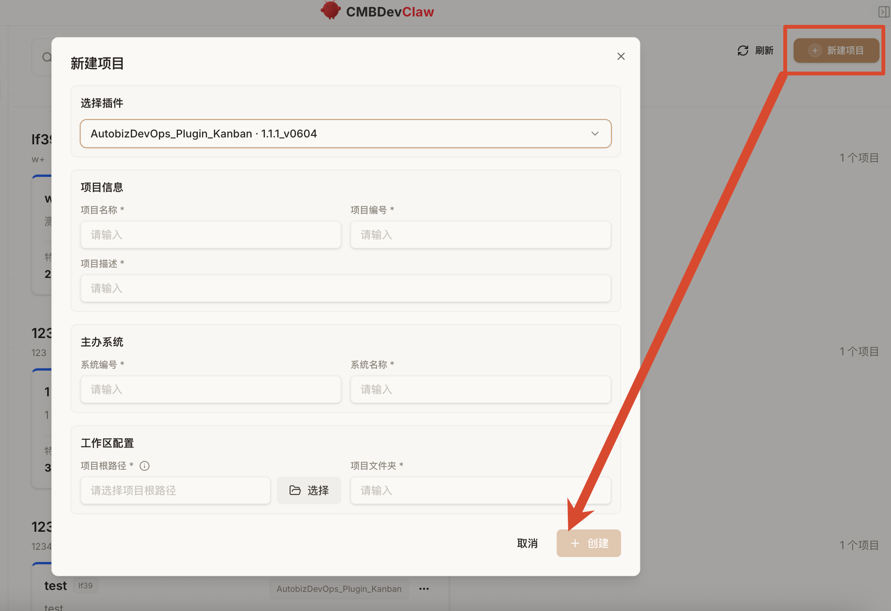
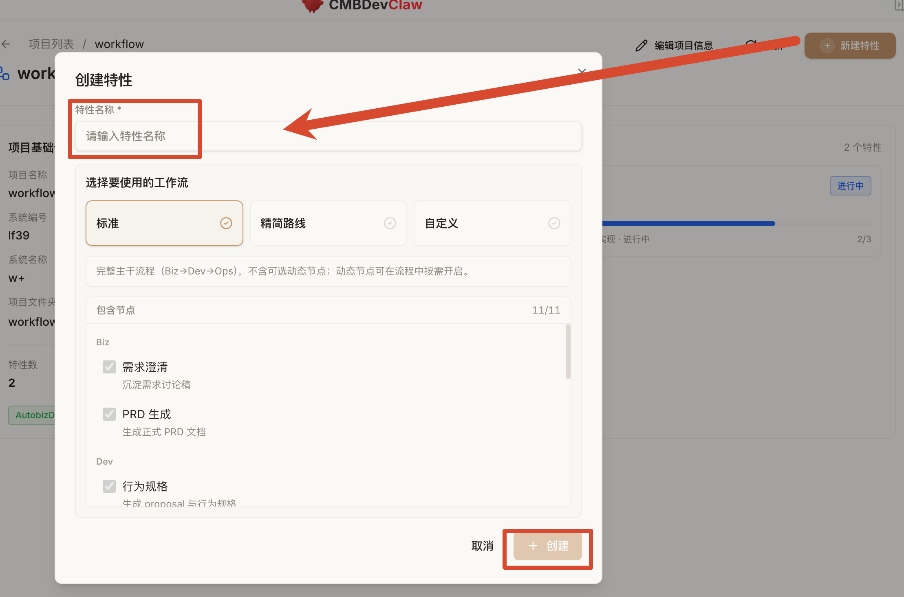
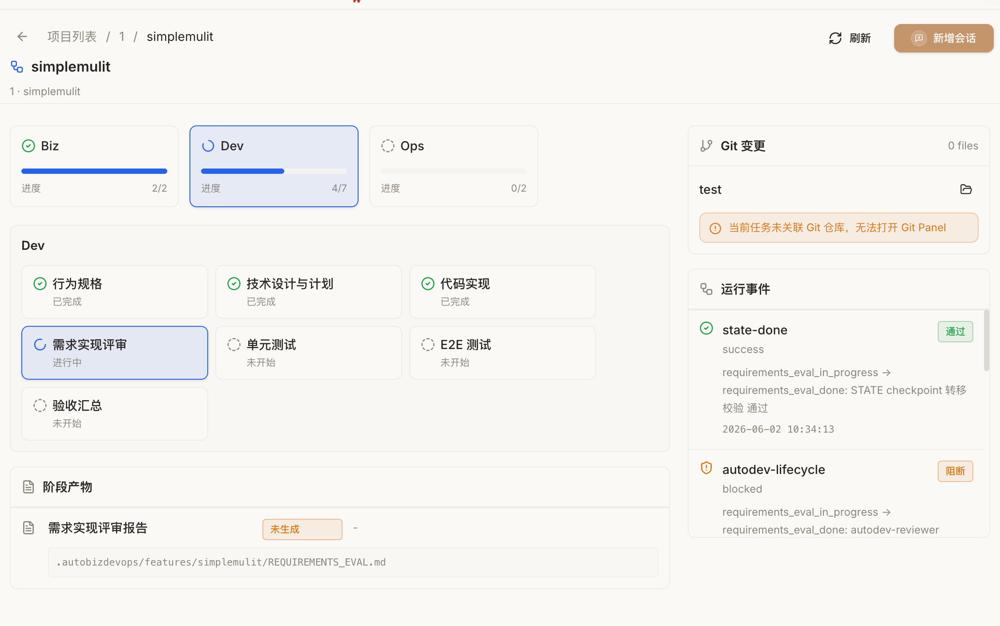

# AutoBizDevOps Kanban 插件新手使用说明
本文面向完全没有使用过 vibe coding、也没有使用过 DevClaw 插件的新用户。读完后，你应该能理解这个插件是什么、什么时候用、怎么一步步推进一个需求，以及哪些事情一定要让 DevClaw 停下来确认。
## 1. 这个插件是什么
`AutobizDevOps_Plugin_Kanban` 是一个面向应用研发的 DevClaw 本地插件。它把一次需求开发拆成三个阶段：
| 阶段 | 入口 | 作用 |
| --- | --- | --- |
| Biz | `/autobiz` | 需求澄清、正式 PRD 生成 |
| Dev | `/autodev` | 规格、设计、编码、评审、单测、E2E、验收汇总 |
| Ops | `/autoops` | CI/CD 准备、发布清单、归档 |
| 它不是“一句提示词自动把项目做完”的工具，而是一套带状态机的协作流程。每个 Feature 都有自己的 checkpoint、过程产物和下一步路由。DevClaw 通过这些信息知道当前应该继续需求、设计、编码、测试还是归档。 |   |   |
## 2. 先理解几个关键词
| 词 | 含义 |
| --- | --- |
| DevClaw | 你与 AI 协作编程的工作界面。你可以让它读代码、改文件、运行命令、生成文档。 |
| vibe coding | 用自然语言与 AI 一起推进开发的工作方式。重点是持续描述目标、确认边界、看结果、再迭代。 |
| 插件 | 给 DevClaw 增加固定工作流、技能和脚本的扩展包。 |
| Skill | 插件中的一个能力模块，例如 `/autodev-code` 负责编码，`/autodev-utest` 负责单测。 |
| Feature | 一次要开发或修改的功能。每个 Feature 有一个稳定的 `FEATURE_ID`。 |
| Checkpoint | 当前 Feature 的进度状态，例如 `prd_done`、`code_done`、`verify_done`。 |
| Artifact | 阶段产物，例如 `PRD.md`、`proposal.md`、`PLAN.md`、`UNIT_TEST_REPORT.md`。 |
| Source Bundle | 当前工作流下某个技能真正需要读取的输入产物清单。 |
| Method Bundle | 插件告诉 DevClaw“这些输入该重点读什么、怎么读、缺失时怎么降级”的规则。 |
## 3. 三个路径先分清
插件最容易让新手困惑的地方不是命令，而是路径。实际使用时，UI 会帮你管理插件本体和具体技能调度；你主要需要理解“过程产物放在哪里”和“真实代码在哪里”。
为了沟通方便，文档里仍然把路径分成三类：
| 路径 | 用户需要关注吗 | 它是什么 | 不要误解成 |
| --- | --- | --- | --- |
| 插件存放路径 | 通常不用关注 | AutoBizDevOps 插件本体所在目录，由 DevClaw管理 | 业务代码目录 |
| 项目产物存放路径 | 需要理解 | 插件为某个项目保存流程记录和阶段文档的目录 | 前端或后端源码目录 |
| 代码工作区路径 | 最需要认真配置 | 真实业务代码目录，或一个能索引前后端仓库的协调目录 | 插件目录或产物目录 |
| 这三个路径的关系可以这样理解： |   |   |   |
```
插件存放路径
  UI 和插件系统会处理，普通用户通常不用检查

项目产物存放路径
  存放这次需求推进过程中产生的文档、状态和报告

代码工作区路径
  让 DevClaw 找到真实前端/后端代码、架构说明和工程约束

```
对应到插件内部变量时，大致是：
| 简化叫法 | 插件内部常见变量 |
| --- | --- |
| 插件存放路径 | `PLUGIN_ROOT` |
| 项目产物存放路径 | `PROJECT_PLUGIN_DIR`，其中某个 Feature 的产物目录是 `FEATURE_DIR` |
| 代码工作区路径 | `CODE_WORKSPACE` |
| 如果只记一句话：插件路径由 UI 管，产物路径放过程记录，代码工作区路径指向真实项目。 |   |
### 3.1 什么是“项目产物”
第一次使用这个插件的人，通常不知道“产物”是什么。这里的产物不是打包后的前端静态文件，也不是 Java 编译产物，而是 AI 协作研发过程中的中间文档和证据。
例如你做一个 `order-export` Feature，插件可能会陆续生成：
| 类型 | 示例 | 用途 |
| --- | --- | --- |
| 流程状态 | `.autobizdevops/state.json` | 记录当前 Feature 走到哪一步 |
| 需求文档 | `PRD_DISCUSS.md`、`PRD.md` | 记录讨论稿和正式需求 |
| 规格文档 | `proposal.md`、`specs/**/*.md` | 记录系统应该表现出的行为 |
| 设计计划 | `design.md`、`PLAN.md`、`DETAIL_DESIGN.md` | 记录技术方案和执行任务 |
| 质量证据 | `REQUIREMENTS_EVAL.md`、`UNIT_TEST_REPORT.md`、`E2E_REPORT.md`、`VERIFY_REPORT.md` | 记录评审、测试、验收结果 |
| 发布资料 | `CICD_CHECKLIST.md`、`PR_BODY.md` | 记录上线检查和 PR 描述 |
| 历史归档 | `.autobizdevops/archive/` | 保存完成后的 Feature 过程记录 |
| 所以“项目产物存放路径”可以理解成这个插件的工作台记录本。它不要求一开始就有很多文件；刚初始化时可能只有 `.autobizdevops/` 和状态文件，后续随着 UI 推进流程才会逐步生成文档。 |   |   |
| 项目产物存放路径里通常会看到或即将生成： |   |   |
```
.autobizdevops/state.json
.autobizdevops/features/<FEATURE_ID>/
.autobizdevops/archive/

```
注意：不要把业务代码复制到项目产物目录里，也不要把这个目录当作前端或后端仓库。
### 3.2 怎么判断代码工作区选对了
代码工作区路径里应该能看到：
```
AGENTS.md
前端工程目录或后端工程目录
构建文件，例如 package.json、pom.xml、build.gradle、pnpm-lock.yaml 等
架构文档、接口文档或指向这些文档的索引

```
强烈建议“项目产物存放路径”和“代码工作区路径”分开。项目产物目录会生成 `.autobizdevops/`、PRD、规格、计划、测试报告、归档等文件；如果直接放进真实前端或后端仓库，容易污染业务工作区、干扰 git diff，也会让新手误以为这些过程文档是业务代码的一部分。更推荐单独建一个产物目录负责记录流程，再通过代码工作区下的 `AGENTS.md` 指向一个或多个真实代码仓库。
## 4. 先初始化 AGENTS.md
`AGENTS.md` 是给devClaw看的项目入口说明。它不需要把所有内容都写进去，更推荐做成“索引 + 关键约束”的形式。
它的核心作用是告诉 DevClaw：
- 前端工程在哪里。
- 后端工程在哪里。
- 架构文档、接口文档、数据库文档在哪里。
- 每个工程有什么特殊约束。
- 构建、测试、启动、代码风格应该看哪里。
   这是渐进式披露：`AGENTS.md` 先给入口和规则，DevClaw 需要更细信息时，再顺着索引去读对应文档，而不是一开始把所有细节都塞进一个超长文件。
### 4.1 AGENTS.md 推荐放在哪里
推荐放在代码工作区路径的根目录：
```
<CODE_WORKSPACE>/AGENTS.md

```
如果代码工作区是一个协调目录，可以这样组织：
```
<CODE_WORKSPACE>/
  AGENTS.md
  frontend-app/
  backend-service/
  docs/

```
如果前端和后端是分开的仓库，`AGENTS.md` 可以不在任何一个业务仓库内部，而是放在协调目录，里面写清楚两个仓库的绝对路径或相对路径。
### 4.2 AGENTS.md 应该写什么
`AGENTS.md` 不是固定模板，而是按项目类型写清“入口在哪里、约束在哪里、命令在哪里”。下面分三种常见情况举例。
#### 情况 A：只有前端项目
适合场景：本次只改前端页面、交互、路由、组件、样式、前端状态管理，后端接口已存在或由 mock / 接口文档提供。
```
# Project Agent Guide

## 工程入口

- 前端工程: ./frontend-app
- 公共组件库: ../shared-components
- 接口文档: ./docs/api.md
- 设计稿或 HTML: ./docs/ui/

## 前端说明

- 架构文档: ./frontend-app/docs/architecture.md
- 路由说明: ./frontend-app/docs/routes.md
- 组件规范: ./frontend-app/docs/components.md
- 状态管理说明: ./frontend-app/docs/state.md
- 启动命令: pnpm dev
- 构建命令: pnpm build
- 测试命令: pnpm test
- 命令执行目录: ./frontend-app
- 约束: 优先复用项目已有组件；不要静默新增 UI/图表依赖；图表必须使用项目既有图表方案或先确认新增依赖。

## 通用代码约束

- 不修改接口契约，除非用户明确确认。
- 不把静态视觉稿直接当作最终业务逻辑。
- 不格式化无关文件。
- 不为通过测试而删除断言、跳过用例或弱化校验。

## 文档阅读顺序

1. 先读本文件。
2. 读取前端架构、路由、组件规范。
3. 涉及接口字段时读取接口文档。
4. 涉及页面还原时读取设计稿、HTML 或 UI 说明。
5. 最后进入具体页面和组件代码。

```
#### 情况 B：只有后端项目
适合场景：本次只改服务端接口、定时任务、数据处理、权限、状态流、数据库访问或集成逻辑。
```
# Project Agent Guide

## 工程入口

- 后端工程: ./backend-service
- API 文档: ./docs/api.md
- 数据库文档: ./docs/database.md
- 部署或配置说明: ./docs/deploy.md

## 后端说明

- 架构文档: ./backend-service/docs/architecture.md
- API 规范: ./backend-service/docs/api-style.md
- 数据访问规范: ./backend-service/docs/data-access.md
- 权限与审计说明: ./backend-service/docs/security-audit.md
- 编译命令: mvn compile
- 测试命令: mvn test
- 命令执行目录: ./backend-service
- 约束: 不改变既有错误码结构；涉及数据库变更必须先确认迁移与回滚；涉及权限、租户、审计、幂等要先确认。

## 通用代码约束

- 遵守现有目录结构和命名风格。
- 不改前端页面或前端接口调用。
- 不凭空新增表、字段、枚举、索引或迁移脚本。
- 不格式化无关文件。
- 不为通过测试而删除断言、跳过用例或弱化校验。

## 文档阅读顺序

1. 先读本文件。
2. 读取后端架构和 API 规范。
3. 涉及数据时读取数据库文档和迁移规范。
4. 涉及权限、租户、审计、幂等时读取对应专项文档。
5. 最后进入具体接口、服务、数据访问和测试代码。

```
#### 情况 C：前后端一起开发
适合场景：本次需求同时涉及页面交互、接口契约、后端实现、数据结构、联调和端到端验证。
```
# Project Agent Guide

## 工程入口

- 前端工程: ./frontend-app
- 后端工程: ./backend-service
- 公共组件库: ../shared-components
- 接口文档: ./docs/api.md
- 数据库文档: ./docs/database.md
- 联调说明: ./docs/integration.md

## 前端说明

- 架构文档: ./frontend-app/docs/architecture.md
- 路由说明: ./frontend-app/docs/routes.md
- 组件规范: ./frontend-app/docs/components.md
- 启动命令: pnpm dev
- 构建命令: pnpm build
- 测试命令: pnpm test
- 命令执行目录: ./frontend-app
- 约束: 优先复用项目已有组件；接口字段以已确认 API 文档为准；不要静默新增 UI/图表依赖。

## 后端说明

- 架构文档: ./backend-service/docs/architecture.md
- API 规范: ./backend-service/docs/api-style.md
- 数据访问规范: ./backend-service/docs/data-access.md
- 编译命令: mvn compile
- 测试命令: mvn test
- 命令执行目录: ./backend-service
- 约束: 不改变既有错误码结构；涉及数据库变更必须先确认迁移与回滚。

## 联调约束

- 前后端接口字段、错误码、状态枚举必须以 specs 和 API 文档对齐。
- 如果前端需求和后端接口不一致，先停止确认，不要各自发明一套字段。
- E2E 或手工验收需覆盖主流程、失败提示、权限或状态边界。

## 通用代码约束

- 遵守现有目录结构和命名风格。
- 不格式化无关文件。
- 不为通过测试而删除断言、跳过用例或弱化校验。
- 修改公共接口、数据结构、权限、审计、租户逻辑前必须先确认。

## 文档阅读顺序

1. 先读本文件。
2. 同时读取前端和后端架构文档，先理解两边边界。
3. 涉及接口时读取 API 文档，并确认前后端字段一致。
4. 涉及数据时读取数据库或迁移文档。
5. 最后分别进入前端页面/组件代码和后端接口/服务代码。

```
### 4.3 AGENTS.md 不适合写什么
- 不要把所有源码说明、接口详情、数据库字段完整复制进来。
- 不要写过期命令。
- 不要只写“按现有风格开发”这种空话，至少给出风格文档或示例目录。
- 不要把不同工程的命令混在一起，要说明命令在哪个目录执行。
- 不要把插件过程产物目录写成代码目录。
   好的 `AGENTS.md` 应该像一张地图，不像一整本百科。
## 5. 第一次使用前要准备什么
1. 确认插件已在 DevClaw 中启用。
24. 在 UI 中选择或创建项目产物存放路径，也就是将生成 `.autobizdevops/` 的目录；建议单独建目录，不要直接选真实前端或后端仓库根目录。
101. 确认代码工作区路径，并在这里准备好 `AGENTS.md`。
133. 准备一个 Feature 名，也就是 `FEATURE_ID`，例如 `order-export`、`approval-reminder`。
201. 准备需求材料。可以是自然语言描述、Markdown、Word 文档、会议纪要，也可以是已有 PRD。
    插件存放路径由 DevClaw生成和管理，普通用户不需要检查它是不是包含 `plugin.json`，也不需要手工选择这个目录。
正常通过项目模式使用时，项目和 Feature 通常由插件面板或入口动作创建。最终产物会落到 `{PROJECT_PLUGIN_DIR}/{FEATURE_ID}/.autobizdevops/`。
## 6. 推荐的使用姿势
通过项目模式使用插件，优先相信 UI：UI 会负责创建项目、创建 Feature、读取状态、控制下一步，并触发具体子技能。用户不需要记住所有 `/autobiz-*`、`/autodev-*`、`/autoops-*` 子技能。
### 6.1 UI 截图导览
#### 新建项目

在项目列表页点击右上角“新建项目”后，会打开新建项目弹窗。这里最重要的是三块：
| 区域 | 怎么理解 |
| --- | --- |
| 选择插件 | UI 会列出可用插件，选择 `AutobizDevOps_Plugin_Kanban` 即可；插件存放路径由 UI 管理，用户不用手工检查插件目录。 |
| 项目信息 | 填项目名称、项目编号、项目描述，主要用于 UI 展示和区分不同项目。 |
| 工作区配置 | 这里决定项目产物放在哪里。建议选择一个专门的产物根目录，再为当前项目创建独立项目文件夹；不要直接选真实前端或后端仓库根目录。 |
| 这一步创建的是“插件管理的项目”，不是创建前端或后端工程。创建完成后，UI 会在项目产物目录下维护 `.autobizdevops/`，后续 Feature 的 PRD、规格、计划、测试报告、验收报告等都会逐步放到这里。 |   |
#### 创建特性

进入项目后，点击右上角“新建特性”。特性可以理解成一次具体需求或一次代码变更，例如 `order-export`、`approval-reminder`。
| 区域 | 怎么理解 |
| --- | --- |
| 特性名称 | 给这次需求取一个稳定名称。后续 UI、状态、产物目录都会围绕这个名称组织。 |
| 工作流 | 通常在 UI 中选择。新手不确定时选“标准”；小修小改可选“精简路线”；熟悉后再用“自定义”。 |
| 包含节点 | UI 展示本工作流会经过哪些阶段。用户只需要理解这是预览，具体下一步仍由 UI 控制。 |
| 创建特性后，UI 会为这个 Feature 建立状态记录和产物目录。用户不需要自己创建 `PRD.md`、`PLAN.md` 这类文件，后续由插件在对应阶段生成。 |   |
#### 项目看板

特性创建后，主要在看板页推进。这个页面比命令更重要，新手优先看这里：
| 区域 | 怎么理解 |
| --- | --- |
| Biz / Dev / Ops 进度卡 | 展示当前大阶段进度。例如 Biz 已完成、Dev 进行中、Ops 未开始。 |
| 阶段节点卡片 | 展示当前阶段内每个节点的状态：已完成、进行中、未开始。高亮卡片就是当前正在推进的节点。 |
| 阶段产物 | 展示当前节点应该生成或已经生成的文档路径，例如 `REQUIREMENTS_EVAL.md`。如果显示“未生成”，说明该阶段产物还没有落盘或被校验阻断。 |
| Git 变更 | 如果代码工作区关联了 Git 仓库，会展示变更数量；如果未关联，会提示无法打开 Git Panel。 |
| 运行事件 | 展示插件 hook 和状态校验结果。绿色“通过”表示该检查通过；橙色“阻断”表示有产物缺失、状态不合法或生命周期检查未通过，需要按提示处理。 |
| 看板里的状态和运行事件能帮助你判断“现在到底卡在哪”。如果某个阶段提示阻断，不要直接跳到后面阶段，也不要手工改状态文件，应该先补齐缺失产物、修复报告中指出的问题，或按 UI 提示回流到对应阶段。 |   |
| 你真正需要做的是： |   |
1. 在 UI 中选好项目产物存放路径。
22. 在 UI 或对话中提供代码工作区路径。
45. 确保代码工作区里有可用的 `AGENTS.md`。
72. 描述需求、补充材料、回答确认问题。
93. 在 UI 提示下一步时确认继续、暂停、回流或归档。
    如果没有 UI，或需要高级调试，才需要记住三个根入口：
```
/autobiz   需求阶段
/autodev   开发阶段
/autoops   发布与归档阶段

```
插件内部有很多子技能，例如 `/autodev-code`、`/autodev-utest`。正常 UI 流程下，这些子技能由 UI 和路由脚本控制；用户不用自己判断该调用哪一个。
示例对话：
```
我要开发 Feature: order-export。
需求是：运营人员可以按筛选条件导出订单 CSV，导出内容需要包含订单号、客户名、金额、状态和创建时间。
代码工作区路径是：<包含 AGENTS.md 的目录>。
请先读取 AGENTS.md，然后按 UI 当前流程帮我推进需求澄清。

```
当 UI 提示进入开发阶段时：
```
继续当前 Feature。
不需要先做 HTML 转前端，直接进入行为规格。

```
当 UI 提示进入发布或归档阶段时：
```
帮我生成 CI/CD 清单和 PR 描述草稿。

```
## 7. 工作流模板怎么选
工作流模板通常在 UI 中选择。新手不需要记住完整节点，只需要知道每个模板适合什么场景。
| 模板 | 适合场景 | 包含节点 |
| --- | --- | --- |
| `standard` 标准流程 | 中大型需求、需要完整文档和质量门禁 | Biz -> Dev -> Ops |
| `lean` 精简路线 | 小修小改、接口修复、低风险需求 | specs -> code -> archive |
| `custom` 自定义 | 用户明确知道要哪些节点 | 必含 code 和 archive，其余自由选择 |
| 新手建议： |   |   |
- 不确定就选 `standard`。
- 只是修一个小 bug 或补一个接口，可以选 `lean`。
- 只有熟悉插件后再用 `custom`。
## 8. 标准流程全景
这一节只用于帮助你理解 UI 为什么会分阶段提问，不要求你背下来。正常情况下，后续由 UI 控制所有具体子技能。
标准流程大致如下：
```
Biz:
  需求澄清 -> PRD 生成

Dev:
  可选 HTML 转前端 -> 行为规格 -> 技术设计与计划
  -> 可选详细设计 -> 代码实现 -> 独立需求评审
  -> 单元测试 -> E2E -> 验收汇总

Ops:
  CI/CD -> 归档

```
对应 checkpoint：
```
discuss_in_progress -> discuss_done
prd_in_progress -> prd_done
specs_in_progress -> specs_done
plan_in_progress -> plan_done
code_in_progress -> code_done
requirements_eval_in_progress -> requirements_eval_done
unit_test_in_progress -> unit_test_done
e2e_in_progress -> e2e_done 或 needs_fix
verify_in_progress -> verify_done 或 needs_fix
cicd_in_progress -> cicd_done
cicd_done -> archived

```
`needs_fix` 表示验收或 E2E 发现问题，需要回流到 Biz、PRD、Specs、Plan、Code 或 Ops 中的某个阶段修复。
## 9. 每个阶段做什么
下面这些阶段说明主要用于培训、排错和理解 UI 背后的动作。普通用户不需要记住技能名，也不需要手动选择具体子技能；UI 会根据当前状态控制下一步。
### 9.1 Biz: 需求澄清
技能：`/autobiz-requirement-discuss`
作用：
- 阅读原始需求材料。
- 识别缺失、冲突、模糊点。
- 生成 P0/P1/P2 问题清单。
- 与用户多轮确认。
- 写入 `{FEATURE_DIR}/PRD_DISCUSS.md`。
   注意：
- 即使需求看起来很清楚，也必须展示检查结果并等待用户确认。
- 不能默认“用户已经确认”。
- `PRD_DISCUSS.md` 是讨论稿，可以保留待确认事项、风险和讨论记录。
### 9.2 Biz: PRD 生成
技能：`/autobiz-prd-generate`
作用：
- 基于已收敛的 `PRD_DISCUSS.md` 生成正式 `PRD.md`。
- 正式 PRD 要包含用户故事、验收口径、验收标准、关键约束。
   注意：
- 标准流程下不能跳过讨论稿直接写正式 PRD。
- PRD 不能包含讨论记录、待确认事项、外部依赖章节正文。
- 未确认的信息不能写成确定需求。
### 9.3 Dev: 可选 HTML 转前端
技能：`/autodev-frontend`
触发时机：
- `prd_done` 后，进入 `/autodev` 时，插件可能询问是否需要先把 HTML 转成前端工程文件。
   适合：
- 有设计导出的 HTML。
- 有普通静态 HTML 或 DOM 片段。
- 用户明确要求 HTML 转 React、TSX、Vite、Next 等。
   注意：
- 必须有 HTML 文件、HTML 片段或可读取 HTML 内容。
- 只有 PRD 或截图时，不应直接进入该路线。
- 新增依赖必须先得到用户确认。
- 主线完成后，必须询问是否进入回检流程。
### 9.4 Dev: 行为规格
技能：`/autodev-specs`
作用：
- 把 PRD 或用户直供需求转成行为契约。
- 生成 `{FEATURE_DIR}/proposal.md`。
- 生成 `{FEATURE_DIR}/specs/<capability>/spec.md`。
   注意：
- specs 只写系统外部可观察行为，不写实现步骤、类名、SQL 细节。
- 如果 API、数据、权限、幂等、分页、异步等会影响行为契约，必须先和用户确认。
- 精简流程下可以没有 PRD，直接基于用户描述澄清并生成规格。
### 9.5 Dev: 技术设计与计划
技能：`/autodev-plan`
作用：
- 阅读 proposal、specs 和现有代码。
- 先探索技术方案，再经用户确认进入 Plan 生成。
- 生成 `{FEATURE_DIR}/design.md`。
- 生成 `{FEATURE_DIR}/PLAN.md`。
   注意：
- 这个阶段不写业务代码。
- `design.md` 记录 API 决策、数据决策、技术设计、风险。
- 如果不涉及 HTTP/API，要写明 `x-auto-no-http-api: true`。
- 如果不涉及数据库或持久化，要写明 `x-auto-no-sql: true`。
- `PLAN.md` 应按业务闭环拆任务，不要拆成“新增 DTO”“修改 Controller”这类纯代码步骤。
- Plan 先校验并锁定 `task-groups.json`，再由 writer 直接生成 Draft Batch；不再生成一套独立的 `.tmp/tasks/Txxx.json`。分组字段只维护一份，task 详情逐个写入 Draft，并在每次写入前立即校验。
- 分组变化时使用 `rebuild-task-draft`，只保留分组投影未变化的 task 详情；全部 task ready 后通过 `preflight-task-draft` 和 `finalize-task-draft` 一次性发布正式计划。
- 每个 TASK 只配置窄范围的行为、集成、E2E 或静态验证；Maven 测试必须指定测试目标。若同一 workspace 的 TASK 定向 Maven 生命周期已覆盖构建，Batch 使用 `task_covered` 自动收口；否则才配置有增量价值的编译、构建、类型检查或 lint 命令。
- 项目级最终验证是可选项，只在确有跨前后端或跨批次检查时配置，不重复批次已经执行的编译命令。
- 项目级最终验证只允许 integration/E2E/static check；命令、执行目录和仓库与 batch profile 相同时会被拒绝。
### 9.6 Dev: 可选详细设计
技能：`/autodev-detail-design`
触发时机：
- `plan_done` 后，插件会询问是否需要代码前详细设计。
   作用：
- 生成 `{FEATURE_DIR}/DETAIL_DESIGN.md`。
- 明确预计新增、修改、删除哪些文件。
- 写清楚文件级逻辑、模块调用、数据和状态流转。
   注意：
- 仍然不能改业务代码。
- 不确定的路径、字段、接口、权限、数据模型必须标记待确认。
### 9.7 Dev: 代码实现
技能：`/autodev-code`
作用：
- 按 Source Bundle 读取规格、设计、计划。
- 在真实代码工作区做最小必要实现。
- 更新 `PLAN.md` 中的任务状态和验证证据。
- 验证通过，或环境/重复修复失败已形成可审计延期记录后，推进到 `code_done`。
   注意：
- 代码阶段不能偷偷修改 `PRD.md`、`proposal.md`、`specs/**/*.md`、`design.md`。
- 如果发现规格或设计冲突，应停止并回流到 Specs 或 Plan。
- 每次只处理一个任务，完成时运行该任务的行为/集成验证，再进入下一个任务；不在每个 TASK 后重复编译。
- 当前 Batch 使用 `task_covered` 时，最后一个 TASK 后只生成批次收口 evidence，不重复编译；使用 `commands` 时才统一执行一次补充性的编译/构建/typecheck/lint，失败后在同一个 batch run 修复并重跑。
- TASK 实现期间不得手工提前运行 Batch 命令；定向 `mvn test -Dtest=...` 自身包含必要的 Maven 编译生命周期。
- 批次修复若改到 TASK 范围，旧 evidence 历史保留，但受影响 TASK 必须重新验证并追加新 evidence；随后还要再跑一次最终 batch 验证，全部通过后才能进入下一批。
- batch-check 中断时通过 `code-session` 取回原 `activeRunId` 并用同一个 run 重试；已写入的命令 evidence 会被恢复采用。optional 命令失败会保留历史，但不会让 required 已通过的批次失败。
- Code 验证遇到环境问题会写 blocked evidence 并延期；普通失败最多做 2 次 repair，第 2 次修复后仍失败也会延期。延期项保存在 `plan.json.deferredValidationIssues`，继续后续 TASK/Batch/UTEST/E2E，但不等同于验证通过。
- 不要为了通过验证削弱校验、安全检查、日志或错误处理。
### 9.8 Dev: 独立需求评审
技能：`/autodev-reviewer`
作用：
- 防止“执行者自证完成”。
- 主 agent 写 `{FEATURE_DIR}/completion-proposal.json`。
- 独立 reviewer 只读真实 git diff、规格、设计和计划。
- reviewer 写 `{FEATURE_DIR}/REQUIREMENTS_EVAL.md`。
   结论：
- `PASS` 或 `PASS_WITH_WARNINGS`：可以进入单测阶段。
- `FAIL`：必须修复 blocker 后重新 review。
- `DEGRADED`：独立评审不成立，不能包装成通过。
   注意：
- reviewer 不修改源码。
- 主 agent 不能替 reviewer 改评估报告。
- 跨仓库任务必须在 completion proposal 中写清 `affected_repositories`。
### 9.9 Dev: 单元测试
技能：`/autodev-utest`
作用：
- 基于 specs、design、PLAN、REQUIREMENTS_EVAL 生成或补齐单测。
- 执行精确测试与扩大验证。
- 失败时做归因。
- 生成 `{FEATURE_DIR}/UNIT_TEST_REPORT.md` 和 `{FEATURE_DIR}/test-output.log`。
   注意：
- 不能委派子 agent。
- 不得跳过失败测试、削弱断言或伪造日志。
- 只有满足“最小业务修复门槛”时，才允许改生产代码。
- 默认模式是 `auto`，也可以使用 `--mode test`、`--mode code`、`--no-fix`。
- 优先读取并处理 `plan.json.deferredValidationIssues` 中能映射到单元边界的 Code 延期项。
### 9.10 Dev: E2E
技能：`/autodev-e2e`
作用：
- 根据 specs 中的主链路生成结构化 E2E 用例。
- 可启动服务或运行长时间测试命令。
- 输出 `{FEATURE_DIR}/E2E_TEST_CASES.yaml`、`{FEATURE_DIR}/E2E_REPORT.md`、`{FEATURE_DIR}/e2e-run.log`。
- 通过后进入 `e2e_done`，失败可进入 `needs_fix`。
   注意：
- E2E pass/fail 的主要依据是 specs。
- Code 延期项中能映射到用户主链路或集成环境的内容，应进入 E2E 用例或环境复核；不能覆盖时明确标为 manual/missing。
- 涉及页面、按钮、点击、弹窗、跳转、表单、前端组件、路由、用户可见流程的 P0/P1 用例，应标记 `ui_required: true`。
- 不要为了通过 E2E 删除用例、弱化断言或伪造报告。
### 9.11 Dev: 验收汇总
技能：`/autodev-verify`
作用：
- 只读上游单测和 E2E 报告。
- 汇总每个 Requirement / Scenario 的裁定。
- 生成 `{FEATURE_DIR}/VERIFY_REPORT.md`。
- 全部通过时进入 `verify_done`，存在失败时进入 `needs_fix`。
   注意：
- 这个阶段不再运行测试、不启动服务、不生成新测试。
- 它只做映射、汇总和分支决策。
### 9.12 Ops: CI/CD
技能：`/autoops-cicd`
作用：
- 生成 `{FEATURE_DIR}/CICD_CHECKLIST.md`。
- 生成 `{FEATURE_DIR}/PR_BODY.md`。
- 可根据 `pipeline_code` 构建或轮询流水线。
- 用户确认完成后推进到 `cicd_done`。
   注意：
- 本技能不得执行 git 写命令。
- 未经用户明确回复“已完成 / done / ok”，不能推进到 `cicd_done`。
- 流水线失败时，要把阻断问题写入清单并等待人工处理或后续技能接管。
### 9.13 Ops: 归档
技能：`/autoops-archive`
作用：
- 将活跃 Feature 目录移动到 `.autobizdevops/archive/{slug}-iter{N}/`。
- 将 checkpoint 推进到 `archived`。
   注意：
- 不能覆盖已有归档目录。
- 标准流程通常要求 `cicd_done` 后才能归档。
- 精简流程可按当前工作流契约从合法 done checkpoint 归档。
## 10. 产物总览
| 阶段 | 主要产物 |
| --- | --- |
| 需求澄清 | `PRD_DISCUSS.md` |
| PRD 生成 | `PRD.md` |
| 行为规格 | `proposal.md`、`specs/**/*.md` |
| 技术设计与计划 | `design.md`、`PLAN.md` |
| 可选详细设计 | `DETAIL_DESIGN.md` |
| 代码实现 | 业务代码、测试、配置修改；`PLAN.md` 状态更新 |
| 独立评审 | `completion-proposal.json`、`REQUIREMENTS_EVAL.md` |
| 单测 | `UNIT_TEST_REPORT.md`、`test-output.log` |
| E2E | `E2E_TEST_CASES.yaml`、`E2E_REPORT.md`、`e2e-run.log` |
| 验收汇总 | `VERIFY_REPORT.md` |
| CI/CD | `CICD_CHECKLIST.md`、`PR_BODY.md` |
| 归档 | `.autobizdevops/archive/{slug}-iter{N}/` |
## 11. 常用检查命令
这些命令主要给高级用户或排错时使用。普通新手一般让 DevClaw 代为执行即可。
读取全部 Feature 状态：
```
python "$PLUGIN_ROOT/read_state_json.py"

```
读取当前 Feature checkpoint：
```
python "$PLUGIN_ROOT/read_state_json.py" --feature "$FEATURE_ID"

```
解析下一步技能：
```
python "$PLUGIN_ROOT/hooks/resolve_next_skill.py" --workspace "$PROJECT_PLUGIN_DIR" --feature "$FEATURE_ID" --json

```
查看某个技能在当前 Feature 下真正需要的输入输出契约：
```
python "$PLUGIN_ROOT/hooks/inspect_skill_contract.py" autodev-code --feature "$FEATURE_ID" --json

```
推进 checkpoint：
```
python "$PLUGIN_ROOT/hooks/update_checkpoint.py" --checkpoint <checkpoint>

```
重要警告：
- 不要手工编辑 `.autobizdevops/state.json`。
- 不要手工编辑 `.autobizdevops/STATE.md`，它只是自动生成视图。
- `read_state_json.py` 和 `update_checkpoint.py` 不要传 `--workspace` 或 `-w`，状态路径由插件环境决定。
## 12. 新手最重要的注意事项
1. 通过 项目模式使用时，优先按项目模式的阶段按钮、状态提示和下一步动作继续。
42. 不要随意跳 checkpoint；checkpoint 由 项目模式 和插件路由共同维护。
91. 不要让 DevClaw 在未确认需求时“脑补”业务规则。
123. 不要把项目产物存放路径或 `FEATURE_DIR` 当作业务代码目录。
161. 不要在 Code 阶段偷偷改 specs 或 design。
195. 不要为了测试通过降低断言、跳过测试或伪造日志。
222. 用户必须在关键阶段确认：需求问题清单、是否进入 Plan 生成、是否需要 HTML 转前端、是否需要详细设计、CI/CD 是否完成、是否归档。
297. 新增依赖、跑长时间命令、访问外部服务、触发流水线等操作，应先确认影响。
336. `AGENTS.md` 要先做成索引，指向前端、后端、架构、接口、数据库、代码规范等文档。
383. 发生冲突时，以系统指令和项目 `AGENTS.md` 优先，其次才是插件技能文档。
426. 如果脚本输出和文档静态说明冲突，以脚本和 `board_core/board_config.json` 的结果为准。
## 13. 推荐给 DevClaw 的提示词模板
### 开始一个标准需求
```
我想用 AutoBizDevOps 标准流程开发一个新 Feature。
项目产物存放路径: <UI 中选择/创建的产物目录>
代码工作区路径: <包含 AGENTS.md 的目录>
FEATURE_ID: <feature-id>
需求背景: <一句话背景>
目标用户: <谁使用>
功能描述: <要做什么>
验收标准: <如何判断完成>

请先读取代码工作区路径下的 AGENTS.md，再按 UI 当前流程推进需求澄清，不要直接写代码。

```
### 继续当前 Feature
```
继续推进 FEATURE_ID=<feature-id>。
请先读取当前 checkpoint，并按 UI 当前状态判断下一步应该执行哪个阶段。

```
### 直接走精简流程
```
这是一个小修复，想走 lean 流程。
FEATURE_ID: <feature-id>
问题: <bug 或小需求>
预期行为: <修完应该怎样>
请生成轻量 specs 后进入代码实现。

```
### 代码前需要详细设计
```
在进入编码前，我需要更细的文件级详细设计。
请启用 detail_design_before_code，并生成 DETAIL_DESIGN.md。

```
### 测试失败后修复
```
E2E/Verify 进入 needs_fix。
请读取最新报告，判断应该回流到哪个阶段，只修复报告中的 blocker，不要扩大范围。

```
## 14. 常见问题排查
### Feature 不存在
现象：`feature '<slug>' 未在 state.json 中找到`。
处理：
- 确认 `FEATURE_ID` 拼写。
- 确认项目已初始化。
- 如果是新 Feature，通过插件界面或 `init_workspace.py --mode createFeature` 创建。
### state.json 缺失
现象：`state.json 未找到`。
处理：
- 确认 `PROJECT_PLUGIN_DIR` 是否正确。
- 执行项目初始化。
- 不要把 `PLUGIN_WORKSPACE` 误当成 `PROJECT_PLUGIN_DIR`。
### DevClaw 找不到前端或后端工程
常见原因：
- `AGENTS.md` 没有放在代码工作区路径下。
- `AGENTS.md` 只写了项目介绍，没有写前端/后端工程地址。
- 前端/后端路径写成了相对另一个目录的路径。
   处理：
- 在 `AGENTS.md` 的“工程入口”中写清楚前端和后端路径。
- 如果是跨仓库协作，写清每个仓库的角色和路径。
### DevClaw 一开始读了太多文档
处理：
- 把 `AGENTS.md` 改成索引式入口。
- 在文档阅读顺序中写清楚：先读 AGENTS，再按任务类型读前端或后端架构文档，涉及接口/数据时再读专项文档。
- 不要把所有详细设计都塞进 `AGENTS.md`。
### 缺少上游产物
现象：某阶段提示缺少 `PRD.md`、`specs/**/*.md`、`PLAN.md` 等。
处理：
- 不要手工造一个空文件糊过去。
- 通过根入口回到应该生成该产物的阶段。
- 如果当前是 lean 或 custom 流程，先用 `inspect_skill_contract.py` 确认真正需要哪些输入。
### DevClaw 想直接写代码
处理：
- 如果还在 Biz、Specs、Plan 阶段，应提醒 DevClaw 不要编码。
- 标准流程下，代码实现必须等到 `code_in_progress`。
### Verify 进入 needs_fix
处理：
- 阅读 `VERIFY_REPORT.md`。
- 找到失败项和建议回流阶段。
- 回到对应阶段修复，而不是直接改报告。
### 归档失败
常见原因：
- checkpoint 还不是合法 done 状态。
- 活跃 Feature 目录不存在。
- 归档目标目录已存在。
   处理：
- 先通过 UI 的 Ops / 归档入口检查当前状态。
- 不要覆盖已有 archive。
## 15. 对新手的工作建议
- 先把需求讲完整，再让 DevClaw 做。
- 在正式开发前，先让 DevClaw 复述三个路径和它从 `AGENTS.md` 读到的工程入口。
- 每一阶段结束后，读一下产物，不要只看总结。
- 对“待确认”“假设”“风险”保持敏感，它们通常是后面返工的来源。
- 小需求可以精简，但不能跳过行为契约。
- 代码阶段要让 DevClaw 先解释会改哪些文件，再改。
- 测试失败时，让 DevClaw 先归因，再修复。
- 发布和归档阶段要谨慎，尤其是流水线、PR、归档移动目录这类操作。
## 16. 一句话记忆版
这个插件的正确用法是：在 项目模式里选好项目产物路径和代码工作区路径，用 `AGENTS.md` 给 DevClaw 一张项目地图，然后让 UI 按 checkpoint 推进需求、开发、测试、发布和归档；全程不跳步、不脑补、不伪造验证。
