# AutoBiz 接入 Dynamic Workflow 设计方案

> 文档用途：架构评审、平台能力建设评审、项目汇报  
> 方案范围：将 AutoBiz 的 Biz、Dev、Ops 全流程直接接入 Dynamic Workflow 运行时  
> 设计基线：一个 Feature 的一次迭代对应一个长期运行的 Dynamic Workflow Run  
> 文档状态：最终评审版  
> 版本：1.0

阅读建议：汇报时重点展示第 1、3、4、5-9、16 和 30 节；第 10-15、18-29 节作为技术评审与实施附录。

## 1. 汇报摘要

AutoBiz 接入后的目标形态不是“Dynamic Workflow 调用一次 `/autobiz` 大 Skill”，而是由 Dynamic Workflow 直接展开 AutoBiz 的全部阶段、用户确认、动态分支、并行执行和失败回流。

核心设计结论：

1. 一个 Feature 的一次迭代对应一个 `AutoBiz Dynamic Workflow Run`。
2. Biz、Dev、Ops 分别作为三个 Subworkflow，由一个主 Workflow 串联。
3. Skill 被拆成结构化 Agent Activity，负责分析、生成、执行和校验，不再自行决定下一阶段。
4. 用户确认统一建模为可持久化的 Human Step，支持等待数小时或数天后继续。
5. `FIX_REQUEST.json` 驱动动态回流，回流节点及其下游使用新 revision 重新执行。
6. Dynamic Workflow Journal 记录控制流，AutoBiz Artifact 记录业务事实，`EVIDENCE.jsonl` 记录证据事实。

预期收益：

- 用户可以在 Discuss、PRD、Plan、Verify、CI/CD 等阶段随时确认、暂停和恢复。
- Agent 调用、用户决策、阶段产物、校验结果和失败回流形成完整时间线。
- Code 阶段可以按照 Lane、Batch、Task 进行受控并行和串行组合。
- App 或会话中断后，不需要用户重新描述上下文，也不会重复已完成步骤。
- AutoBiz 的路由从 Skill 提示词和 checkpoint 驱动，升级为 Dynamic Workflow 代码驱动。

### 1.1 优化内容评审结论

| 优化项                    | 结论                 | 最终取舍                                                         |
| ------------------------- | -------------------- | ---------------------------------------------------------------- |
| 错误重试、超时与人工恢复  | 合理                 | 保留，但严格区分瞬时故障、平台故障、业务失败和待用户决策         |
| Lane 并发与 Workspace 锁  | 合理但原规则过于乐观 | 保留，并增加读写冲突、基线 revision 和并行结果集成 Gate          |
| Revision 与嵌套修复       | 合理                 | 保留“优先回流最上游根因”，每次新失败重新路由，不固定回到 Code    |
| Human Step 提醒与过期回答 | 合理                 | 保留，提醒阈值配置化，任何超时都不能自动通过业务 Gate            |
| Workflow 版本固定与迁移   | 必须                 | 定义包不可变留存；版本缺失时暂停恢复，不能要求重建 Feature       |
| 监控、成本归因与审计      | 合理                 | 保留低基数指标；Feature 级明细进入事件和查询存储，不作为指标标签 |
| Dry Run 与自动回答        | 需要修正             | Dry Run 只能使用显式答案 fixture，不能自动接受严格 Human Step    |
| 性能数字                  | 缺少真实样本支撑     | 改为基准采集框架，不把示例数字作为承诺                           |

## 2. 目标与边界

### 2.1 目标

- 覆盖标准流程 `Biz -> Dev -> Ops` 的完整生命周期。
- 支持精简流程和 Detail Design 等动态节点。
- 支持 Discuss、PRD、Plan 中多轮、逐项的用户确认。
- 支持等待用户、等待外部 CI/CD、暂停、恢复、取消和失败重试。
- 支持 Review、UTest、E2E、Verify 发现问题后的精确回流。
- 保留现有 PRD、Specs、Design、Plan、Evidence、Test Result 等产物契约。
- 让 Workflow 可审计、可重放、可观察，并能用于后续评测和过程分析。

### 2.2 不在本方案中展开的内容

- 不评估平台当前 Dynamic Workflow 已经实现了哪些能力。
- 不改变 AutoBiz 各阶段的业务职责和产物语义。
- 不在第一期删除 `state.json`、checkpoint 和现有路由脚本；它们先作为兼容投影保留。
- 不允许 Dynamic Workflow 绕过现有 validator、Task Runner 或 Evidence 完整性约束。

## 3. 总体架构

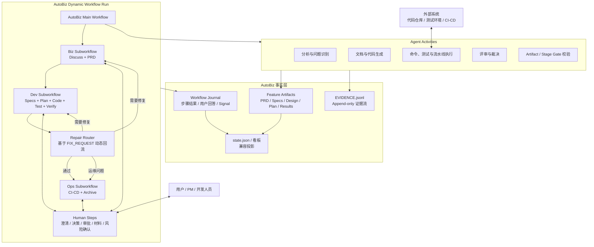

### 3.1 职责划分

| 组件           | 职责                                               | 不负责             |
| -------------- | -------------------------------------------------- | ------------------ |
| Main Workflow  | 选择模板、串联 Subworkflow、控制修复循环和最终结束 | 直接生成业务产物   |
| Subworkflow    | 编排某个领域内的阶段、循环、并行和确认# AutoBiz 接入 Dynamic Workflow 设计方案

> 文档用途：架构评审、平台能力建设评审、项目汇报  
> 方案范围：将 AutoBiz 的 Biz、Dev、Ops 全流程直接接入 Dynamic Workflow 运行时  
> 设计基线：一个 Feature 的一次迭代对应一个长期运行的 Dynamic Workflow Run  
> 文档状态：最终评审版  
> 版本：1.0

阅读建议：汇报时重点展示第 1、3、4、5-9、16 和 30 节；第 10-15、18-29 节作为技术评审与实施附录。

## 1. 汇报摘要

AutoBiz 接入后的目标形态不是“Dynamic Workflow 调用一次 `/autobiz` 大 Skill”，而是由 Dynamic Workflow 直接展开 AutoBiz 的全部阶段、用户确认、动态分支、并行执行和失败回流。

核心设计结论：

1. 一个 Feature 的一次迭代对应一个 `AutoBiz Dynamic Workflow Run`。
2. Biz、Dev、Ops 分别作为三个 Subworkflow，由一个主 Workflow 串联。
3. Skill 被拆成结构化 Agent Activity，负责分析、生成、执行和校验，不再自行决定下一阶段。
4. 用户确认统一建模为可持久化的 Human Step，支持等待数小时或数天后继续。
5. `FIX_REQUEST.json` 驱动动态回流，回流节点及其下游使用新 revision 重新执行。
6. Dynamic Workflow Journal 记录控制流，AutoBiz Artifact 记录业务事实，`EVIDENCE.jsonl` 记录证据事实。

预期收益：

- 用户可以在 Discuss、PRD、Plan、Verify、CI/CD 等阶段随时确认、暂停和恢复。
- Agent 调用、用户决策、阶段产物、校验结果和失败回流形成完整时间线。
- Code 阶段可以按照 Lane、Batch、Task 进行受控并行和串行组合。
- App 或会话中断后，不需要用户重新描述上下文，也不会重复已完成步骤。
- AutoBiz 的路由从 Skill 提示词和 checkpoint 驱动，升级为 Dynamic Workflow 代码驱动。

### 1.1 优化内容评审结论

| 优化项                    | 结论                 | 最终取舍                                                         |
| ------------------------- | -------------------- | ---------------------------------------------------------------- |
| 错误重试、超时与人工恢复  | 合理                 | 保留，但严格区分瞬时故障、平台故障、业务失败和待用户决策         |
| Lane 并发与 Workspace 锁  | 合理但原规则过于乐观 | 保留，并增加读写冲突、基线 revision 和并行结果集成 Gate          |
| Revision 与嵌套修复       | 合理                 | 保留“优先回流最上游根因”，每次新失败重新路由，不固定回到 Code    |
| Human Step 提醒与过期回答 | 合理                 | 保留，提醒阈值配置化，任何超时都不能自动通过业务 Gate            |
| Workflow 版本固定与迁移   | 必须                 | 定义包不可变留存；版本缺失时暂停恢复，不能要求重建 Feature       |
| 监控、成本归因与审计      | 合理                 | 保留低基数指标；Feature 级明细进入事件和查询存储，不作为指标标签 |
| Dry Run 与自动回答        | 需要修正             | Dry Run 只能使用显式答案 fixture，不能自动接受严格 Human Step    |
| 性能数字                  | 缺少真实样本支撑     | 改为基准采集框架，不把示例数字作为承诺                           |

## 2. 目标与边界

### 2.1 目标

- 覆盖标准流程 `Biz -> Dev -> Ops` 的完整生命周期。
- 支持精简流程和 Detail Design 等动态节点。
- 支持 Discuss、PRD、Plan 中多轮、逐项的用户确认。
- 支持等待用户、等待外部 CI/CD、暂停、恢复、取消和失败重试。
- 支持 Review、UTest、E2E、Verify 发现问题后的精确回流。
- 保留现有 PRD、Specs、Design、Plan、Evidence、Test Result 等产物契约。
- 让 Workflow 可审计、可重放、可观察，并能用于后续评测和过程分析。

### 2.2 不在本方案中展开的内容

- 不评估平台当前 Dynamic Workflow 已经实现了哪些能力。
- 不改变 AutoBiz 各阶段的业务职责和产物语义。
- 不在第一期删除 `state.json`、checkpoint 和现有路由脚本；它们先作为兼容投影保留。
- 不允许 Dynamic Workflow 绕过现有 validator、Task Runner 或 Evidence 完整性约束。

## 3. 总体架构


### 3.1 职责划分

| 组件           | 职责                                               | 不负责             |
| -------------- | -------------------------------------------------- | ------------------ |
| Main Workflow  | 选择模板、串联 Subworkflow、控制修复循环和最终结束 | 直接生成业务产物   |
| Subworkflow    | 编排某个领域内的阶段、循环、并行和确认             | 绕过阶段契约       |
| Agent Activity | 分析、生成、修改代码、测试、评审                   | 决定全局下一阶段   |
| Human Step     | 收集澄清、决策、审批、材料和风险接受               | 充当工具安全审批   |
| Validator      | 检查 Artifact、Evidence 和阶段完成条件             | 自动补全未确认事实 |
| Repair Router  | 根据结构化失败信息选择回流阶段                     | 直接修改失败产物   |

### 3.2 Dynamic Workflow 运行时原语

| 原语                                                          | 用途                                        | 持久化要求                                    |
| ------------------------------------------------------------- | ------------------------------------------- | --------------------------------------------- |
| `workflow()` / `subworkflow()` / `phase()`                    | 组织 AutoBiz 主流程、Biz/Dev/Ops 和阶段边界 | 固定 Definition 版本并记录阶段状态            |
| `agent()` / `activity()`                                      | 执行分析、生成、代码、测试和评审            | 以稳定 `stepKey` 记录输入摘要、结果和 attempt |
| `parallel()` / `pipeline()`                                   | 表达就绪 Batch 并行、依赖等待和调度波次      | 记录分支状态，Join 前完成冲突和完整性校验     |
| `human.ask()` / `human.approve()` / `human.provideMaterial()` | 需求澄清、方案决策、审批和材料补充          | 创建可恢复 Human Step，答案写入 Journal       |
| `signal.wait()`                                               | 等待 CI/CD 等外部系统                       | 持久化订阅、Signal 幂等键和最后查询状态       |
| `artifact.read/write()` / `validate()`                        | 访问阶段产物并执行 Gate                     | 记录 Artifact hash、Validator 版本和结果      |
| `checkpoint()`                                                | 生成看板和旧系统兼容投影                    | 只做投影，不决定实际路由                      |
| `invalidateFrom()`                                            | 修复回流时废弃目标节点及下游结果            | 保留历史结果，递增 revision 并重新执行        |
| `value()` / Journal replay                                    | 将时间、外部查询等分支输入纳入确定性重放    | 已完成步骤恢复时直接返回已记录值              |

## 4. AutoBiz 完整执行流程图

下图是标准流程的完整执行路径，同时包含用户等待、Detail Design 动态分支、人工验证、CI/CD 等待和失败回流。


## 5. Biz 用户确认子流程

### 5.1 Discuss 多轮澄清

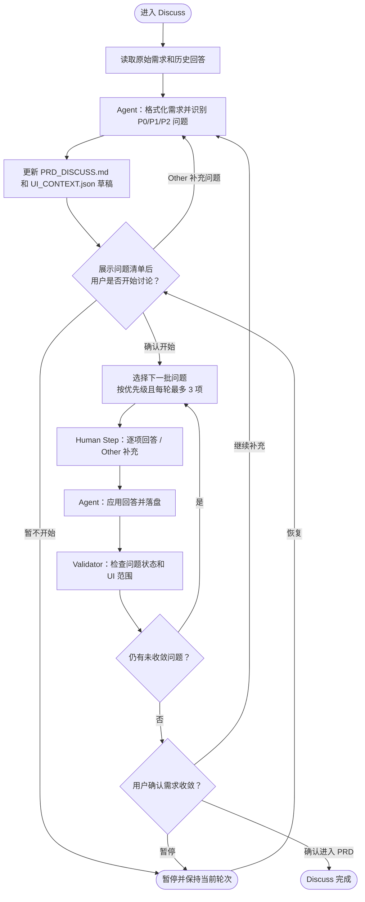

Discuss 的每一轮都必须使用稳定的 `decisionKey`，例如：

```text
biz.discuss/r1/question-list
biz.discuss/r1/issues/batch-001
biz.discuss/r2/issues/batch-002
biz.discuss/convergence/r3
```

这样恢复 Workflow 时可以重放已有答案，而不会重新向用户提出同一个问题。

### 5.2 PRD 待定项裁决


PRD 阶段不得使用自动默认答案。用户没有明确裁决时，Workflow 保持 `WAITING_USER`，不能把待确认内容包装为正式需求。

## 6. Plan 与动态节点子流程

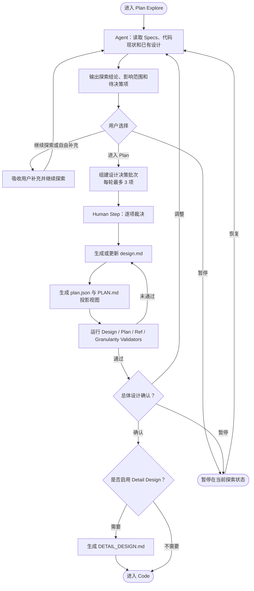

## 7. Code 并行与批次执行流程

Code 阶段遵循 `plan.json` 的执行契约：Batch 以真实 `deps` 构成 DAG，所有无未完成依赖的 Batch 在隔离 workspace 中并行；依赖 Batch 合并完成后重新调度下游 Batch。Batch 内 Task 按 DAG 和 Task Runner 约束执行。

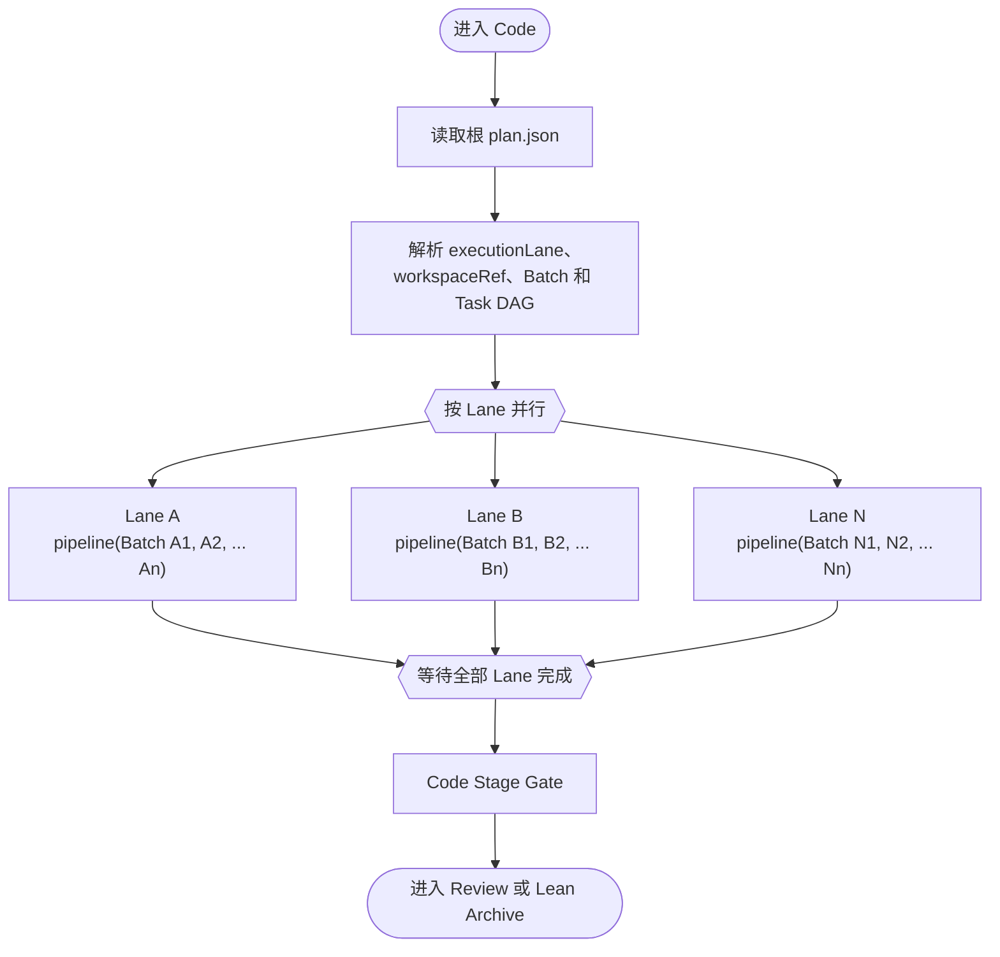

每个 Lane 中的 Batch 使用下面的统一子流程：

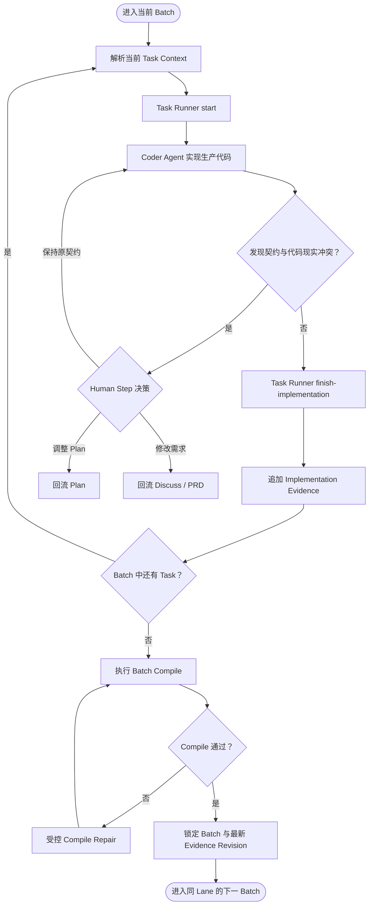

并行执行需要满足：

- 不同 Lane 具有不同 `workspaceRef` 或明确的文件所有权。
- 同一个 workspace 内有文件交集的 Task 不得并行写入。
- 每个 Activity 的输入只包含当前 Task、当前 Batch 摘要和解析后的 Artifact 引用。
- 后续 Batch 的完整 Task 契约不提前注入当前 Agent 上下文。
- Workflow 不直接编辑 `plan.json`、Task Run 或 Evidence 文件，必须调用对应 writer/runner。

## 8. Review、测试、Verify 与修复回流

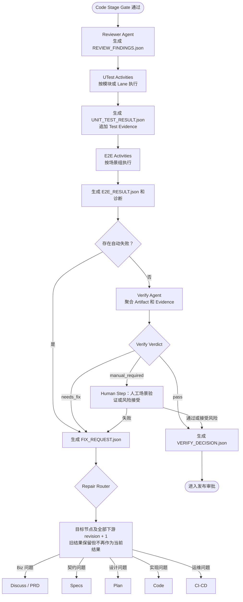

### 8.1 Revision 规则

Dynamic Workflow 的步骤结果不能只使用阶段名作为缓存键，否则修复后可能重放旧结果。建议统一使用：

```text
stepKey = featureId / iteration / stageId / stageRevision / localStepId / attempt
```

示例：

```text
login-v2/1/dev.code/r1/B001/T003/attempt-1
login-v2/1/dev.verify/r1/aggregate/attempt-1
login-v2/1/dev.code/r2/B001/T003/attempt-1
login-v2/1/dev.verify/r2/aggregate/attempt-1
```

回流到 `dev.plan` 时，需要增加 `dev.plan` 以及 Code、Review、UTest、E2E、Verify 的 revision；回流到 `dev.code` 时，只增加 Code 及其下游 revision。

## 9. Human Step 挂起与恢复时序

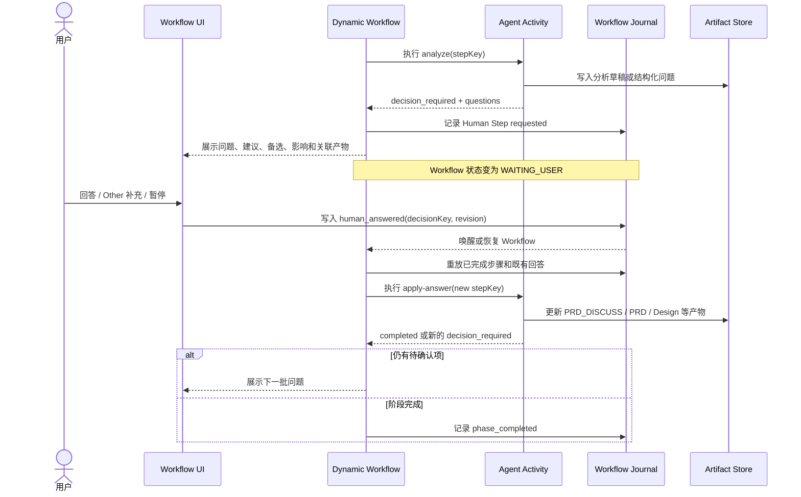

### 9.1 Human Step 类型

| 类型                  | 典型场景                      | 可选结果                   | 超时行为               |
| --------------------- | ----------------------------- | -------------------------- | ---------------------- |
| Clarification         | Discuss 问题、PRD 待定项      | 明确结论、Other、暂停      | 保持等待               |
| Decision              | 进入 Plan、启用 Detail Design | 分支选项、暂停             | 保持等待               |
| Approval              | PRD、总体设计、发布审批       | 通过、退回、暂停           | 保持等待               |
| Material              | 原型、HTML、链接、环境信息    | 提交材料、声明不适用、暂停 | 保持等待               |
| Risk Acceptance       | 手工验证、不可自动验证场景    | 通过、接受风险、失败       | 保持等待               |
| External Confirmation | CI/CD 是否真正完成            | 已完成、继续等待、重跑     | 保持等待或 Signal 唤醒 |

严禁对需求范围、正式 PRD、设计决策、风险接受和发布审批设置“超时后自动同意”。

## 10. Dynamic Workflow 代码骨架

```ts
export default workflow(
  {
    id: "autobiz",
    version: "1.0.0",
    maxFixReflows: 3,
    maxTotalSteps: 120,
  },
  async (ctx) => {
    const input = await ctx.initializeFeature();

    if (input.template === "lean") {
      await runSpecs(ctx, { mode: "lean" });
      await runCode(ctx);
      await runArchive(ctx);
      return ctx.complete();
    }

    let cursor: StageId = "biz.discuss";

    while (true) {
      const result = await runFrom(ctx, cursor, {
        biz: async () => {
          await runDiscuss(ctx);
          await runPrd(ctx);
        },
        dev: async () => {
          await runSpecs(ctx);
          await runPlan(ctx);
          await runOptionalDetailDesign(ctx);
          await runCode(ctx);
          await runReview(ctx);
          await runUnitTest(ctx);
          await runE2E(ctx);
          return runVerify(ctx);
        },
        ops: async () => {
          await runReleaseApproval(ctx);
          await runCicd(ctx);
          await runArchive(ctx);
        },
      });

      if (result.outcome === "completed") return ctx.complete();

      if (result.outcome === "needs_fix") {
        cursor = result.suggestedStage;
        await ctx.invalidateFrom(cursor, {
          fixRequest: result.fixRequest,
          incrementRevision: true,
        });
      }
    }
  },
);
```

## 11. Activity 与 Human Step 契约

### 11.1 Agent Activity 输入

```ts
interface ActivityRequest {
  workflowRunId: string;
  featureId: string;
  iteration: number;
  stageId: string;
  stageRevision: number;
  stepKey: string;
  workspaceRefs: string[];
  inputArtifacts: ArtifactRef[];
  previousDecisions: DecisionRef[];
  fixRequest?: ArtifactRef;
}
```

### 11.2 Agent Activity 输出

```ts
interface ActivityResult {
  outcome:
    | "completed"
    | "decision_required"
    | "waiting_external"
    | "needs_fix"
    | "blocked"
    | "failed";

  artifacts: ArtifactRef[];
  evidenceIds: string[];
  decisionRequest?: HumanStepRequest;
  externalSignal?: ExternalSignalRequest;
  suggestedRepairStage?: StageId;
  fixRequest?: ArtifactRef;
  diagnostics?: Diagnostic[];
}
```

Activity 可以建议修复阶段，但 Workflow 必须校验该目标是否属于允许的回流集合，不能允许 Agent 任意跳转。

### 11.3 Human Step

```ts
interface HumanStepRequest {
  decisionKey: string;
  type:
    | "clarification"
    | "decision"
    | "approval"
    | "material"
    | "risk_acceptance"
    | "external_confirmation";
  title: string;
  questions: Question[];
  contextArtifacts: ArtifactRef[];
  blocking: true;
  resolutionPolicy: "require_explicit" | "timeout_to_pause";
  expectedStageRevision: number;
  decisionRevision: number;
  reminderPolicy?: ReminderPolicy;
}
```

用户提交答案时必须回传 `decisionKey`、`expectedStageRevision` 和 `expectedDecisionRevision`。同一答案重复提交时返回第一次处理结果；Human Step 已被回流替换时拒绝过期答案。

## 12. 阶段映射表

| Workflow Phase      | Activity/Skill                              | 主要产物                                       | 用户交互                              | 完成条件                                |
| ------------------- | ------------------------------------------- | ---------------------------------------------- | ------------------------------------- | --------------------------------------- |
| `biz.discuss`       | `autobiz-requirement-discuss` 拆分 Activity | `PRD_DISCUSS.md`、`UI_CONTEXT.json`            | 问题清单、逐项澄清、UI 范围、收敛确认 | 问题处理完成且用户确认收敛              |
| `biz.prd`           | `autobiz-prd-generate` 拆分 Activity        | `PRD.md`、`UI_CONTEXT.json`                    | 待定项裁决、PRD 审批                  | 无 TBD/待确认且 validator 通过          |
| `dev.specs`         | `autodev-specs`                             | `proposal.md`、`specs/**/*.md`                 | 仅契约冲突时确认                      | Specs 与 UI Context gate 通过           |
| `dev.plan`          | `autodev-plan` 拆分 Activity                | `design.md`、`plan.json`、`PLAN.md`            | 探索决策、设计裁决、总体设计确认      | Plan 全部 validator 通过且设计确认      |
| `dev.detail_design` | `autodev-detail-design`                     | `DETAIL_DESIGN.md`                             | 是否启用动态节点                      | 产物校验通过或明确跳过                  |
| `dev.code`          | `autodev-code` + Task Runner                | `EVIDENCE.jsonl`、探索缓存、业务代码           | 仅 scope/契约变化时确认               | 所有 Batch compile 通过且 evidence 完整 |
| `dev.review`        | `autodev-reviewer`                          | `REQUIREMENTS_EVAL.md`、`REVIEW_FINDINGS.json` | 默认无                                | Review Findings 合法                    |
| `dev.utest`         | `autodev-utest`                             | `UNIT_TEST_RESULT.json`、报告和日志            | 默认无                                | 测试结果与 evidence 合法                |
| `dev.e2e`           | `autodev-e2e`                               | `E2E_RESULT.json`、Cases、诊断、Fix Request    | 缺环境或人工场景时确认                | 结果合法，失败时 Fix Request 合法       |
| `dev.verify`        | `autodev-verify`                            | `VERIFY_DECISION.json`、`FIX_REQUEST.json`     | 人工验证、风险接受                    | pass 或合法 needs_fix                   |
| `ops.cicd`          | `autoops-cicd`                              | `CICD_CHECKLIST.md`、`PR_BODY.md`              | 发布审批、完成确认、是否重跑          | 用户确认完成或失败回流                  |
| `ops.archive`       | `autoops-archive`                           | 归档目录和状态                                 | 默认无                                | 归档完整且状态投影成功                  |

## 13. Skill 改造原则

### 13.1 交互型 Skill 拆分

现有交互型 Skill 建议拆成三类 Activity：

```text
analyze      读取事实并返回问题或决策请求
apply        应用用户回答并更新 Artifact
finalize     生成正式产物并执行 Stage Gate
```

示例：

```text
autobiz-requirement-discuss
  -> discuss.analyze
  -> discuss.applyAnswers
  -> discuss.finalize

autobiz-prd-generate
  -> prd.collectUnresolved
  -> prd.applyDecisions
  -> prd.generateAndValidate

autodev-plan
  -> plan.explore
  -> plan.applyDecisions
  -> plan.generateDesign
  -> plan.generateTaskGraph
```

### 13.2 非交互型 Skill 适配

Specs、Detail Design、Review、UTest、E2E、Verify、Archive 可以先保留完整 Skill，由 Activity Adapter 调用。后续再按并行粒度拆成更小 Activity。

### 13.3 路由职责迁移

Skill 内以下职责逐步迁移到 Dynamic Workflow：

- 读取 checkpoint 决定调用哪个 Skill。
- 直接调用 `request_user_input`。
- 写入完成 checkpoint 后提示下一阶段。
- 根据自然语言报告决定修复目标。

Skill 继续保留：

- Artifact 的领域生成逻辑。
- Writer、Runner、Validator 和 Stage Gate 调用。
- 结构化 Evidence 写入。
- 当前阶段内可恢复的实现和自动修复逻辑。

## 14. Workflow 状态模型

```text
WorkflowRun:
  CREATED
  RUNNING
  WAITING_USER
  WAITING_SIGNAL
  PAUSED
  COMPLETED
  FAILED
  CANCELLED

PhaseRun / ActivityRun:
  PENDING
  READY
  RUNNING
  WAITING_USER
  WAITING_SIGNAL
  SUCCEEDED
  FAILED
  INVALIDATED
  SKIPPED
  CANCELLED
```

`INVALIDATED` 不等于删除。旧结果、旧 Artifact hash 和旧 Evidence 仍然保留用于审计，但不能继续满足当前 revision 的 Stage Gate。

## 15. 重放与幂等规则

Dynamic Workflow 可以在恢复时从主函数开头重放，但必须遵守以下规则：

1. 所有 `agent()`、`human()`、`signal.wait()`、`artifact.write()` 调用都必须有稳定 `stepKey`。
2. 已完成的 step 直接从 Journal 返回结果，不重复调用 Agent 或工具。
3. Human Step 使用 `decisionKey + expectedRevision` 防止重复提交和过期回答。
4. 外部 Signal 使用 `signalName + idempotencyKey` 防止 CI/CD 重复回调。
5. Workflow 脚本不得直接使用未记录的时间、随机数或文件内容做分支判断。
6. 需要参与分支的外部值必须先通过 Journal 化的 `ctx.value()` 或 Activity 获取。
7. 所有有副作用的 writer、runner 和命令必须支持幂等键或执行前状态检查。

## 16. 分阶段落地计划

### 阶段一：Workflow 骨架与协议

- 建立 `autobiz.workflow.ts` 主流程。
- 定义 Activity、Human Step、Signal、Artifact、Revision 协议。
- 将 `board_config.json` 中的节点、Artifact、Validator 元数据提供给 Workflow 使用。
- 让 `state.json` 成为 Workflow 状态投影。

### 阶段二：Biz 交互闭环

- 接入 Discuss 问题清单、多轮问题和 UI 范围确认。
- 接入 PRD 待定项裁决和正式稿审批。
- 验证关闭应用、隔日恢复、重复回答和问题追加等场景。

### 阶段三：Plan 与动态分支

- 接入 Explore 自由对话和“继续探索/进入 Plan/暂停”。
- 接入设计决策批次、总体设计审批和 Detail Design 选择。
- 接入 Plan 全部 Validator。

### 阶段四：Code 并行执行

- 将 Lane 映射为 `parallel`，将 Lane 内 Batch 映射为 `pipeline`。
- 接入 Task Runner、Batch Compile、Evidence 和契约冲突 Human Step。
- 完成 workspace ownership、写冲突和上下文裁剪控制。

### 阶段五：测试、Verify 与回流

- 接入 Review、UTest、E2E、Verify。
- 统一生成和解析 `FIX_REQUEST.json`。
- 实现 `invalidateFrom()` 与下游 revision 递增。

### 阶段六：Ops 与正式切换

- 接入发布审批、CI/CD Signal、人工完成确认和 Archive。
- Dynamic Workflow 成为唯一控制流来源。
- checkpoint 路由器降级为兼容接口，最终视使用情况移除。

## 17. 验收场景

上线前至少覆盖以下端到端测试：

1. Discuss 提问后关闭应用，重新打开仍显示相同问题和上下文。
2. 用户重复提交同一个回答，Workflow 只推进一次。
3. Discuss 回答后仍有问题，继续当前节点而不是提前进入 PRD。
4. PRD 存在 TBD 时不能生成正式通过结果。
5. Plan 用户自由补充内容后继续探索，不机械重复同一个选择题。
6. Detail Design 选择在恢复后保持一致，不重复询问。
7. 两个 Lane 并行执行，但同 workspace 文件冲突会被阻止。
8. Code 契约冲突选择“调整 Plan”后，Code 及下游旧结果失效。
9. E2E 失败回流 Code 后，重新执行的阶段使用新 revision。
10. Verify 同时存在自动失败和人工项时，优先进入自动失败修复路径。
11. CI/CD 重复回调不会重复推进或重复归档。
12. Workflow 定义升级后，运行中的 Feature 继续使用启动时固定的版本。
13. 精简模板只执行其声明节点，同时仍满足 Code 和 Archive 的必要 Gate。
14. 达到最大修复次数或最大总步骤数后暂停并请求人工处置。

## 18. 错误处理与容错

### 18.1 重试策略

| 组件            | 错误类型                                   | 处理策略                                                | 重试预算                                 | 最终状态                                  |
| --------------- | ------------------------------------------ | ------------------------------------------------------- | ---------------------------------------- | ----------------------------------------- |
| Agent Activity  | 网络超时、连接中断、429、502/503           | 指数退避并加入抖动                                      | 使用 `maxErrorRetries`，当前建议初值为 2 | 超限后 `PAUSED`，保留诊断和恢复入口       |
| Agent Activity  | 400/401/403、Schema 不兼容、确定性参数错误 | 不自动重试                                              | 0                                        | `PAUSED`，由平台或配置修复后重试          |
| Agent Activity  | 产物不满足契约                             | 先做阶段内受控修复；只有缺少业务决策时才创建 Human Step | 使用阶段修复预算                         | 仍失败则 `needs_fix` 或 `PAUSED`          |
| Validator       | 进程超时或异常退出                         | 按平台故障重试                                          | 独立的小预算                             | 超限后 `PAUSED`，不得伪造业务 Fix Request |
| External Signal | 未收到回调                                 | 保持订阅并按策略提醒或轮询                              | 不计为 Activity 重试                     | `WAITING_SIGNAL`                          |
| Workflow 脚本   | 未捕获异常、不变量破坏                     | 不自动重放有副作用的步骤                                | 0                                        | 当前 Activity `FAILED`，Workflow `PAUSED` |

重试预算必须来自 Workflow Policy；第一版可映射现有 [board_config.json](../board_core/board_config.json) 的 `maxErrorRetries=2`、`maxFixReflows=3` 和 `maxTotalSteps=120`，不能在不同 Activity 中散落硬编码次数。

### 18.2 降级策略

```ts
interface DegradationPolicy {
  e2eUnavailable: "block_until_ready" | "manual_verification";
  cicdTimeout: "continue_waiting" | "request_explicit_confirmation";
  validatorUnavailable: "pause_as_platform_error";
}
```

具体规则：

- **E2E 环境不可用**：默认阻断；只有场景被契约明确标记为可人工验证时，才能转为 `manual_verification`。用户的风险接受必须进入 `VERIFY_DECISION.json`，不能用“跳过并警告”冒充测试通过。
- **CI/CD 长时间无响应**：在达到该流水线配置的预期时长后创建 Human Step，允许继续等待、重新查询或显式确认完成；不得超时自动完成。
- **Validator 不可用**：这是平台故障，不是产品缺陷。重试耗尽后暂停并通知平台维护，不能生成指向 Biz/Dev 的 `FIX_REQUEST.json`，也不能跳过必需 Gate。

### 18.3 非预期异常处理

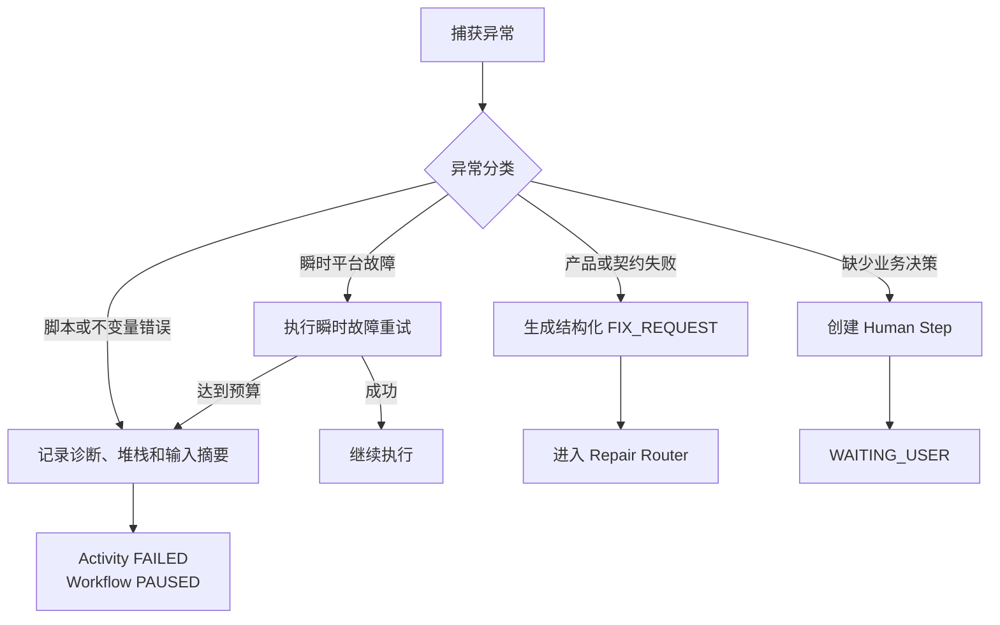

用户恢复选项：

1. **重新执行当前步骤**：保留失败记录，使用新 attempt 和新幂等键重新调用。
2. **跳过当前步骤**：仅在非关键步骤（如可选的静态分析）中允许。
3. **回流到上游阶段**：必须先生成或补齐合法 `FIX_REQUEST.json`，再由 Repair Router 校验目标。
4. **取消整个 Workflow**。

## 19. 并发控制与资源限制

### 19.1 并发限制

| 维度                   | 最终策略                                                              | 超限行为                                        |
| ---------------------- | --------------------------------------------------------------------- | ----------------------------------------------- |
| 最大并行 Lane          | `min(policy.maxParallelLanes, scheduler.availableSlots)`              | 排队等待，不降低正确性 Gate                     |
| 单 workspace 可写 Task | 默认 1；只读 Activity 可按 DAG 并行                                   | 写任务串行或切换到隔离 workspace                |
| 单 Feature 总步骤      | 使用 `maxTotalSteps`，当前建议初值为 120                              | `PAUSED` 并请求人工处置                         |
| 修复回流次数           | 使用 `maxFixReflows`，当前建议初值为 3                                | `PAUSED` 并输出 revision 历史                   |
| Activity 上下文        | 不超过模型窗口和 Workflow Context Policy 的较小值；当前策略阈值为 90% | 裁剪、摘要或拆分 Activity，禁止静默丢弃必需引用 |
| Journal 存储           | 不按固定文件大小截断；使用快照、索引和归档策略                        | 保留恢复与审计所需事件                          |

### 19.2 Workspace 锁机制

Code 阶段并行执行的前提是不同 Lane 不会产生文件写冲突：

```ts
interface WorkspaceOwnership {
  laneId: string;
  workspaceRef: string;
  ownedPaths: string[]; // 该 Lane 可写的文件路径前缀
  readOnlyPaths: string[]; // 只读依赖
}
```

**冲突检测规则**：

1. 两个 Lane 的 `ownedPaths` 存在交集时，不能在同一个 workspace 并行写；使用隔离 workspace 也必须在 Join 阶段检测合并冲突。
2. 一个 Lane 的写集合与另一个 Lane 的读集合相交时，必须由 Task DAG 指定先后关系，或让读取方绑定不可变基线 revision；不能仅凭路径推断顺序。
3. 不同 `workspaceRef` 只能消除运行时文件覆盖，不能消除后续合并、接口和数据库契约冲突。
4. 共享环境、端口、数据库、测试账号等非文件资源也必须声明资源锁。

**锁实现**：

- Workflow 启动 Lane 前，向锁管理器申请 `ownedPaths` 的写锁。
- 申请失败时，Lane 进入 `PENDING` 状态，等待其他 Lane 释放锁。
- 锁记录 owner、lease、heartbeat 和基线 revision；失联后只能按 lease 过期协议回收，不能直接强制释放活动锁。
- Lane 的所有 Batch 完成后释放执行锁；所有并行结果在 Join 阶段执行合并、编译和契约校验，通过后才允许进入 Code Stage Gate。

### 19.3 长时间运行的内存管理

Workflow 可能运行数天甚至数周，需要控制内存占用：

- **Journal 原子持久化**：每个 Activity 完成、Human Step 创建/回答、Signal 接收和状态迁移都必须先事务提交，再对外确认成功。
- **快照与压缩**：可按事件数或时间生成恢复快照，但快照只优化重放速度，不能替代审计事件。
- **Artifact 引用化**：Activity 输入使用 `ArtifactRef`（路径 + hash），不直接加载全部内容到内存。
- **老旧 revision 归档**：已失效产物可进入冷存储，但必须保留 hash、索引、引用关系和配置化保留期。

## 20. Revision 冲突与嵌套修复

### 20.1 多个 Fix Request 的优先级

当 Verify 阶段同时发现多个问题，且它们指向不同上游阶段时：

```json
{
  "fixRequests": [
    { "suggestedStage": "biz.prd", "reason": "需求定义的行为与实现不一致" },
    { "suggestedStage": "dev.plan", "reason": "设计遗漏了边界条件处理" },
    { "suggestedStage": "dev.code", "reason": "实现中存在逻辑错误" }
  ]
}
```

**处理规则**：

1. **优先回流最上游阶段**：`biz.prd` 优先于 `dev.plan` 优先于 `dev.code`。
2. **聚合失败事实**：本轮所有失败项、受影响的 spec/design/task/evidence 引用都进入同一个修复批次，不能只保留最上游问题。
3. **重新裁决覆盖**：用户不能直接忽略已证实的上游不一致；若用户认为需求或设计无误，必须通过 Human Step 明确裁决并更新对应事实后，由 Router 重新计算目标。
4. **独立问题并行**：只有目标 workspace 和 Artifact 所有权完全独立时，才允许拆成并行修复分支；Join 后仍需统一 Verify。

### 20.2 修复过程中的再次失败

场景：回流到 `dev.code/r2` 后，新的实现通过了原来的 E2E，但又触发了新的失败。

**规则**：

- 不复用旧步骤结果；根据新的 `FIX_REQUEST.json` 再次执行 Repair Router。目标仍为 Code 时递增为 `dev.code/r3`，目标变为 Plan 时则递增 Plan 及全部下游 revision。
- 每次递增计入修复计数器，达到 `maxFixReflows` 后停止自动回流。
- Workflow 进入 `PAUSED`，生成诊断报告，包含所有 revision 的修复历史和失败原因。

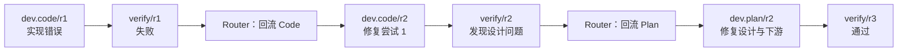

### 20.3 达到修复上限的处理

```ts
if (ctx.fixReflowCount >= maxFixReflows) {
  await ctx.pause({
    reason: "exceeded_max_reflows",
    diagnostic: {
      totalReflows: ctx.fixReflowCount,
      revisionHistory: ctx.getRevisionHistory(),
      lastFixRequest: ctx.lastFixRequest,
    },
    userOptions: [
      "increase_limit_and_retry",
      "manual_fix_then_resume",
      "cancel_feature",
    ],
  });
}
```

选择 `manual_fix_then_resume` 时，必须捕获人工修改 diff、绑定新的代码基线 hash、追加 Evidence，并重新执行目标阶段 Gate；不能直接把人工修改视为已经通过。

## 21. Human Step 超时与提醒

### 21.1 超时策略

以下时长是建议初值，最终由租户、项目或 Workflow Policy 配置。任何超时和自动暂停都只改变运行状态，不替用户作出业务决定。

| Human Step 类型               | 建议首次提醒             | 超时行为                                  |
| ----------------------------- | ------------------------ | ----------------------------------------- |
| Clarification                 | 7 天                     | 可在 14 天后转为 `PAUSED`，保留原问题     |
| Decision                      | 7 天                     | 可在 14 天后转为 `PAUSED`，保留原分支选择 |
| Approval (PRD/Design/Release) | 3 天                     | 持续等待，不自动批准                      |
| Material                      | 7 天                     | 持续等待；仅在契约允许时提供“不适用”选项  |
| Risk Acceptance               | 3 天                     | 持续等待，不自动接受风险                  |
| External Confirmation (CI/CD) | 流水线预期时长或配置 SLA | 转为显式人工确认或继续等待                |

### 21.2 提醒机制

```ts
interface ReminderPolicy {
  decisionKey: string;
  firstReminderAfter: Duration; // 首次提醒
  reminderInterval: Duration; // 后续提醒间隔
  autoSuspendAfter?: Duration; // 自动暂停时间
}
```

提醒内容包含：

- 当前等待的问题或决策
- Feature 和 Workflow 上下文
- 已等待时长
- 快速回答链接

### 21.3 过期回答检测

防止用户在旧版本 revision 中回答：

```ts
const task = ctx.humanStep(answer.decisionKey);

if (
  task.status !== "PENDING" ||
  answer.expectedStageRevision !== task.expectedStageRevision ||
  answer.expectedDecisionRevision !== task.decisionRevision
) {
  return {
    status: "rejected",
    reason: "Human Step 已解决、已替换或对应阶段已失效",
    suggestAction: "查看当前待办并回答最新问题",
  };
}
```

## 22. Workflow 版本管理

### 22.1 版本固定与兼容性

```ts
interface WorkflowRun {
  workflowDefinitionVersion: string; // 例如 "1.2.0"
  workflowDefinitionHash: string; // 代码内容的 SHA-256
  schemaVersion: string; // Journal/Artifact 契约版本
}
```

**固定规则**：

- Workflow Run 创建时记录当前 workflow 定义的版本号和 hash。
- 定义代码、依赖清单和 Schema 组成不可变 Definition Bundle，其保留期不得短于关联 Run 和审计数据的保留期。
- 恢复时按 hash 加载对应 Definition Bundle，并校验签名或内容 hash。
- 若 Bundle 损坏或暂时不可用，Run 进入 `PAUSED` 并从可信版本库恢复；不得要求用户重新创建 Feature 或丢失已有进度。

**兼容性判断**：

| 变更类型   | 示例                            | 处理方式                                               |
| ---------- | ------------------------------- | ------------------------------------------------------ |
| 向后兼容   | 新增可选 Activity、新增可选字段 | 新 Run 使用新版本；老 Run 继续固定旧 Bundle            |
| 破坏性变更 | 删除必需阶段、改变 stepKey 格式 | 必须提供显式迁移映射，不能原地热切换                   |
| 修复性变更 | 修复 bug、优化性能              | 默认只作用于新 Run；老 Run 经 dry-run 和人工确认后迁移 |

### 22.2 平滑升级策略

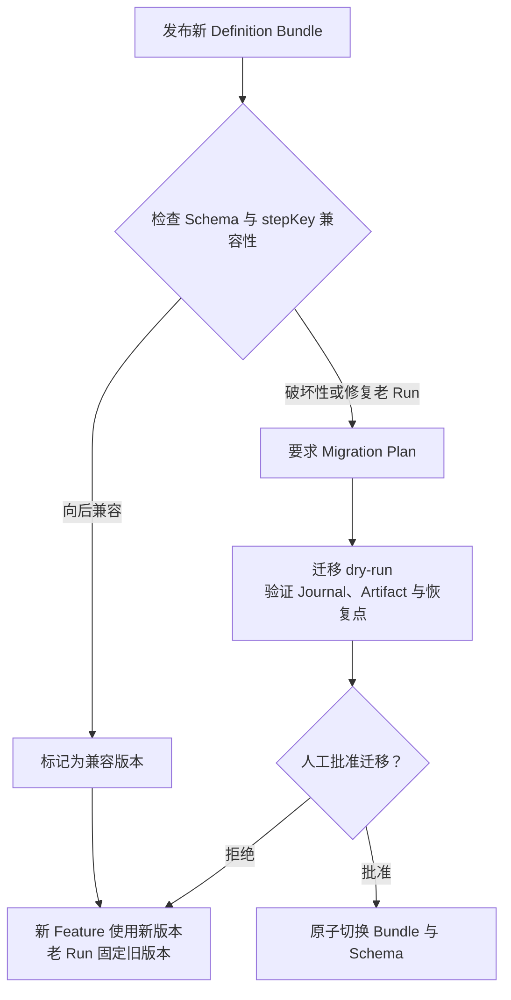

### 22.3 手动迁移工具

对于长时间运行的 Workflow（如暂停数周的 Feature），提供迁移工具：

```bash
autobiz workflow migrate \
  --feature-id login-v2 \
  --from-version 1.1.0 \
  --to-version 1.2.0 \
  --dry-run
```

迁移工具职责：

- 检查新旧版本的 stepKey 映射关系。
- 转换 Journal 格式（如有必要）。
- 验证迁移后 Workflow 可以正确恢复。
- 迁移前创建恢复快照，Bundle、Schema 和 Run 指针必须原子切换，失败时回滚到旧版本。

## 23. 监控与可观测性

### 23.1 关键指标

#### 执行指标

| 指标名                                 | 类型      | 维度                       | 说明                                         |
| -------------------------------------- | --------- | -------------------------- | -------------------------------------------- |
| `workflow.run.wall_duration`           | Histogram | `template`, `outcome`      | Run 总墙钟时间，包含等待                     |
| `workflow.run.active_duration`         | Histogram | `template`, `outcome`      | 扣除 Human/Signal/调度等待后的执行时间       |
| `workflow.stage.active_duration`       | Histogram | `stage_id`, `template`     | 各阶段实际执行耗时                           |
| `workflow.activity.duration`           | Histogram | `activity_name`, `outcome` | Activity 调用耗时                            |
| `workflow.activity.token_usage`        | Counter   | `activity_name`, `model`   | Agent 调用 Token 消耗                        |
| `workflow.fix_reflow.count`            | Counter   | `from_stage`, `to_stage`   | 修复回流次数统计                             |
| `workflow.revision.count`              | Histogram | `stage_id`                 | 各阶段 revision 递增次数                     |
| `workflow.run.last_progress_timestamp` | Gauge     | `state`, `template`        | 最近一次有效推进时间，用于识别真正卡住的 Run |

#### 等待指标

| 指标名                          | 类型      | 维度          | 说明                 |
| ------------------------------- | --------- | ------------- | -------------------- |
| `workflow.human_step.wait_time` | Histogram | `step_type`   | 用户响应等待时长     |
| `workflow.signal.wait_time`     | Histogram | `signal_type` | 外部 Signal 等待时长 |
| `workflow.state.count`          | Gauge     | `state`       | 各状态 Workflow 数量 |

#### 成本指标

| 指标名                   | 类型    | 维度                          | 说明                                |
| ------------------------ | ------- | ----------------------------- | ----------------------------------- |
| `workflow.cost.total`    | Counter | `tenant`, `project`, `model`  | 聚合成本，避免 Feature 级高基数标签 |
| `workflow.cost.by_stage` | Counter | `tenant`, `stage_id`, `model` | 各阶段成本分布                      |

单个 Feature 的成本、Token、用户和 decisionKey 等高基数信息进入审计事件或查询存储，不作为时序指标标签。

### 23.2 告警规则

| 告警                      | 判断依据                                                              | 处理动作                                                              |
| ------------------------- | --------------------------------------------------------------------- | --------------------------------------------------------------------- |
| WorkflowStuck             | 状态为 `RUNNING`，且 `last_progress_timestamp` 超过阶段策略阈值未更新 | 检查 Activity、锁、心跳和 Journal，不把正常 `WAITING_USER` 误报为卡住 |
| ExcessiveReflows          | 单个 Run 的 `fixReflowCount` 接近 `maxFixReflows`                     | 提前展示 revision 历史并通知负责人                                    |
| HighTokenUsage            | 租户或项目窗口内 Token/成本接近配额                                   | 降低并发、暂停新的 Activity 或申请提额                                |
| ActivityContinuousFailure | 同一 Activity 类型在多个 Run 中连续出现相同平台错误                   | 熔断该 Activity 版本并通知维护人员                                    |
| LongWaitingUser           | Human Step 超过 Reminder Policy 阈值                                  | 发送提醒或转 `PAUSED`，不自动回答                                     |

### 23.3 可观测性工具

#### 实时 Dashboard

```text
AutoBiz Workflow Dashboard
├── 运行中 Workflow 总数
├── 各状态分布（RUNNING / WAITING_USER / WAITING_SIGNAL / PAUSED）
├── 各阶段平均耗时（P50 / P95）
├── 当日 Token 消耗与成本
└── 修复回流热力图（from_stage × to_stage）
```

#### Workflow 时间线视图

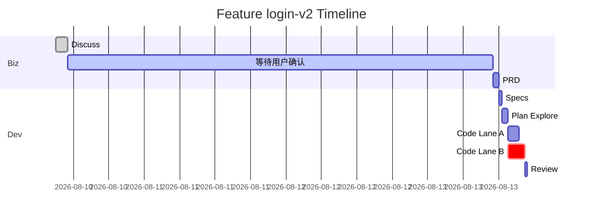

#### 修复回流追踪

展示每个 revision 的触发原因、修复内容和验证结果：

```text
Feature: login-v2 | Iteration: 1
├── dev.code/r1 [INVALIDATED]
│   ├── 实现时间: 2026-08-12 10:30
│   ├── 失败原因: E2E 场景“忘记密码流程”失败
│   └── Fix Request: 实现遗漏了邮件发送逻辑
├── dev.code/r2 [INVALIDATED]
│   ├── 实现时间: 2026-08-12 14:20
│   ├── 失败原因: 新引入的依赖导致编译错误
│   └── Fix Request: 修复 import 路径
└── dev.code/r3 [SUCCEEDED]
    ├── 实现时间: 2026-08-12 15:10
    └── 验证结果: 全部测试通过
```

### 23.4 审计日志

记录所有关键决策和状态变更：

```jsonl
{"ts":"2026-08-12T10:00:00Z","event":"workflow.created","featureId":"login-v2","template":"standard","user":"alice"}
{"ts":"2026-08-12T10:30:00Z","event":"stage.completed","stageId":"biz.discuss","revision":1}
{"ts":"2026-08-12T10:31:00Z","event":"human_step.requested","decisionKey":"biz.prd/tbd-001","type":"clarification"}
{"ts":"2026-08-12T14:20:00Z","event":"human_step.answered","decisionKey":"biz.prd/tbd-001","answeredBy":"alice"}
{"ts":"2026-08-12T16:00:00Z","event":"fix_reflow.triggered","fromStage":"dev.verify","toStage":"dev.code","reason":"E2E failure"}
{"ts":"2026-08-12T16:00:01Z","event":"revision.incremented","stageId":"dev.code","fromRevision":1,"toRevision":2}
```

## 24. 成本管理

### 24.1 成本估算

Workflow 启动前只能基于模板、代码规模和历史分布提供低置信度区间；Plan 生成后再根据 Lane、Batch、Task、模型和验证命令更新为高置信度估算。

```ts
interface CostEstimate {
  confidence: "low" | "medium" | "high";
  totalTokens: { min: number; max: number; p50?: number };
  totalCost: { min: number; max: number; p50?: number; currency: string };
  pricingVersion: string;
  breakdown: {
    stageId: string;
    model: string;
    tokens: number;
    cost: number;
  }[];
  assumptions: string[]; // 例如 "尚未生成 Plan，暂按同类 Feature 分布估算"
}
```

**估算方法**：

- 基于历史同类型 Feature 的实际消耗。
- 考虑 `plan.json` 的 Task 数量、代码规模和模板类型。
- 修复回流使用历史分位数建模；没有足够样本时展示“不含回流”和“达到最大回流预算”两个边界，不假设固定平均次数。

### 24.2 配额限制

```ts
interface QuotaPolicy {
  maxConcurrentWorkflows: number; // 单用户或租户最大并行数
  maxTokensPerDay: number; // 单日最大 Token 消耗
  maxTokensPerFeature: number; // 单个 Feature 最大消耗
  alertThreshold: number; // 达到配额的百分比时告警
}
```

**超限行为**：

- 达到 `alertThreshold`（如 80%）时发送通知。
- 达到硬限制时，在下一个 Activity 开始前将 Run 转为 `PAUSED` 或排队；不得中断正在提交 Artifact/Evidence 的原子步骤。
- 用户可以申请临时提额或升级配额。

### 24.3 成本归因

以下仅展示归因报告结构，金额不是预算或性能承诺：

```text
Feature: login-v2 | Total Cost: $12.34

阶段成本分布:
├── Biz (Discuss + PRD):        $1.20 (9.7%)
├── Dev.Specs:                  $0.80 (6.5%)
├── Dev.Plan:                   $2.10 (17.0%)
├── Dev.Code:                   $5.40 (43.8%)  ← 最高
├── Dev.Review:                 $0.60 (4.9%)
├── Dev.UTest:                  $1.10 (8.9%)
├── Dev.E2E:                    $0.80 (6.5%)
└── Dev.Verify:                 $0.34 (2.8%)

修复回流额外成本: $2.10 (17.0% of total，已包含在阶段成本中)
```

帮助用户识别成本优化机会（如 Code 阶段 Task 粒度过细导致上下文重复加载）。

## 25. 测试策略

### 25.1 单元测试

每个 Agent Activity 独立测试：

```ts
describe("DiscussAnalyzeActivity", () => {
  it("extracts prioritized questions with stable ids", async () => {
    const input = {
      featureId: "test-001",
      artifacts: [mockArtifact("RAW_REQUIREMENT.md")],
    };
    const result = await discussAnalyze.execute(input);
    expect(result.outcome).toBe("decision_required");
    expect(result.decisionRequest.questions.length).toBeLessThanOrEqual(3);
    expect(result.decisionRequest.questions.every((q) => q.id)).toBe(true);
  });
});
```

**Mock 策略**：

- Artifact 使用预定义样本文件。
- Agent 调用使用 Mock LLM 返回固定响应。
- Validator 使用真实实现。

### 25.2 集成测试

端到端测试完整 Subworkflow：

```ts
describe("Biz Subworkflow", () => {
  it("completes Discuss and PRD with explicit fixture answers", async () => {
    const ctx = createTestWorkflowContext({
      humanAnswers: {
        "biz.discuss/r1/batch-001": mockAnswers,
        "biz.prd/tbd-001": mockDecisions,
      },
    });

    await runBizSubworkflow(ctx);

    expect(ctx.artifacts["PRD.md"]).toBeDefined();
    expect(ctx.stage("biz.prd").status).toBe("SUCCEEDED");
  });
});
```

**Human Step Fixture 回答**：

- 测试模式下，所有 Human Step 从预设字典中读取答案。
- 若答案缺失，测试失败并提示需要补充。

### 25.3 Dry Run 模式

用户可以启动 Dry Run 预览 Workflow 行为：

```bash
autobiz workflow start \
  --feature-id login-v2 \
  --dry-run \
  --answer-fixture ./tests/fixtures/login-v2-answers.json
```

**Dry Run 行为**：

- 不写入真实代码文件，所有修改在内存或临时目录中。
- 不调用真实 CI/CD 或外部系统。
- 生成 Workflow 执行报告和成本估算。
- Human Step 只能读取显式 fixture，并在报告中标记为 `synthetic_answer`。
- fixture 缺少严格 Gate 的答案时，将该 Gate 标记为 `UNRESOLVED`；不得用推荐项自动通过。

### 25.4 Workflow 回归测试

使用历史成功的 Feature 作为回归测试基准：

```bash
autobiz test regression \
  --baseline ./tests/baselines/login-v2.jsonl \
  --compare-journal \
  --compare-artifacts
```

验证 Workflow 定义升级后，相同输入是否产生相同阶段序列和产物结构（具体内容可能因模型随机性略有差异）。

## 26. 术语表

| 术语             | 定义                                      | 示例                                          |
| ---------------- | ----------------------------------------- | --------------------------------------------- |
| **Feature**      | 一个完整的业务需求或功能点                | `login-v2`                                    |
| **Iteration**    | Feature 的迭代次数，从 1 开始递增         | `1`, `2`                                      |
| **Workflow Run** | 一个 Feature 的一次完整 Workflow 执行实例 | `login-v2/iteration-1`                        |
| **Stage**        | Workflow 中的一个主要阶段                 | `biz.discuss`, `dev.code`, `ops.cicd`         |
| **Revision**     | 同一 Stage 因修复回流而递增的版本号       | `dev.code/r1`, `dev.code/r2`                  |
| **Activity**     | 执行具体任务的原子单元，通常由 Agent 完成 | `discuss.analyze`, `code.implement`           |
| **stepKey**      | Activity 或步骤的全局唯一标识             | `login-v2/1/dev.code/r2/B001/T003`            |
| **decisionKey**  | Human Step 的稳定标识，用于防止重复提问   | `biz.discuss/r1/batch-001`                    |
| **Artifact**     | 阶段产生的结构化产物                      | `PRD.md`, `plan.json`, `VERIFY_DECISION.json` |
| **Evidence**     | 记录执行事实的 append-only 日志           | `EVIDENCE.jsonl` 中的实现记录                 |
| **Journal**      | Workflow 执行历史的持久化记录             | 步骤结果、用户回答、Signal                    |
| **Human Step**   | 需要用户参与的决策或确认点                | Discuss 问题、PRD 审批、风险接受              |
| **Signal**       | 外部系统的异步回调通知                    | CI/CD 完成通知                                |
| **Fix Request**  | 验证失败后生成的结构化修复建议            | 指向目标 Stage 和失败原因                     |
| **Lane**         | Code 阶段的并行执行单元                   | `frontend-lane`, `backend-lane`               |
| **Batch**        | 按真实依赖 DAG 调度的任务批次               | `B001`, `B002`                                |
| **Task**         | 最小执行单元，对应一个具体的代码实现目标  | `T003: 实现登录表单组件`                      |
| **Validator**    | 校验 Artifact 或 Stage 完成条件的检查器   | `PrdValidator`, `PlanGranularityValidator`    |
| **Template**     | Workflow 的预定义模式                     | `standard`, `lean`                            |

## 27. 故障排查指南

### 27.1 Workflow 卡住不推进

**症状**：状态为 `RUNNING` 但长时间无进展。

**诊断步骤**：

1. 查看 Journal 最后一条记录的时间戳和内容。
2. 检查是否有 Activity 在重试（查看重试计数器）。
3. 检查是否等待 Signal 但未收到回调（查看 Signal 注册状态）。
4. 检查 workspace 锁状态（是否有死锁）。

**常见原因与解决**：

| 原因                                | 解决方法                                                       |
| ----------------------------------- | -------------------------------------------------------------- |
| Agent Activity 超时但未正确记录失败 | 通过管理恢复接口补记失败事件，再以新 attempt 重试              |
| Signal 回调丢失                     | 查询外部系统事实；确认幂等键后补发 Signal 或转为显式人工确认   |
| Workspace 锁疑似失效                | 核对 owner heartbeat、lease 和进程状态，lease 合法过期后再回收 |
| Workflow 脚本进入无限循环           | 暂停相关 Definition 版本的新 Run，终止当前 Activity 并修复脚本 |

### 27.2 Human Step 回答未生效

**症状**：用户已回答问题，但 Workflow 未推进。

**诊断步骤**：

1. 检查回答的 `decisionKey` 和 `expectedRevision` 是否匹配当前状态。
2. 检查 Journal 是否记录了 `human_answered` 事件。
3. 检查 Workflow 是否在回答提交后被唤醒。

**常见原因与解决**：

| 原因                                  | 解决方法                       |
| ------------------------------------- | ------------------------------ |
| 回答对应的 revision 已过期            | 引导用户查看最新问题并重新回答 |
| 回答格式不符合预期（校验失败）        | 展示具体错误，要求用户修正     |
| Workflow 未正确从 `WAITING_USER` 唤醒 | 手动触发恢复                   |

### 27.3 修复回流后旧错误重现

**症状**：回流到某阶段修复后，之前已通过的测试又失败。

**诊断步骤**：

1. 比较新旧 revision 的 Artifact 差异。
2. 检查修复是否引入了新的变更。
3. 检查是否有其他并行修改（如手动编辑代码）。

**常见原因与解决**：

| 原因                         | 解决方法                                                         |
| ---------------------------- | ---------------------------------------------------------------- |
| 修复过度，改动了不相关部分   | 从上一 revision 创建新的修复 revision，不重写或删除历史 Evidence |
| 修复基于过期的上下文         | 确保 Activity 读取最新 Artifact                                  |
| 手动修改与 Workflow 修改冲突 | 合并冲突或回滚手动修改                                           |

### 27.4 成本超出预期

**症状**：Token 消耗或费用远高于估算。

**诊断步骤**：

1. 查看成本归因报告，定位高消耗阶段。
2. 检查修复回流次数是否异常。
3. 检查 Activity 上下文大小是否超标。

**常见原因与解决**：

| 原因                          | 解决方法                         |
| ----------------------------- | -------------------------------- |
| 频繁修复回流                  | 分析回流原因，优化上游阶段质量   |
| Activity 上下文未裁剪         | 配置上下文裁剪策略               |
| Task 粒度过细，重复加载上下文 | 合并小 Task 或优化 plan 生成逻辑 |

## 28. 迁移检查清单

从 checkpoint 系统迁移到 Dynamic Workflow 前的准备工作：

### 28.1 前置条件

- [ ] 所有正在运行的 Feature 已完成或暂停到稳定状态。
- [ ] Workflow 定义代码通过全部单元测试和集成测试。
- [ ] 端到端测试矩阵已覆盖 standard、lean、Human Step 恢复、修复回流和 CI/CD Signal。
- [ ] 监控和告警系统已就绪。

### 28.2 兼容性检查

- [ ] 所有 Artifact 格式保持向后兼容。
- [ ] Validator 签名保持兼容，或已提供版本化 Adapter。
- [ ] Task Runner 接口保持兼容，或已提供版本化 Adapter。
- [ ] Evidence 格式保持兼容，或迁移器已经过完整性验证。

### 28.3 迁移步骤

1. **灰度发布**：
    - [ ] 新 Feature 使用 Dynamic Workflow，老 Feature 继续使用 checkpoint。
    - [ ] 按验收场景和质量指标对比两套系统；达到预设样本量、成功率和恢复正确性后才能进入全量阶段。

2. **全量切换**：
    - [ ] 停止接受新的 checkpoint Feature。
    - [ ] 将 checkpoint 路由器标记为 deprecated。
    - [ ] 更新文档和示例。

3. **清理**：
    - [ ] 等待 checkpoint Feature 自然完成；确需迁移时必须逐个执行 dry-run、审批和可回滚迁移。
    - [ ] 归档 checkpoint 相关代码。
    - [ ] 确认看板、脚本和外部集成均不再消费 `state.json` 后，再评估删除兼容投影。

### 28.4 回滚方案

若 Dynamic Workflow 上线后出现严重问题：

- [ ] 停止新 Feature 进入故障 Definition 版本，并把新启动流量切回 checkpoint 系统。
- [ ] 已启动的 Dynamic Workflow Run 保持原 Journal 和 Artifact，不直接改写为 checkpoint Run。
- [ ] 能安全继续的 Run 固定旧 Definition Bundle 运行；不能继续的 Run 进入 `PAUSED` 等待修复或经过验证的迁移工具。
- [ ] 修复、回归验证后重新灰度发布。

## 29. 性能基准采集方案

当前仓库没有足以证明各阶段 P50/P95 和用户等待时长的历史样本，因此最终版不预设分钟级承诺。上线后按以下口径采集，达到统计样本门槛后再形成正式 SLO。

### 29.1 统一计时口径

| 时间类型             | 起止边界                          | 是否计入执行性能             |
| -------------------- | --------------------------------- | ---------------------------- |
| Activity 执行时间    | `activity.started` 到终态事件     | 是                           |
| Agent 服务等待       | 请求发出到模型响应完成            | 是，单独拆分                 |
| 本地命令执行         | 命令启动到退出                    | 是，按命令类型拆分           |
| Human Step 等待      | `human_step.requested` 到有效回答 | 否，计入业务等待指标         |
| External Signal 等待 | Signal 注册到有效回调             | 否，计入外部等待指标         |
| 排队时间             | Activity 进入 READY 到获得资源    | 否，单独作为调度指标         |
| 修复回流时间         | Fix Request 创建到重新 Verify     | 单独统计，不混入首次通过耗时 |

### 29.2 基准维度

至少按以下维度输出 standard 和 lean 的 P50/P95：

- Stage、Activity 类型、模型和 Workflow Definition 版本。
- Task、Batch、Lane 数量以及代码仓库规模。
- 首次通过或包含修复回流。
- 用户等待、外部等待、执行和排队时间。
- 成功、失败、暂停和取消结果。

### 29.3 基准形成规则

1. 先用 Dry Run 和受控压测验证上限、幂等与恢复正确性，不把 Mock Agent 耗时作为生产基准。
2. 灰度阶段采集真实执行样本，并过滤平台故障、人工长时间暂停等异常分类。
3. 样本量达到团队定义的统计门槛后发布 P50/P95；样本不足时只展示原始分布和置信度。
4. SLO 必须绑定 Definition 版本、模板和 Feature 规模，不给所有 Feature 使用同一个耗时承诺。

### 29.4 性能优化方向

- **Code 阶段慢**：检查 Task 粒度、Lane 隔离、合并 Gate 和上下文重复加载。
- **Plan 阶段慢**：检查代码探索范围和 Artifact 引用解析是否过宽。
- **排队时间长**：检查租户配额、模型并发和 workspace 锁竞争。
- **恢复时间长**：优化 Journal 快照与索引，但不删除重放和审计所需事件。

## 30. 汇报结论

本方案把 AutoBiz 从“多个 Skill 依赖 checkpoint 接力”升级为“一个可持久化、可重放、支持 Human-in-the-loop 的 Dynamic Workflow”。

最终控制关系为：

```text
Dynamic Workflow 决定何时执行、等待、并行、分支和回流
Agent Activity 决定当前步骤如何分析、生成和执行
Validator 决定阶段产物是否合格
用户决定需求、设计、风险和发布等业务问题
Artifact 与 Evidence 提供跨阶段可审计事实
```

第一阶段成功的判断标准不是“能够顺序调用所有 Skill”，而是：用户在 Discuss 中等待确认后中断会话，几天后恢复仍能从原问题继续；回答完成后 Workflow 正确进入下一批问题或下一阶段，并且已经完成的 Agent Activity 不会重复执行。
| 绕过阶段契约       |
| Agent Activity | 分析、生成、修改代码、测试、评审                   | 决定全局下一阶段   |
| Human Step     | 收集澄清、决策、审批、材料和风险接受               | 充当工具安全审批   |
| Validator      | 检查 Artifact、Evidence 和阶段完成条件             | 自动补全未确认事实 |
| Repair Router  | 根据结构化失败信息选择回流阶段                     | 直接修改失败产物   |

### 3.2 Dynamic Workflow 运行时原语

| 原语                                                          | 用途                                        | 持久化要求                                    |
| ------------------------------------------------------------- | ------------------------------------------- | --------------------------------------------- |
| `workflow()` / `subworkflow()` / `phase()`                    | 组织 AutoBiz 主流程、Biz/Dev/Ops 和阶段边界 | 固定 Definition 版本并记录阶段状态            |
| `agent()` / `activity()`                                      | 执行分析、生成、代码、测试和评审            | 以稳定 `stepKey` 记录输入摘要、结果和 attempt |
| `parallel()` / `pipeline()`                                   | 表达就绪 Batch 并行、依赖等待和调度波次      | 记录分支状态，Join 前完成冲突和完整性校验     |
| `human.ask()` / `human.approve()` / `human.provideMaterial()` | 需求澄清、方案决策、审批和材料补充          | 创建可恢复 Human Step，答案写入 Journal       |
| `signal.wait()`                                               | 等待 CI/CD 等外部系统                       | 持久化订阅、Signal 幂等键和最后查询状态       |
| `artifact.read/write()` / `validate()`                        | 访问阶段产物并执行 Gate                     | 记录 Artifact hash、Validator 版本和结果      |
| `checkpoint()`                                                | 生成看板和旧系统兼容投影                    | 只做投影，不决定实际路由                      |
| `invalidateFrom()`                                            | 修复回流时废弃目标节点及下游结果            | 保留历史结果，递增 revision 并重新执行        |
| `value()` / Journal replay                                    | 将时间、外部查询等分支输入纳入确定性重放    | 已完成步骤恢复时直接返回已记录值              |

## 4. AutoBiz 完整执行流程图

下图是标准流程的完整执行路径，同时包含用户等待、Detail Design 动态分支、人工验证、CI/CD 等待和失败回流。

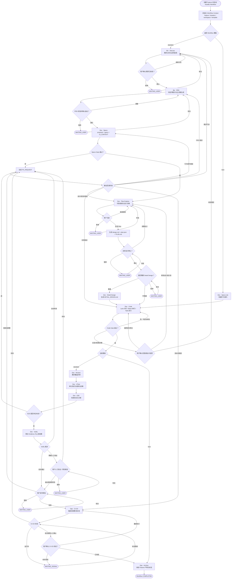

## 5. Biz 用户确认子流程

### 5.1 Discuss 多轮澄清


Discuss 的每一轮都必须使用稳定的 `decisionKey`，例如：

```text
biz.discuss/r1/question-list
biz.discuss/r1/issues/batch-001
biz.discuss/r2/issues/batch-002
biz.discuss/convergence/r3
```

这样恢复 Workflow 时可以重放已有答案，而不会重新向用户提出同一个问题。

### 5.2 PRD 待定项裁决

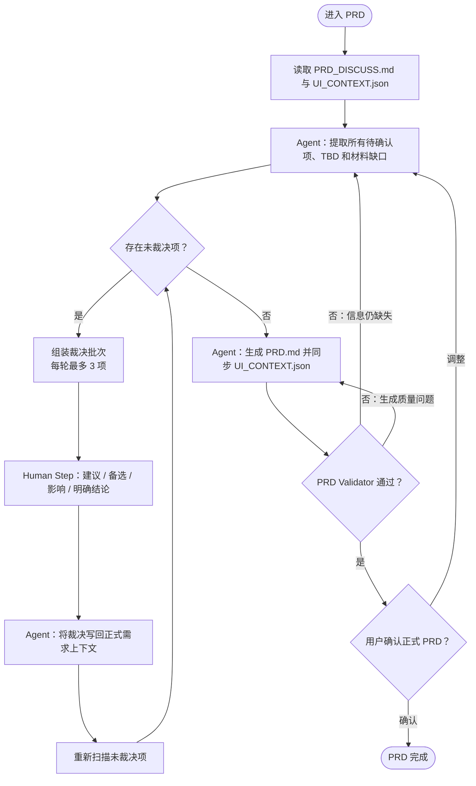

PRD 阶段不得使用自动默认答案。用户没有明确裁决时，Workflow 保持 `WAITING_USER`，不能把待确认内容包装为正式需求。

## 6. Plan 与动态节点子流程


## 7. Code 并行与批次执行流程

Code 阶段遵循 `plan.json` 的执行契约：Batch 以真实 `deps` 构成 DAG，所有无未完成依赖的 Batch 在隔离 workspace 中并行；依赖 Batch 合并完成后重新调度下游 Batch。Batch 内 Task 按 DAG 和 Task Runner 约束执行。


每个 Lane 中的 Batch 使用下面的统一子流程：


并行执行需要满足：

- 不同 Lane 具有不同 `workspaceRef` 或明确的文件所有权。
- 同一个 workspace 内有文件交集的 Task 不得并行写入。
- 每个 Activity 的输入只包含当前 Task、当前 Batch 摘要和解析后的 Artifact 引用。
- 后续 Batch 的完整 Task 契约不提前注入当前 Agent 上下文。
- Workflow 不直接编辑 `plan.json`、Task Run 或 Evidence 文件，必须调用对应 writer/runner。

## 8. Review、测试、Verify 与修复回流

```mermaid
flowchart TD
    R0(["Code Stage Gate 通过"])
    R1["Reviewer Agent<br/>生成 REVIEW_FINDINGS.json"]
    R2["UTest Activities<br/>按模块或 Lane 执行"]
    R3["生成 UNIT_TEST_RESULT.json<br/>追加 Test Evidence"]
    R4["E2E Activities<br/>按场景组执行"]
    R5["生成 E2E_RESULT.json 和诊断"]
    R6{"存在自动失败？"}
    R7["生成 FIX_REQUEST.json"]
    R8["Verify Agent<br/>聚合 Artifact 和 Evidence"]
    R9{"Verify Verdict"}
    R10["Human Step：人工场景验证或风险接受"]
    R11["生成 VERIFY_DECISION.json"]
    ROUTER{"Repair Router"}
    INVALIDATE["目标节点及全部下游 revision + 1<br/>旧结果保留但不再作为当前结果"]
    PASS(["进入发布审批"])

    R0 --> R1 --> R2 --> R3 --> R4 --> R5 --> R6
    R6 -->|"是"| R7 --> ROUTER
    R6 -->|"否"| R8 --> R9
    R9 -->|"pass"| R11 --> PASS
    R9 -->|"needs_fix"| R7
    R9 -->|"manual_required"| R10
    R10 -->|"通过或接受风险"| R11
    R10 -->|"失败"| R7
    ROUTER --> INVALIDATE
    INVALIDATE -->|"Biz 问题"| BIZ["Discuss / PRD"]
    INVALIDATE -->|"契约问题"| SPECS["Specs"]
    INVALIDATE -->|"设计问题"| PLAN["Plan"]
    INVALIDATE -->|"实现问题"| CODE["Code"]
    INVALIDATE -->|"运维问题"| OPS["CI-CD"]
```

### 8.1 Revision 规则

Dynamic Workflow 的步骤结果不能只使用阶段名作为缓存键，否则修复后可能重放旧结果。建议统一使用：

```text
stepKey = featureId / iteration / stageId / stageRevision / localStepId / attempt
```

示例：

```text
login-v2/1/dev.code/r1/B001/T003/attempt-1
login-v2/1/dev.verify/r1/aggregate/attempt-1
login-v2/1/dev.code/r2/B001/T003/attempt-1
login-v2/1/dev.verify/r2/aggregate/attempt-1
```

回流到 `dev.plan` 时，需要增加 `dev.plan` 以及 Code、Review、UTest、E2E、Verify 的 revision；回流到 `dev.code` 时，只增加 Code 及其下游 revision。

## 9. Human Step 挂起与恢复时序

```mermaid
sequenceDiagram
    actor User as 用户
    participant UI as Workflow UI
    participant WF as Dynamic Workflow
    participant Agent as Agent Activity
    participant Journal as Workflow Journal
    participant Artifact as Artifact Store

    WF->>Agent: 执行 analyze(stepKey)
    Agent->>Artifact: 写入分析草稿或结构化问题
    Agent-->>WF: decision_required + questions
    WF->>Journal: 记录 Human Step requested
    WF-->>UI: 展示问题、建议、备选、影响和关联产物
    Note over WF,Journal: Workflow 状态变为 WAITING_USER
    User->>UI: 回答 / Other 补充 / 暂停
    UI->>Journal: 写入 human_answered(decisionKey, revision)
    Journal-->>WF: 唤醒或恢复 Workflow
    WF->>Journal: 重放已完成步骤和既有回答
    WF->>Agent: 执行 apply-answer(new stepKey)
    Agent->>Artifact: 更新 PRD_DISCUSS / PRD / Design 等产物
    Agent-->>WF: completed 或新的 decision_required
    alt 仍有待确认项
        WF-->>UI: 展示下一批问题
    else 阶段完成
        WF->>Journal: 记录 phase_completed
    end
```

### 9.1 Human Step 类型

| 类型                  | 典型场景                      | 可选结果                   | 超时行为               |
| --------------------- | ----------------------------- | -------------------------- | ---------------------- |
| Clarification         | Discuss 问题、PRD 待定项      | 明确结论、Other、暂停      | 保持等待               |
| Decision              | 进入 Plan、启用 Detail Design | 分支选项、暂停             | 保持等待               |
| Approval              | PRD、总体设计、发布审批       | 通过、退回、暂停           | 保持等待               |
| Material              | 原型、HTML、链接、环境信息    | 提交材料、声明不适用、暂停 | 保持等待               |
| Risk Acceptance       | 手工验证、不可自动验证场景    | 通过、接受风险、失败       | 保持等待               |
| External Confirmation | CI/CD 是否真正完成            | 已完成、继续等待、重跑     | 保持等待或 Signal 唤醒 |

严禁对需求范围、正式 PRD、设计决策、风险接受和发布审批设置“超时后自动同意”。

## 10. Dynamic Workflow 代码骨架

```ts
export default workflow(
  {
    id: "autobiz",
    version: "1.0.0",
    maxFixReflows: 3,
    maxTotalSteps: 120,
  },
  async (ctx) => {
    const input = await ctx.initializeFeature();

    if (input.template === "lean") {
      await runSpecs(ctx, { mode: "lean" });
      await runCode(ctx);
      await runArchive(ctx);
      return ctx.complete();
    }

    let cursor: StageId = "biz.discuss";

    while (true) {
      const result = await runFrom(ctx, cursor, {
        biz: async () => {
          await runDiscuss(ctx);
          await runPrd(ctx);
        },
        dev: async () => {
          await runSpecs(ctx);
          await runPlan(ctx);
          await runOptionalDetailDesign(ctx);
          await runCode(ctx);
          await runReview(ctx);
          await runUnitTest(ctx);
          await runE2E(ctx);
          return runVerify(ctx);
        },
        ops: async () => {
          await runReleaseApproval(ctx);
          await runCicd(ctx);
          await runArchive(ctx);
        },
      });

      if (result.outcome === "completed") return ctx.complete();

      if (result.outcome === "needs_fix") {
        cursor = result.suggestedStage;
        await ctx.invalidateFrom(cursor, {
          fixRequest: result.fixRequest,
          incrementRevision: true,
        });
      }
    }
  },
);
```

## 11. Activity 与 Human Step 契约

### 11.1 Agent Activity 输入

```ts
interface ActivityRequest {
  workflowRunId: string;
  featureId: string;
  iteration: number;
  stageId: string;
  stageRevision: number;
  stepKey: string;
  workspaceRefs: string[];
  inputArtifacts: ArtifactRef[];
  previousDecisions: DecisionRef[];
  fixRequest?: ArtifactRef;
}
```

### 11.2 Agent Activity 输出

```ts
interface ActivityResult {
  outcome:
    | "completed"
    | "decision_required"
    | "waiting_external"
    | "needs_fix"
    | "blocked"
    | "failed";

  artifacts: ArtifactRef[];
  evidenceIds: string[];
  decisionRequest?: HumanStepRequest;
  externalSignal?: ExternalSignalRequest;
  suggestedRepairStage?: StageId;
  fixRequest?: ArtifactRef;
  diagnostics?: Diagnostic[];
}
```

Activity 可以建议修复阶段，但 Workflow 必须校验该目标是否属于允许的回流集合，不能允许 Agent 任意跳转。

### 11.3 Human Step

```ts
interface HumanStepRequest {
  decisionKey: string;
  type:
    | "clarification"
    | "decision"
    | "approval"
    | "material"
    | "risk_acceptance"
    | "external_confirmation";
  title: string;
  questions: Question[];
  contextArtifacts: ArtifactRef[];
  blocking: true;
  resolutionPolicy: "require_explicit" | "timeout_to_pause";
  expectedStageRevision: number;
  decisionRevision: number;
  reminderPolicy?: ReminderPolicy;
}
```

用户提交答案时必须回传 `decisionKey`、`expectedStageRevision` 和 `expectedDecisionRevision`。同一答案重复提交时返回第一次处理结果；Human Step 已被回流替换时拒绝过期答案。

## 12. 阶段映射表

| Workflow Phase      | Activity/Skill                              | 主要产物                                       | 用户交互                              | 完成条件                                |
| ------------------- | ------------------------------------------- | ---------------------------------------------- | ------------------------------------- | --------------------------------------- |
| `biz.discuss`       | `autobiz-requirement-discuss` 拆分 Activity | `PRD_DISCUSS.md`、`UI_CONTEXT.json`            | 问题清单、逐项澄清、UI 范围、收敛确认 | 问题处理完成且用户确认收敛              |
| `biz.prd`           | `autobiz-prd-generate` 拆分 Activity        | `PRD.md`、`UI_CONTEXT.json`                    | 待定项裁决、PRD 审批                  | 无 TBD/待确认且 validator 通过          |
| `dev.specs`         | `autodev-specs`                             | `proposal.md`、`specs/**/*.md`                 | 仅契约冲突时确认                      | Specs 与 UI Context gate 通过           |
| `dev.plan`          | `autodev-plan` 拆分 Activity                | `design.md`、`plan.json`、`PLAN.md`            | 探索决策、设计裁决、总体设计确认      | Plan 全部 validator 通过且设计确认      |
| `dev.detail_design` | `autodev-detail-design`                     | `DETAIL_DESIGN.md`                             | 是否启用动态节点                      | 产物校验通过或明确跳过                  |
| `dev.code`          | `autodev-code` + Task Runner                | `EVIDENCE.jsonl`、探索缓存、业务代码           | 仅 scope/契约变化时确认               | 所有 Batch compile 通过且 evidence 完整 |
| `dev.review`        | `autodev-reviewer`                          | `REQUIREMENTS_EVAL.md`、`REVIEW_FINDINGS.json` | 默认无                                | Review Findings 合法                    |
| `dev.utest`         | `autodev-utest`                             | `UNIT_TEST_RESULT.json`、报告和日志            | 默认无                                | 测试结果与 evidence 合法                |
| `dev.e2e`           | `autodev-e2e`                               | `E2E_RESULT.json`、Cases、诊断、Fix Request    | 缺环境或人工场景时确认                | 结果合法，失败时 Fix Request 合法       |
| `dev.verify`        | `autodev-verify`                            | `VERIFY_DECISION.json`、`FIX_REQUEST.json`     | 人工验证、风险接受                    | pass 或合法 needs_fix                   |
| `ops.cicd`          | `autoops-cicd`                              | `CICD_CHECKLIST.md`、`PR_BODY.md`              | 发布审批、完成确认、是否重跑          | 用户确认完成或失败回流                  |
| `ops.archive`       | `autoops-archive`                           | 归档目录和状态                                 | 默认无                                | 归档完整且状态投影成功                  |

## 13. Skill 改造原则

### 13.1 交互型 Skill 拆分

现有交互型 Skill 建议拆成三类 Activity：

```text
analyze      读取事实并返回问题或决策请求
apply        应用用户回答并更新 Artifact
finalize     生成正式产物并执行 Stage Gate
```

示例：

```text
autobiz-requirement-discuss
  -> discuss.analyze
  -> discuss.applyAnswers
  -> discuss.finalize

autobiz-prd-generate
  -> prd.collectUnresolved
  -> prd.applyDecisions
  -> prd.generateAndValidate

autodev-plan
  -> plan.explore
  -> plan.applyDecisions
  -> plan.generateDesign
  -> plan.generateTaskGraph
```

### 13.2 非交互型 Skill 适配

Specs、Detail Design、Review、UTest、E2E、Verify、Archive 可以先保留完整 Skill，由 Activity Adapter 调用。后续再按并行粒度拆成更小 Activity。

### 13.3 路由职责迁移

Skill 内以下职责逐步迁移到 Dynamic Workflow：

- 读取 checkpoint 决定调用哪个 Skill。
- 直接调用 `request_user_input`。
- 写入完成 checkpoint 后提示下一阶段。
- 根据自然语言报告决定修复目标。

Skill 继续保留：

- Artifact 的领域生成逻辑。
- Writer、Runner、Validator 和 Stage Gate 调用。
- 结构化 Evidence 写入。
- 当前阶段内可恢复的实现和自动修复逻辑。

## 14. Workflow 状态模型

```text
WorkflowRun:
  CREATED
  RUNNING
  WAITING_USER
  WAITING_SIGNAL
  PAUSED
  COMPLETED
  FAILED
  CANCELLED

PhaseRun / ActivityRun:
  PENDING
  READY
  RUNNING
  WAITING_USER
  WAITING_SIGNAL
  SUCCEEDED
  FAILED
  INVALIDATED
  SKIPPED
  CANCELLED
```

`INVALIDATED` 不等于删除。旧结果、旧 Artifact hash 和旧 Evidence 仍然保留用于审计，但不能继续满足当前 revision 的 Stage Gate。

## 15. 重放与幂等规则

Dynamic Workflow 可以在恢复时从主函数开头重放，但必须遵守以下规则：

1. 所有 `agent()`、`human()`、`signal.wait()`、`artifact.write()` 调用都必须有稳定 `stepKey`。
2. 已完成的 step 直接从 Journal 返回结果，不重复调用 Agent 或工具。
3. Human Step 使用 `decisionKey + expectedRevision` 防止重复提交和过期回答。
4. 外部 Signal 使用 `signalName + idempotencyKey` 防止 CI/CD 重复回调。
5. Workflow 脚本不得直接使用未记录的时间、随机数或文件内容做分支判断。
6. 需要参与分支的外部值必须先通过 Journal 化的 `ctx.value()` 或 Activity 获取。
7. 所有有副作用的 writer、runner 和命令必须支持幂等键或执行前状态检查。

## 16. 分阶段落地计划

### 阶段一：Workflow 骨架与协议

- 建立 `autobiz.workflow.ts` 主流程。
- 定义 Activity、Human Step、Signal、Artifact、Revision 协议。
- 将 `board_config.json` 中的节点、Artifact、Validator 元数据提供给 Workflow 使用。
- 让 `state.json` 成为 Workflow 状态投影。

### 阶段二：Biz 交互闭环

- 接入 Discuss 问题清单、多轮问题和 UI 范围确认。
- 接入 PRD 待定项裁决和正式稿审批。
- 验证关闭应用、隔日恢复、重复回答和问题追加等场景。

### 阶段三：Plan 与动态分支

- 接入 Explore 自由对话和“继续探索/进入 Plan/暂停”。
- 接入设计决策批次、总体设计审批和 Detail Design 选择。
- 接入 Plan 全部 Validator。

### 阶段四：Code 并行执行

- 将 Lane 映射为 `parallel`，将 Lane 内 Batch 映射为 `pipeline`。
- 接入 Task Runner、Batch Compile、Evidence 和契约冲突 Human Step。
- 完成 workspace ownership、写冲突和上下文裁剪控制。

### 阶段五：测试、Verify 与回流

- 接入 Review、UTest、E2E、Verify。
- 统一生成和解析 `FIX_REQUEST.json`。
- 实现 `invalidateFrom()` 与下游 revision 递增。

### 阶段六：Ops 与正式切换

- 接入发布审批、CI/CD Signal、人工完成确认和 Archive。
- Dynamic Workflow 成为唯一控制流来源。
- checkpoint 路由器降级为兼容接口，最终视使用情况移除。

## 17. 验收场景

上线前至少覆盖以下端到端测试：

1. Discuss 提问后关闭应用，重新打开仍显示相同问题和上下文。
2. 用户重复提交同一个回答，Workflow 只推进一次。
3. Discuss 回答后仍有问题，继续当前节点而不是提前进入 PRD。
4. PRD 存在 TBD 时不能生成正式通过结果。
5. Plan 用户自由补充内容后继续探索，不机械重复同一个选择题。
6. Detail Design 选择在恢复后保持一致，不重复询问。
7. 两个 Lane 并行执行，但同 workspace 文件冲突会被阻止。
8. Code 契约冲突选择“调整 Plan”后，Code 及下游旧结果失效。
9. E2E 失败回流 Code 后，重新执行的阶段使用新 revision。
10. Verify 同时存在自动失败和人工项时，优先进入自动失败修复路径。
11. CI/CD 重复回调不会重复推进或重复归档。
12. Workflow 定义升级后，运行中的 Feature 继续使用启动时固定的版本。
13. 精简模板只执行其声明节点，同时仍满足 Code 和 Archive 的必要 Gate。
14. 达到最大修复次数或最大总步骤数后暂停并请求人工处置。

## 18. 错误处理与容错

### 18.1 重试策略

| 组件            | 错误类型                                   | 处理策略                                                | 重试预算                                 | 最终状态                                  |
| --------------- | ------------------------------------------ | ------------------------------------------------------- | ---------------------------------------- | ----------------------------------------- |
| Agent Activity  | 网络超时、连接中断、429、502/503           | 指数退避并加入抖动                                      | 使用 `maxErrorRetries`，当前建议初值为 2 | 超限后 `PAUSED`，保留诊断和恢复入口       |
| Agent Activity  | 400/401/403、Schema 不兼容、确定性参数错误 | 不自动重试                                              | 0                                        | `PAUSED`，由平台或配置修复后重试          |
| Agent Activity  | 产物不满足契约                             | 先做阶段内受控修复；只有缺少业务决策时才创建 Human Step | 使用阶段修复预算                         | 仍失败则 `needs_fix` 或 `PAUSED`          |
| Validator       | 进程超时或异常退出                         | 按平台故障重试                                          | 独立的小预算                             | 超限后 `PAUSED`，不得伪造业务 Fix Request |
| External Signal | 未收到回调                                 | 保持订阅并按策略提醒或轮询                              | 不计为 Activity 重试                     | `WAITING_SIGNAL`                          |
| Workflow 脚本   | 未捕获异常、不变量破坏                     | 不自动重放有副作用的步骤                                | 0                                        | 当前 Activity `FAILED`，Workflow `PAUSED` |

重试预算必须来自 Workflow Policy；第一版可映射现有 [board_config.json](../board_core/board_config.json) 的 `maxErrorRetries=2`、`maxFixReflows=3` 和 `maxTotalSteps=120`，不能在不同 Activity 中散落硬编码次数。

### 18.2 降级策略

```ts
interface DegradationPolicy {
  e2eUnavailable: "block_until_ready" | "manual_verification";
  cicdTimeout: "continue_waiting" | "request_explicit_confirmation";
  validatorUnavailable: "pause_as_platform_error";
}
```

具体规则：

- **E2E 环境不可用**：默认阻断；只有场景被契约明确标记为可人工验证时，才能转为 `manual_verification`。用户的风险接受必须进入 `VERIFY_DECISION.json`，不能用“跳过并警告”冒充测试通过。
- **CI/CD 长时间无响应**：在达到该流水线配置的预期时长后创建 Human Step，允许继续等待、重新查询或显式确认完成；不得超时自动完成。
- **Validator 不可用**：这是平台故障，不是产品缺陷。重试耗尽后暂停并通知平台维护，不能生成指向 Biz/Dev 的 `FIX_REQUEST.json`，也不能跳过必需 Gate。

### 18.3 非预期异常处理

```mermaid
flowchart TD
    ERR["捕获异常"]
    TYPE{"异常分类"}
    RETRY["执行瞬时故障重试"]
    LOG["记录诊断、堆栈和输入摘要"]
    DOMAIN["生成结构化 FIX_REQUEST"]
    HUMAN["创建 Human Step"]
    PAUSE["Activity FAILED<br/>Workflow PAUSED"]

    ERR --> TYPE
    TYPE -->|"瞬时平台故障"| RETRY
    TYPE -->|"产品或契约失败"| DOMAIN
    TYPE -->|"缺少业务决策"| HUMAN
    TYPE -->|"脚本或不变量错误"| LOG
    RETRY -->|"成功"| SUCCESS["继续执行"]
    RETRY -->|"达到预算"| LOG
    DOMAIN --> ROUTE["进入 Repair Router"]
    HUMAN --> WAIT["WAITING_USER"]
    LOG --> PAUSE
```

用户恢复选项：

1. **重新执行当前步骤**：保留失败记录，使用新 attempt 和新幂等键重新调用。
2. **跳过当前步骤**：仅在非关键步骤（如可选的静态分析）中允许。
3. **回流到上游阶段**：必须先生成或补齐合法 `FIX_REQUEST.json`，再由 Repair Router 校验目标。
4. **取消整个 Workflow**。

## 19. 并发控制与资源限制

### 19.1 并发限制

| 维度                   | 最终策略                                                              | 超限行为                                        |
| ---------------------- | --------------------------------------------------------------------- | ----------------------------------------------- |
| 最大并行 Lane          | `min(policy.maxParallelLanes, scheduler.availableSlots)`              | 排队等待，不降低正确性 Gate                     |
| 单 workspace 可写 Task | 默认 1；只读 Activity 可按 DAG 并行                                   | 写任务串行或切换到隔离 workspace                |
| 单 Feature 总步骤      | 使用 `maxTotalSteps`，当前建议初值为 120                              | `PAUSED` 并请求人工处置                         |
| 修复回流次数           | 使用 `maxFixReflows`，当前建议初值为 3                                | `PAUSED` 并输出 revision 历史                   |
| Activity 上下文        | 不超过模型窗口和 Workflow Context Policy 的较小值；当前策略阈值为 90% | 裁剪、摘要或拆分 Activity，禁止静默丢弃必需引用 |
| Journal 存储           | 不按固定文件大小截断；使用快照、索引和归档策略                        | 保留恢复与审计所需事件                          |

### 19.2 Workspace 锁机制

Code 阶段并行执行的前提是不同 Lane 不会产生文件写冲突：

```ts
interface WorkspaceOwnership {
  laneId: string;
  workspaceRef: string;
  ownedPaths: string[]; // 该 Lane 可写的文件路径前缀
  readOnlyPaths: string[]; // 只读依赖
}
```

**冲突检测规则**：

1. 两个 Lane 的 `ownedPaths` 存在交集时，不能在同一个 workspace 并行写；使用隔离 workspace 也必须在 Join 阶段检测合并冲突。
2. 一个 Lane 的写集合与另一个 Lane 的读集合相交时，必须由 Task DAG 指定先后关系，或让读取方绑定不可变基线 revision；不能仅凭路径推断顺序。
3. 不同 `workspaceRef` 只能消除运行时文件覆盖，不能消除后续合并、接口和数据库契约冲突。
4. 共享环境、端口、数据库、测试账号等非文件资源也必须声明资源锁。

**锁实现**：

- Workflow 启动 Lane 前，向锁管理器申请 `ownedPaths` 的写锁。
- 申请失败时，Lane 进入 `PENDING` 状态，等待其他 Lane 释放锁。
- 锁记录 owner、lease、heartbeat 和基线 revision；失联后只能按 lease 过期协议回收，不能直接强制释放活动锁。
- Lane 的所有 Batch 完成后释放执行锁；所有并行结果在 Join 阶段执行合并、编译和契约校验，通过后才允许进入 Code Stage Gate。

### 19.3 长时间运行的内存管理

Workflow 可能运行数天甚至数周，需要控制内存占用：

- **Journal 原子持久化**：每个 Activity 完成、Human Step 创建/回答、Signal 接收和状态迁移都必须先事务提交，再对外确认成功。
- **快照与压缩**：可按事件数或时间生成恢复快照，但快照只优化重放速度，不能替代审计事件。
- **Artifact 引用化**：Activity 输入使用 `ArtifactRef`（路径 + hash），不直接加载全部内容到内存。
- **老旧 revision 归档**：已失效产物可进入冷存储，但必须保留 hash、索引、引用关系和配置化保留期。

## 20. Revision 冲突与嵌套修复

### 20.1 多个 Fix Request 的优先级

当 Verify 阶段同时发现多个问题，且它们指向不同上游阶段时：

```json
{
  "fixRequests": [
    { "suggestedStage": "biz.prd", "reason": "需求定义的行为与实现不一致" },
    { "suggestedStage": "dev.plan", "reason": "设计遗漏了边界条件处理" },
    { "suggestedStage": "dev.code", "reason": "实现中存在逻辑错误" }
  ]
}
```

**处理规则**：

1. **优先回流最上游阶段**：`biz.prd` 优先于 `dev.plan` 优先于 `dev.code`。
2. **聚合失败事实**：本轮所有失败项、受影响的 spec/design/task/evidence 引用都进入同一个修复批次，不能只保留最上游问题。
3. **重新裁决覆盖**：用户不能直接忽略已证实的上游不一致；若用户认为需求或设计无误，必须通过 Human Step 明确裁决并更新对应事实后，由 Router 重新计算目标。
4. **独立问题并行**：只有目标 workspace 和 Artifact 所有权完全独立时，才允许拆成并行修复分支；Join 后仍需统一 Verify。

### 20.2 修复过程中的再次失败

场景：回流到 `dev.code/r2` 后，新的实现通过了原来的 E2E，但又触发了新的失败。

**规则**：

- 不复用旧步骤结果；根据新的 `FIX_REQUEST.json` 再次执行 Repair Router。目标仍为 Code 时递增为 `dev.code/r3`，目标变为 Plan 时则递增 Plan 及全部下游 revision。
- 每次递增计入修复计数器，达到 `maxFixReflows` 后停止自动回流。
- Workflow 进入 `PAUSED`，生成诊断报告，包含所有 revision 的修复历史和失败原因。

```mermaid
flowchart LR
    R1["dev.code/r1<br/>实现错误"] --> V1["verify/r1<br/>失败"]
    V1 --> ROUTE1["Router：回流 Code"] --> R2["dev.code/r2<br/>修复尝试 1"]
    R2 --> V2["verify/r2<br/>发现设计问题"]
    V2 --> ROUTE2["Router：回流 Plan"] --> P2["dev.plan/r2<br/>修复设计与下游"]
    P2 --> V3["verify/r3<br/>通过"]
```

### 20.3 达到修复上限的处理

```ts
if (ctx.fixReflowCount >= maxFixReflows) {
  await ctx.pause({
    reason: "exceeded_max_reflows",
    diagnostic: {
      totalReflows: ctx.fixReflowCount,
      revisionHistory: ctx.getRevisionHistory(),
      lastFixRequest: ctx.lastFixRequest,
    },
    userOptions: [
      "increase_limit_and_retry",
      "manual_fix_then_resume",
      "cancel_feature",
    ],
  });
}
```

选择 `manual_fix_then_resume` 时，必须捕获人工修改 diff、绑定新的代码基线 hash、追加 Evidence，并重新执行目标阶段 Gate；不能直接把人工修改视为已经通过。

## 21. Human Step 超时与提醒

### 21.1 超时策略

以下时长是建议初值，最终由租户、项目或 Workflow Policy 配置。任何超时和自动暂停都只改变运行状态，不替用户作出业务决定。

| Human Step 类型               | 建议首次提醒             | 超时行为                                  |
| ----------------------------- | ------------------------ | ----------------------------------------- |
| Clarification                 | 7 天                     | 可在 14 天后转为 `PAUSED`，保留原问题     |
| Decision                      | 7 天                     | 可在 14 天后转为 `PAUSED`，保留原分支选择 |
| Approval (PRD/Design/Release) | 3 天                     | 持续等待，不自动批准                      |
| Material                      | 7 天                     | 持续等待；仅在契约允许时提供“不适用”选项  |
| Risk Acceptance               | 3 天                     | 持续等待，不自动接受风险                  |
| External Confirmation (CI/CD) | 流水线预期时长或配置 SLA | 转为显式人工确认或继续等待                |

### 21.2 提醒机制

```ts
interface ReminderPolicy {
  decisionKey: string;
  firstReminderAfter: Duration; // 首次提醒
  reminderInterval: Duration; // 后续提醒间隔
  autoSuspendAfter?: Duration; // 自动暂停时间
}
```

提醒内容包含：

- 当前等待的问题或决策
- Feature 和 Workflow 上下文
- 已等待时长
- 快速回答链接

### 21.3 过期回答检测

防止用户在旧版本 revision 中回答：

```ts
const task = ctx.humanStep(answer.decisionKey);

if (
  task.status !== "PENDING" ||
  answer.expectedStageRevision !== task.expectedStageRevision ||
  answer.expectedDecisionRevision !== task.decisionRevision
) {
  return {
    status: "rejected",
    reason: "Human Step 已解决、已替换或对应阶段已失效",
    suggestAction: "查看当前待办并回答最新问题",
  };
}
```

## 22. Workflow 版本管理

### 22.1 版本固定与兼容性

```ts
interface WorkflowRun {
  workflowDefinitionVersion: string; // 例如 "1.2.0"
  workflowDefinitionHash: string; // 代码内容的 SHA-256
  schemaVersion: string; // Journal/Artifact 契约版本
}
```

**固定规则**：

- Workflow Run 创建时记录当前 workflow 定义的版本号和 hash。
- 定义代码、依赖清单和 Schema 组成不可变 Definition Bundle，其保留期不得短于关联 Run 和审计数据的保留期。
- 恢复时按 hash 加载对应 Definition Bundle，并校验签名或内容 hash。
- 若 Bundle 损坏或暂时不可用，Run 进入 `PAUSED` 并从可信版本库恢复；不得要求用户重新创建 Feature 或丢失已有进度。

**兼容性判断**：

| 变更类型   | 示例                            | 处理方式                                               |
| ---------- | ------------------------------- | ------------------------------------------------------ |
| 向后兼容   | 新增可选 Activity、新增可选字段 | 新 Run 使用新版本；老 Run 继续固定旧 Bundle            |
| 破坏性变更 | 删除必需阶段、改变 stepKey 格式 | 必须提供显式迁移映射，不能原地热切换                   |
| 修复性变更 | 修复 bug、优化性能              | 默认只作用于新 Run；老 Run 经 dry-run 和人工确认后迁移 |

### 22.2 平滑升级策略

```mermaid
flowchart TD
    DETECT["发布新 Definition Bundle"]
    CHECK{"检查 Schema 与 stepKey 兼容性"}
    COMPAT["标记为兼容版本"]
    BREAKING["要求 Migration Plan"]
    ALLOW["新 Feature 使用新版本<br/>老 Run 固定旧版本"]
    DRYRUN["迁移 dry-run<br/>验证 Journal、Artifact 与恢复点"]
    APPROVE{"人工批准迁移？"}
    MIGRATE["原子切换 Bundle 与 Schema"]

    DETECT --> CHECK
    CHECK -->|"向后兼容"| COMPAT --> ALLOW
    CHECK -->|"破坏性或修复老 Run"| BREAKING --> DRYRUN --> APPROVE
    APPROVE -->|"批准"| MIGRATE
    APPROVE -->|"拒绝"| ALLOW
```

### 22.3 手动迁移工具

对于长时间运行的 Workflow（如暂停数周的 Feature），提供迁移工具：

```bash
autobiz workflow migrate \
  --feature-id login-v2 \
  --from-version 1.1.0 \
  --to-version 1.2.0 \
  --dry-run
```

迁移工具职责：

- 检查新旧版本的 stepKey 映射关系。
- 转换 Journal 格式（如有必要）。
- 验证迁移后 Workflow 可以正确恢复。
- 迁移前创建恢复快照，Bundle、Schema 和 Run 指针必须原子切换，失败时回滚到旧版本。

## 23. 监控与可观测性

### 23.1 关键指标

#### 执行指标

| 指标名                                 | 类型      | 维度                       | 说明                                         |
| -------------------------------------- | --------- | -------------------------- | -------------------------------------------- |
| `workflow.run.wall_duration`           | Histogram | `template`, `outcome`      | Run 总墙钟时间，包含等待                     |
| `workflow.run.active_duration`         | Histogram | `template`, `outcome`      | 扣除 Human/Signal/调度等待后的执行时间       |
| `workflow.stage.active_duration`       | Histogram | `stage_id`, `template`     | 各阶段实际执行耗时                           |
| `workflow.activity.duration`           | Histogram | `activity_name`, `outcome` | Activity 调用耗时                            |
| `workflow.activity.token_usage`        | Counter   | `activity_name`, `model`   | Agent 调用 Token 消耗                        |
| `workflow.fix_reflow.count`            | Counter   | `from_stage`, `to_stage`   | 修复回流次数统计                             |
| `workflow.revision.count`              | Histogram | `stage_id`                 | 各阶段 revision 递增次数                     |
| `workflow.run.last_progress_timestamp` | Gauge     | `state`, `template`        | 最近一次有效推进时间，用于识别真正卡住的 Run |

#### 等待指标

| 指标名                          | 类型      | 维度          | 说明                 |
| ------------------------------- | --------- | ------------- | -------------------- |
| `workflow.human_step.wait_time` | Histogram | `step_type`   | 用户响应等待时长     |
| `workflow.signal.wait_time`     | Histogram | `signal_type` | 外部 Signal 等待时长 |
| `workflow.state.count`          | Gauge     | `state`       | 各状态 Workflow 数量 |

#### 成本指标

| 指标名                   | 类型    | 维度                          | 说明                                |
| ------------------------ | ------- | ----------------------------- | ----------------------------------- |
| `workflow.cost.total`    | Counter | `tenant`, `project`, `model`  | 聚合成本，避免 Feature 级高基数标签 |
| `workflow.cost.by_stage` | Counter | `tenant`, `stage_id`, `model` | 各阶段成本分布                      |

单个 Feature 的成本、Token、用户和 decisionKey 等高基数信息进入审计事件或查询存储，不作为时序指标标签。

### 23.2 告警规则

| 告警                      | 判断依据                                                              | 处理动作                                                              |
| ------------------------- | --------------------------------------------------------------------- | --------------------------------------------------------------------- |
| WorkflowStuck             | 状态为 `RUNNING`，且 `last_progress_timestamp` 超过阶段策略阈值未更新 | 检查 Activity、锁、心跳和 Journal，不把正常 `WAITING_USER` 误报为卡住 |
| ExcessiveReflows          | 单个 Run 的 `fixReflowCount` 接近 `maxFixReflows`                     | 提前展示 revision 历史并通知负责人                                    |
| HighTokenUsage            | 租户或项目窗口内 Token/成本接近配额                                   | 降低并发、暂停新的 Activity 或申请提额                                |
| ActivityContinuousFailure | 同一 Activity 类型在多个 Run 中连续出现相同平台错误                   | 熔断该 Activity 版本并通知维护人员                                    |
| LongWaitingUser           | Human Step 超过 Reminder Policy 阈值                                  | 发送提醒或转 `PAUSED`，不自动回答                                     |

### 23.3 可观测性工具

#### 实时 Dashboard

```text
AutoBiz Workflow Dashboard
├── 运行中 Workflow 总数
├── 各状态分布（RUNNING / WAITING_USER / WAITING_SIGNAL / PAUSED）
├── 各阶段平均耗时（P50 / P95）
├── 当日 Token 消耗与成本
└── 修复回流热力图（from_stage × to_stage）
```

#### Workflow 时间线视图

```mermaid
gantt
    title Feature login-v2 Timeline
    dateFormat YYYY-MM-DD HH:mm
    section Biz
    Discuss          :done, d1, 2026-08-10 09:00, 2h
    等待用户确认       :active, w1, after d1, 3d
    PRD              :p1, after w1, 1h
    section Dev
    Specs            :s1, after p1, 30m
    Plan Explore     :pl1, after s1, 1h
    Code Lane A      :c1, after pl1, 2h
    Code Lane B      :crit, c2, after pl1, 3h
    Review           :r1, after c2, 20m
```

#### 修复回流追踪

展示每个 revision 的触发原因、修复内容和验证结果：

```text
Feature: login-v2 | Iteration: 1
├── dev.code/r1 [INVALIDATED]
│   ├── 实现时间: 2026-08-12 10:30
│   ├── 失败原因: E2E 场景“忘记密码流程”失败
│   └── Fix Request: 实现遗漏了邮件发送逻辑
├── dev.code/r2 [INVALIDATED]
│   ├── 实现时间: 2026-08-12 14:20
│   ├── 失败原因: 新引入的依赖导致编译错误
│   └── Fix Request: 修复 import 路径
└── dev.code/r3 [SUCCEEDED]
    ├── 实现时间: 2026-08-12 15:10
    └── 验证结果: 全部测试通过
```

### 23.4 审计日志

记录所有关键决策和状态变更：

```jsonl
{"ts":"2026-08-12T10:00:00Z","event":"workflow.created","featureId":"login-v2","template":"standard","user":"alice"}
{"ts":"2026-08-12T10:30:00Z","event":"stage.completed","stageId":"biz.discuss","revision":1}
{"ts":"2026-08-12T10:31:00Z","event":"human_step.requested","decisionKey":"biz.prd/tbd-001","type":"clarification"}
{"ts":"2026-08-12T14:20:00Z","event":"human_step.answered","decisionKey":"biz.prd/tbd-001","answeredBy":"alice"}
{"ts":"2026-08-12T16:00:00Z","event":"fix_reflow.triggered","fromStage":"dev.verify","toStage":"dev.code","reason":"E2E failure"}
{"ts":"2026-08-12T16:00:01Z","event":"revision.incremented","stageId":"dev.code","fromRevision":1,"toRevision":2}
```

## 24. 成本管理

### 24.1 成本估算

Workflow 启动前只能基于模板、代码规模和历史分布提供低置信度区间；Plan 生成后再根据 Lane、Batch、Task、模型和验证命令更新为高置信度估算。

```ts
interface CostEstimate {
  confidence: "low" | "medium" | "high";
  totalTokens: { min: number; max: number; p50?: number };
  totalCost: { min: number; max: number; p50?: number; currency: string };
  pricingVersion: string;
  breakdown: {
    stageId: string;
    model: string;
    tokens: number;
    cost: number;
  }[];
  assumptions: string[]; // 例如 "尚未生成 Plan，暂按同类 Feature 分布估算"
}
```

**估算方法**：

- 基于历史同类型 Feature 的实际消耗。
- 考虑 `plan.json` 的 Task 数量、代码规模和模板类型。
- 修复回流使用历史分位数建模；没有足够样本时展示“不含回流”和“达到最大回流预算”两个边界，不假设固定平均次数。

### 24.2 配额限制

```ts
interface QuotaPolicy {
  maxConcurrentWorkflows: number; // 单用户或租户最大并行数
  maxTokensPerDay: number; // 单日最大 Token 消耗
  maxTokensPerFeature: number; // 单个 Feature 最大消耗
  alertThreshold: number; // 达到配额的百分比时告警
}
```

**超限行为**：

- 达到 `alertThreshold`（如 80%）时发送通知。
- 达到硬限制时，在下一个 Activity 开始前将 Run 转为 `PAUSED` 或排队；不得中断正在提交 Artifact/Evidence 的原子步骤。
- 用户可以申请临时提额或升级配额。

### 24.3 成本归因

以下仅展示归因报告结构，金额不是预算或性能承诺：

```text
Feature: login-v2 | Total Cost: $12.34

阶段成本分布:
├── Biz (Discuss + PRD):        $1.20 (9.7%)
├── Dev.Specs:                  $0.80 (6.5%)
├── Dev.Plan:                   $2.10 (17.0%)
├── Dev.Code:                   $5.40 (43.8%)  ← 最高
├── Dev.Review:                 $0.60 (4.9%)
├── Dev.UTest:                  $1.10 (8.9%)
├── Dev.E2E:                    $0.80 (6.5%)
└── Dev.Verify:                 $0.34 (2.8%)

修复回流额外成本: $2.10 (17.0% of total，已包含在阶段成本中)
```

帮助用户识别成本优化机会（如 Code 阶段 Task 粒度过细导致上下文重复加载）。

## 25. 测试策略

### 25.1 单元测试

每个 Agent Activity 独立测试：

```ts
describe("DiscussAnalyzeActivity", () => {
  it("extracts prioritized questions with stable ids", async () => {
    const input = {
      featureId: "test-001",
      artifacts: [mockArtifact("RAW_REQUIREMENT.md")],
    };
    const result = await discussAnalyze.execute(input);
    expect(result.outcome).toBe("decision_required");
    expect(result.decisionRequest.questions.length).toBeLessThanOrEqual(3);
    expect(result.decisionRequest.questions.every((q) => q.id)).toBe(true);
  });
});
```

**Mock 策略**：

- Artifact 使用预定义样本文件。
- Agent 调用使用 Mock LLM 返回固定响应。
- Validator 使用真实实现。

### 25.2 集成测试

端到端测试完整 Subworkflow：

```ts
describe("Biz Subworkflow", () => {
  it("completes Discuss and PRD with explicit fixture answers", async () => {
    const ctx = createTestWorkflowContext({
      humanAnswers: {
        "biz.discuss/r1/batch-001": mockAnswers,
        "biz.prd/tbd-001": mockDecisions,
      },
    });

    await runBizSubworkflow(ctx);

    expect(ctx.artifacts["PRD.md"]).toBeDefined();
    expect(ctx.stage("biz.prd").status).toBe("SUCCEEDED");
  });
});
```

**Human Step Fixture 回答**：

- 测试模式下，所有 Human Step 从预设字典中读取答案。
- 若答案缺失，测试失败并提示需要补充。

### 25.3 Dry Run 模式

用户可以启动 Dry Run 预览 Workflow 行为：

```bash
autobiz workflow start \
  --feature-id login-v2 \
  --dry-run \
  --answer-fixture ./tests/fixtures/login-v2-answers.json
```

**Dry Run 行为**：

- 不写入真实代码文件，所有修改在内存或临时目录中。
- 不调用真实 CI/CD 或外部系统。
- 生成 Workflow 执行报告和成本估算。
- Human Step 只能读取显式 fixture，并在报告中标记为 `synthetic_answer`。
- fixture 缺少严格 Gate 的答案时，将该 Gate 标记为 `UNRESOLVED`；不得用推荐项自动通过。

### 25.4 Workflow 回归测试

使用历史成功的 Feature 作为回归测试基准：

```bash
autobiz test regression \
  --baseline ./tests/baselines/login-v2.jsonl \
  --compare-journal \
  --compare-artifacts
```

验证 Workflow 定义升级后，相同输入是否产生相同阶段序列和产物结构（具体内容可能因模型随机性略有差异）。

## 26. 术语表

| 术语             | 定义                                      | 示例                                          |
| ---------------- | ----------------------------------------- | --------------------------------------------- |
| **Feature**      | 一个完整的业务需求或功能点                | `login-v2`                                    |
| **Iteration**    | Feature 的迭代次数，从 1 开始递增         | `1`, `2`                                      |
| **Workflow Run** | 一个 Feature 的一次完整 Workflow 执行实例 | `login-v2/iteration-1`                        |
| **Stage**        | Workflow 中的一个主要阶段                 | `biz.discuss`, `dev.code`, `ops.cicd`         |
| **Revision**     | 同一 Stage 因修复回流而递增的版本号       | `dev.code/r1`, `dev.code/r2`                  |
| **Activity**     | 执行具体任务的原子单元，通常由 Agent 完成 | `discuss.analyze`, `code.implement`           |
| **stepKey**      | Activity 或步骤的全局唯一标识             | `login-v2/1/dev.code/r2/B001/T003`            |
| **decisionKey**  | Human Step 的稳定标识，用于防止重复提问   | `biz.discuss/r1/batch-001`                    |
| **Artifact**     | 阶段产生的结构化产物                      | `PRD.md`, `plan.json`, `VERIFY_DECISION.json` |
| **Evidence**     | 记录执行事实的 append-only 日志           | `EVIDENCE.jsonl` 中的实现记录                 |
| **Journal**      | Workflow 执行历史的持久化记录             | 步骤结果、用户回答、Signal                    |
| **Human Step**   | 需要用户参与的决策或确认点                | Discuss 问题、PRD 审批、风险接受              |
| **Signal**       | 外部系统的异步回调通知                    | CI/CD 完成通知                                |
| **Fix Request**  | 验证失败后生成的结构化修复建议            | 指向目标 Stage 和失败原因                     |
| **Lane**         | Code 阶段的并行执行单元                   | `frontend-lane`, `backend-lane`               |
| **Batch**        | 按真实依赖 DAG 调度的任务批次               | `B001`, `B002`                                |
| **Task**         | 最小执行单元，对应一个具体的代码实现目标  | `T003: 实现登录表单组件`                      |
| **Validator**    | 校验 Artifact 或 Stage 完成条件的检查器   | `PrdValidator`, `PlanGranularityValidator`    |
| **Template**     | Workflow 的预定义模式                     | `standard`, `lean`                            |

## 27. 故障排查指南

### 27.1 Workflow 卡住不推进

**症状**：状态为 `RUNNING` 但长时间无进展。

**诊断步骤**：

1. 查看 Journal 最后一条记录的时间戳和内容。
2. 检查是否有 Activity 在重试（查看重试计数器）。
3. 检查是否等待 Signal 但未收到回调（查看 Signal 注册状态）。
4. 检查 workspace 锁状态（是否有死锁）。

**常见原因与解决**：

| 原因                                | 解决方法                                                       |
| ----------------------------------- | -------------------------------------------------------------- |
| Agent Activity 超时但未正确记录失败 | 通过管理恢复接口补记失败事件，再以新 attempt 重试              |
| Signal 回调丢失                     | 查询外部系统事实；确认幂等键后补发 Signal 或转为显式人工确认   |
| Workspace 锁疑似失效                | 核对 owner heartbeat、lease 和进程状态，lease 合法过期后再回收 |
| Workflow 脚本进入无限循环           | 暂停相关 Definition 版本的新 Run，终止当前 Activity 并修复脚本 |

### 27.2 Human Step 回答未生效

**症状**：用户已回答问题，但 Workflow 未推进。

**诊断步骤**：

1. 检查回答的 `decisionKey` 和 `expectedRevision` 是否匹配当前状态。
2. 检查 Journal 是否记录了 `human_answered` 事件。
3. 检查 Workflow 是否在回答提交后被唤醒。

**常见原因与解决**：

| 原因                                  | 解决方法                       |
| ------------------------------------- | ------------------------------ |
| 回答对应的 revision 已过期            | 引导用户查看最新问题并重新回答 |
| 回答格式不符合预期（校验失败）        | 展示具体错误，要求用户修正     |
| Workflow 未正确从 `WAITING_USER` 唤醒 | 手动触发恢复                   |

### 27.3 修复回流后旧错误重现

**症状**：回流到某阶段修复后，之前已通过的测试又失败。

**诊断步骤**：

1. 比较新旧 revision 的 Artifact 差异。
2. 检查修复是否引入了新的变更。
3. 检查是否有其他并行修改（如手动编辑代码）。

**常见原因与解决**：

| 原因                         | 解决方法                                                         |
| ---------------------------- | ---------------------------------------------------------------- |
| 修复过度，改动了不相关部分   | 从上一 revision 创建新的修复 revision，不重写或删除历史 Evidence |
| 修复基于过期的上下文         | 确保 Activity 读取最新 Artifact                                  |
| 手动修改与 Workflow 修改冲突 | 合并冲突或回滚手动修改                                           |

### 27.4 成本超出预期

**症状**：Token 消耗或费用远高于估算。

**诊断步骤**：

1. 查看成本归因报告，定位高消耗阶段。
2. 检查修复回流次数是否异常。
3. 检查 Activity 上下文大小是否超标。

**常见原因与解决**：

| 原因                          | 解决方法                         |
| ----------------------------- | -------------------------------- |
| 频繁修复回流                  | 分析回流原因，优化上游阶段质量   |
| Activity 上下文未裁剪         | 配置上下文裁剪策略               |
| Task 粒度过细，重复加载上下文 | 合并小 Task 或优化 plan 生成逻辑 |

## 28. 迁移检查清单

从 checkpoint 系统迁移到 Dynamic Workflow 前的准备工作：

### 28.1 前置条件

- [ ] 所有正在运行的 Feature 已完成或暂停到稳定状态。
- [ ] Workflow 定义代码通过全部单元测试和集成测试。
- [ ] 端到端测试矩阵已覆盖 standard、lean、Human Step 恢复、修复回流和 CI/CD Signal。
- [ ] 监控和告警系统已就绪。

### 28.2 兼容性检查

- [ ] 所有 Artifact 格式保持向后兼容。
- [ ] Validator 签名保持兼容，或已提供版本化 Adapter。
- [ ] Task Runner 接口保持兼容，或已提供版本化 Adapter。
- [ ] Evidence 格式保持兼容，或迁移器已经过完整性验证。

### 28.3 迁移步骤

1. **灰度发布**：
   - [ ] 新 Feature 使用 Dynamic Workflow，老 Feature 继续使用 checkpoint。
   - [ ] 按验收场景和质量指标对比两套系统；达到预设样本量、成功率和恢复正确性后才能进入全量阶段。

2. **全量切换**：
   - [ ] 停止接受新的 checkpoint Feature。
   - [ ] 将 checkpoint 路由器标记为 deprecated。
   - [ ] 更新文档和示例。

3. **清理**：
   - [ ] 等待 checkpoint Feature 自然完成；确需迁移时必须逐个执行 dry-run、审批和可回滚迁移。
   - [ ] 归档 checkpoint 相关代码。
   - [ ] 确认看板、脚本和外部集成均不再消费 `state.json` 后，再评估删除兼容投影。

### 28.4 回滚方案

若 Dynamic Workflow 上线后出现严重问题：

- [ ] 停止新 Feature 进入故障 Definition 版本，并把新启动流量切回 checkpoint 系统。
- [ ] 已启动的 Dynamic Workflow Run 保持原 Journal 和 Artifact，不直接改写为 checkpoint Run。
- [ ] 能安全继续的 Run 固定旧 Definition Bundle 运行；不能继续的 Run 进入 `PAUSED` 等待修复或经过验证的迁移工具。
- [ ] 修复、回归验证后重新灰度发布。

## 29. 性能基准采集方案

当前仓库没有足以证明各阶段 P50/P95 和用户等待时长的历史样本，因此最终版不预设分钟级承诺。上线后按以下口径采集，达到统计样本门槛后再形成正式 SLO。

### 29.1 统一计时口径

| 时间类型             | 起止边界                          | 是否计入执行性能             |
| -------------------- | --------------------------------- | ---------------------------- |
| Activity 执行时间    | `activity.started` 到终态事件     | 是                           |
| Agent 服务等待       | 请求发出到模型响应完成            | 是，单独拆分                 |
| 本地命令执行         | 命令启动到退出                    | 是，按命令类型拆分           |
| Human Step 等待      | `human_step.requested` 到有效回答 | 否，计入业务等待指标         |
| External Signal 等待 | Signal 注册到有效回调             | 否，计入外部等待指标         |
| 排队时间             | Activity 进入 READY 到获得资源    | 否，单独作为调度指标         |
| 修复回流时间         | Fix Request 创建到重新 Verify     | 单独统计，不混入首次通过耗时 |

### 29.2 基准维度

至少按以下维度输出 standard 和 lean 的 P50/P95：

- Stage、Activity 类型、模型和 Workflow Definition 版本。
- Task、Batch、Lane 数量以及代码仓库规模。
- 首次通过或包含修复回流。
- 用户等待、外部等待、执行和排队时间。
- 成功、失败、暂停和取消结果。

### 29.3 基准形成规则

1. 先用 Dry Run 和受控压测验证上限、幂等与恢复正确性，不把 Mock Agent 耗时作为生产基准。
2. 灰度阶段采集真实执行样本，并过滤平台故障、人工长时间暂停等异常分类。
3. 样本量达到团队定义的统计门槛后发布 P50/P95；样本不足时只展示原始分布和置信度。
4. SLO 必须绑定 Definition 版本、模板和 Feature 规模，不给所有 Feature 使用同一个耗时承诺。

### 29.4 性能优化方向

- **Code 阶段慢**：检查 Task 粒度、Lane 隔离、合并 Gate 和上下文重复加载。
- **Plan 阶段慢**：检查代码探索范围和 Artifact 引用解析是否过宽。
- **排队时间长**：检查租户配额、模型并发和 workspace 锁竞争。
- **恢复时间长**：优化 Journal 快照与索引，但不删除重放和审计所需事件。

## 30. 汇报结论

本方案把 AutoBiz 从“多个 Skill 依赖 checkpoint 接力”升级为“一个可持久化、可重放、支持 Human-in-the-loop 的 Dynamic Workflow”。

最终控制关系为：

```text
Dynamic Workflow 决定何时执行、等待、并行、分支和回流
Agent Activity 决定当前步骤如何分析、生成和执行
Validator 决定阶段产物是否合格
用户决定需求、设计、风险和发布等业务问题
Artifact 与 Evidence 提供跨阶段可审计事实
```

第一阶段成功的判断标准不是“能够顺序调用所有 Skill”，而是：用户在 Discuss 中等待确认后中断会话，几天后恢复仍能从原问题继续；回答完成后 Workflow 正确进入下一批问题或下一阶段，并且已经完成的 Agent Activity 不会重复执行。
