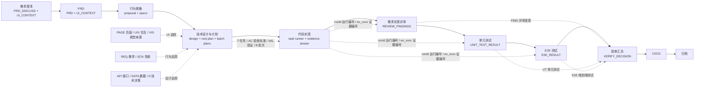
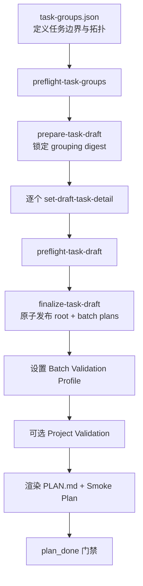
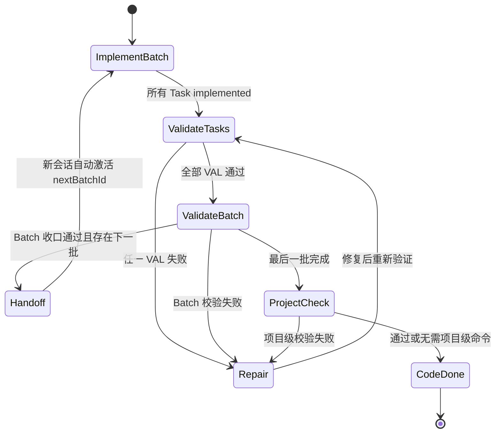

# AutoBizDevOps 全流程 ID 流转与 Plan 分 Batch 实现说明

> 适用范围：`dev_workflow_py` 分支的实现。
>
> 分享目标：说明一个 Feature 从需求澄清到验收归档，如何通过稳定 ID 串起规格、设计、任务、验证和证据；同时说明 Plan 如何生成 Batch、如何逐批执行，以及失败后如何恢复和重新验证。
>
> 2026-08-03：`dev_0803` 主线已决定不合入 F05/F06，本文中 `UI_CONTEXT.json`、`PAGE/UIX/VIS` 与 `ui_context*.py` 相关章节不反映主线现状。主线前端走 `frontend_before_specs` profile 的 `dev.frontend` 节点，Plan 只保留 `uiRequired` 作为 backend/frontend lane 开关，PAGE/UIX ID 由 Plan 自行分配。

## 1. 核心结论

整个流程不是靠文档标题或自然语言关联，而是靠一组稳定 ID 和机器可校验的引用关系形成闭环：

```text
Feature
  -> UI 范围（PAGE 页面 / UIX 用户界面交互 / VIS 视觉来源）
  -> 行为规格（REQ 需求 / SCN 行为场景）
  -> 技术设计（API 接口 / DATA 数据 / D 技术决策）
  -> 执行任务（T 任务 / AC 验收标准 / VAL 验证）
  -> 执行批次（B 批次 / BATCH-VAL 批次验证）
  -> 运行与证据（runId 运行编号 / ev 证据编号）
  -> Review 评审、UT 单元测试、E2E 端到端测试、Verify 验收结果
```

### 1.1 缩写与中文含义速查

| 缩写/前缀 | 英文全称 | 中文含义 | 示例 |
| --- | --- | --- | --- |
| `ID` | Identifier | 标识符/编号 | `T001` |
| `Feature` | Feature | 功能单元/本次需求 | `order-create` |
| `UI` | User Interface | 用户界面 | `UI_CONTEXT.json` |
| `PAGE` | Page | 页面 | `PAGE-001` |
| `UIX` | UI Interaction | 用户界面交互 | `UIX-001` |
| `VIS` | Visual Source | 视觉来源，如设计稿或截图 | `VIS-001` |
| `REQ` | Requirement | 需求/能力要求 | `REQ-001` |
| `SCN` | Scenario | 行为场景/验收场景 | `SCN-001` |
| `Spec` | Specification | 行为规格 | `specs/order/spec.md` |
| `API` | Application Programming Interface | 应用程序接口 | `API-001` |
| `DATA` | Data | 数据模型或数据决策 | `DATA-001` |
| `D` | Decision | 技术决策 | `D-001` |
| `T` | Task | 实现任务 | `T001` |
| `AC` | Acceptance Criteria | 验收标准 | `AC-T001-01` |
| `VAL` | Validation | 验证命令/验证项 | `VAL-T001-01` |
| `B` | Batch | 执行批次 | `B001` |
| `BATCH-VAL` | Batch Validation | 批次级验证 | `BATCH-B001-VAL-001` |
| `PROJECT-VAL` | Project Validation | 项目级最终验证 | `PROJECT-VAL-001` |
| `SMK` | Smoke Test | 冒烟测试 | `SMK-001` |
| `runId` | Run Identifier | 单次执行的运行编号 | `run-20260722T080000Z-a1b2c3d4` |
| `ev` | Evidence | 证据编号 | `ev_0001` |
| `FIND` | Review Finding | 评审发现/评审问题 | `FIND-001` |
| `UT` | Unit Test | 单元测试 | `UT-001` |
| `E2E` | End-to-End Test | 端到端测试 | `E2E-order-create-001` |
| `PRD` | Product Requirements Document | 产品需求文档 | `PRD.md` |
| `CI/CD` | Continuous Integration / Continuous Delivery | 持续集成/持续交付 | `CICD_CHECKLIST.md` |
| `JSON` | JavaScript Object Notation | 结构化数据文件格式 | `plan.json` |
| `JSONL` | JSON Lines | 每行一条 JSON 记录的流式文件格式 | `EVIDENCE.jsonl` |
| `SHA-256` | Secure Hash Algorithm 256-bit | 256 位安全哈希算法，用于完整性摘要 | `taskSetDigest` |
| `UTC` | Coordinated Universal Time | 协调世界时，Run ID 使用的时间基准 | `20260722T080000Z` |

Plan 的职责也分成两层：

- `plan.json` 是 Feature 级索引，只保存 Batch、全局状态和项目级验证，不重复保存任务明细。
- `plans/Bxxx/plan.json` 是 Batch 事实源，拥有该批次的任务、任务验证和批次验证状态。

当前 Batch 策略为 `spec_capability_execution_lane_topological`：任务先满足拓扑顺序，再按主规格、执行通道和工作区契约分组，每批最多 5 个任务，并通过前一批依赖保证逐批收口。

## 2. 全流程视图



### 2.1 阶段、检查点与主要产物

| 阶段 | 检查点 | 主要产物 |
| --- | --- | --- |
| 需求澄清 `biz.discuss` | `discuss_in_progress` -> `discuss_done` | `PRD_DISCUSS.md`、`UI_CONTEXT.json` |
| PRD `biz.prd` | `prd_in_progress` -> `prd_done` | `PRD.md`、`UI_CONTEXT.json` |
| 行为规格 `dev.specs` | `specs_in_progress` -> `specs_done` | `proposal.md`、`specs/**/*.md`、`UI_CONTEXT.json` |
| 技术设计与计划 `dev.plan` | `plan_in_progress` -> `plan_done` | `design.md`、`PLAN.md`、`plan.json`、`plans/Bxxx/plan.json`、`SMOKE_TEST_PLAN.json` |
| 代码实现 `dev.code` | `code_in_progress` -> `code_done` | 源码、`evidence/EVIDENCE.jsonl`，可选探索缓存和冒烟结果 |
| 需求实现评审 `dev.review` | `requirements_eval_in_progress` -> `requirements_eval_done` | `REVIEW_FINDINGS.json`，可选评审报告 |
| 单元测试 `dev.utest` | `unit_test_in_progress` -> `unit_test_done` | `UNIT_TEST_RESULT.json`、`test-output.log`、证据流 |
| E2E `dev.e2e` | `e2e_in_progress` -> `e2e_done` | `E2E_TEST_CASES.yaml`、`E2E_RESULT.json`、`e2e-run.log`、证据流，可选修复请求 |
| 验收汇总 `dev.verify` | `verify_in_progress` -> `verify_done` | `VERIFY_DECISION.json`、证据流，可选验收报告和修复请求 |
| CI/CD `ops.cicd` | `cicd_in_progress` -> `cicd_done` | `CICD_CHECKLIST.md`，可选 `PR_BODY.md` |
| 归档 `ops.archive` | `archived` | Feature 全量产物归档 |

## 3. ID 体系与作用域

### 3.1 ID 总表

| ID（编号） | 示例 | 作用域 | 生成/维护方 | 主要用途 |
| --- | --- | --- | --- | --- |
| Feature ID（功能单元编号） | `order-create` | 工作区内的 Feature | Feature 创建流程 | 所有产物目录和记录的根身份 |
| Capability ID（能力编号） | `order-create-ui` | `UI_CONTEXT.json` | UI Context writer | 将 UI 能力与规格引用绑定 |
| Page ID（页面编号） | `PAGE-001` | 单个 Feature | UI Context writer 顺序分配 | 页面范围、前端任务和 E2E 页面引用 |
| Interaction ID（交互编号） | `UIX-001` | 单个 Feature | UI Context writer 顺序分配 | 交互行为、前端任务和 E2E 交互引用 |
| Visual Source ID（视觉来源编号） | `VIS-001` | 单个 Feature | UI Context writer 顺序分配 | 设计稿、截图等视觉事实来源 |
| Requirement ID（需求编号） | `REQ-001` | 单个 spec 文件；引用时需带路径 | Specs 阶段编写，门禁校验 | 需求能力契约 |
| Scenario ID（行为场景编号） | `SCN-001` | 单个 spec 文件；引用时需带路径 | Specs 阶段编写，门禁校验 | 可验收的行为场景，是覆盖率的核心粒度 |
| API ID（接口编号） | `API-001` | `design.md` | Plan/Design 阶段编写，门禁校验 | 接口决策和任务追踪 |
| Data ID（数据决策编号） | `DATA-001` | `design.md` | Plan/Design 阶段编写，门禁校验 | 数据模型、迁移和回滚决策 |
| Decision ID（技术决策编号） | `D-001` | `design.md` | Plan/Design 阶段编写，门禁校验 | 关键技术决策 |
| Task ID（任务编号） | `T001` | 单个 Feature | 分组输入声明，Plan writer 校验并发布 | 最小实现与验收闭环 |
| Acceptance ID（验收标准编号） | `AC-T001-01` | 单个 Task | Plan writer 自动生成 | 任务内验收标准 |
| Task Validation ID（任务验证编号） | `VAL-T001-01` | 单个 Task | Plan writer 自动生成 | 任务级验证命令及 AC 覆盖关系 |
| Batch ID（批次编号） | `B001` | 单个 Feature | Plan writer 自动分配 | 一次上下文内执行和收口的任务集合 |
| Batch Validation ID（批次验证编号） | `BATCH-B001-VAL-001` | 单个 Batch | Plan writer 从通道 Profile 投影 | 编译、构建、类型检查、Lint 等批次验证 |
| Project Validation ID（项目验证编号） | `PROJECT-VAL-001` | 单个 Feature | Plan writer 顺序分配 | 跨 Batch、跨通道的最终集成/E2E/静态验证 |
| Smoke Test ID（冒烟测试编号） | `SMK-001` | 单个 Feature | Smoke Plan writer 顺序分配 | 旁路冒烟测试及其结果引用 |
| Run ID（运行编号） | `run-20260722T080000Z-a1b2c3d4` | 对应的 Task/Batch 运行目录 | Task runner | 将一次执行快照、命令和证据绑定在一起 |
| Evidence ID（证据编号） | `ev_0001` | 单个 Feature 的证据流 | Evidence store 严格顺序分配 | 所有执行、验证和下游结论的可审计事实 |
| Review Finding ID（评审发现编号） | `FIND-001` | 单个 Feature | Review Findings writer | 评审问题及其 Task/Spec/Evidence 引用 |
| Unit Test Target ID（单测目标编号） | `UT-001` | 单个 Feature | Unit Test Result writer | 单测目标、命令、结果和证据引用 |
| E2E Case ID（端到端用例编号） | `E2E-order-create-001` | 单个 Feature | E2E Result writer | E2E 用例、UI/Spec/Task/Evidence 引用 |

`VERIFY_DECISION.json` 不再额外发明一套验收项 ID，而是直接以 `scenarioRef` 聚合结论，并引用已有 `evidenceIds`。这保证最终验收仍然回到最初的行为场景，而不是停留在“任务已完成”。

### 3.2 为什么 Requirement 和 Scenario 必须带文件路径

`REQ-001`、`SCN-001` 允许在不同 capability 的 spec 文件中重复。因此机器引用使用完整形式：

```text
specs/order-create/spec.md#REQ-001
specs/order-create/spec.md#SCN-001
```

Plan 分组和场景覆盖门禁也基于“文件路径 + 本地 ID”计算。仅写 `SCN-001` 会丢失 capability 上下文，无法可靠判断是否漏场景或错连到其他规格。

### 3.3 一条完整 ID 链路示例

以“创建订单”为例，一条链路可以是：

```text
featureId: order-create
  UI（用户界面）: PAGE-001（页面） -> UIX-002（交互） -> VIS-001（视觉来源）
  Spec（行为规格）: specs/order-create/spec.md#REQ-001（需求）
                   -> specs/order-create/spec.md#SCN-003（行为场景）
  Design（技术设计）: design.md#API-002（接口）
                    -> design.md#DATA-001（数据决策）
                    -> design.md#D-003（技术决策）
  Task（任务）: T003（任务编号）
               -> AC-T003-01（验收标准）
               -> VAL-T003-01（任务验证）
  Batch（批次）: B002（批次编号）
                -> BATCH-B002-VAL-001（批次验证）
  Run（运行）: run-20260722T080000Z-a1b2c3d4（运行编号）
              -> ev_0017（证据编号）
  Downstream（下游结果）:
              UT-003（单元测试）
              / E2E-order-create-002（端到端测试）
              / FIND-001（评审发现）
              -> VERIFY_DECISION.scenarioResults[SCN-003]（场景验收结论）
```

关键点不是 ID 的样式，而是每层都保留上游引用：

- `T003.specRefs` 指向 `REQ（需求）/SCN（行为场景）`，`designRefs/apiIds/dataIds/decisionIds` 指向设计决策。
- `AC-T003-01.scenarioRefs` 表示“该验收标准关联的行为场景”。
- `VAL-T003-01.covers` 表示“该任务验证覆盖的 AC（验收标准）”。
- Evidence 同时记录 `taskId`、`runId`、规格/设计引用、命令结果和变更文件。
- UT、E2E、Review、Verify 只消费这些稳定引用，不通过标题猜测关系。

## 4. Plan 的生成过程

Plan 不是一次性直接写正式 JSON，而是先分组、再逐任务补齐详情，最后原子发布。



### 4.1 第一步：只确定任务分组

`task-groups.json` 只表达任务的稳定边界：

- `id`、`title`、`deps`
- `specRefs`、可选 `mergedScenarioRefs`
- `apiIds`
- `uiRequired` 和 `uiRefs`
- `validationBoundary`
- `workspaceRef`
- 超过常规粒度时的 `splitRationale`

结构门禁要求：

- Task ID 必须严格按输入顺序为 `T001`、`T002`、`T003`。
- 依赖只能指向前面已经出现的任务，保证输入本身就是拓扑序。
- 后端任务必须排在前端任务之前，不能在出现前端任务后再插入后端任务。
- 每个任务必须能回到 Requirement 和 Scenario。
- UI 任务必须提供 Page 等 UI 引用。
- `workspaceRef` 必须命中已声明的代码工作区。
- 所有 path-qualified Scenario 必须被任务完整覆盖。

### 4.2 第二步：逐任务补齐可执行详情

`prepare-task-draft` 根据分组创建草稿骨架，并用 SHA-256 锁定分组内容。随后通过 `set-draft-task-detail` 逐个补齐：

- 目标、范围、入口点、数据对象和文件路径
- 实现要点与非目标
- 验收标准文本及其 Scenario 引用
- 设计、API、Data、Decision 引用
- 可直接执行的验证命令
- 预期文件和阻塞项

以下字段由 writer 统一生成或维护，详情输入不能自行指定：

- `AC-Txxx-xx` 验收 ID
- `VAL-Txxx-xx` 验证命令 ID
- `scope.pages` 和 `scope.workspaceRoots`
- Task 的状态、证据、完成指针等运行时字段

这样可以避免多个任务分别生成冲突 ID，也防止草稿输入伪造“已完成”或“已有证据”的运行时状态。

### 4.3 第三步：粒度与覆盖门禁

普通任务的建议上限为：

| 维度 | 常规上限 | 硬上限/矩阵例外 |
| --- | ---: | ---: |
| Scenario | 5 | 12；超过 12 必须拆分 |
| API | 2 | 3 |
| UI Page | 1 | 2 |
| UI Interaction | 3 | 4 |

6 到 12 个 Scenario 只有在同一个请求/响应或状态矩阵中无法独立验证时才能合并，并且必须：

- 明确列出 `mergedScenarioRefs`。
- 提供足够具体的 `splitRationale`，不能只写“同一模块”或“实现方便”。
- 只有一个必需的行为类验证命令，并完整覆盖该任务的全部 AC。

### 4.4 第四步：原子发布

`preflight-task-draft` 会同时检查分组契约、任务详情、粒度、工作区命令和场景覆盖。全部通过后，`finalize-task-draft` 才会：

1. 将 `taskSetStatus` 从 `collecting` 置为 `finalized`。
2. 投影 Batch。
3. 通过事务写入根 `plan.json` 和所有 `plans/Bxxx/plan.json`。
4. 计算并封存 `taskSetDigest`。

正式产物发布后，状态和证据只能通过 writer/task runner 更新。直接改 JSON 不属于支持的执行路径，因为它会破坏契约摘要、运行快照和证据绑定。

## 5. Batch 如何划分

### 5.1 输入约束

Batch 划分以已经过门禁的 Task 顺序为输入。这个顺序同时具备两个性质：

- 依赖拓扑已满足：一个任务只依赖更早任务。
- 执行通道已分段：先 backend，后 frontend。

### 5.2 首次投影算法

对于尚未分配 Batch 的任务，只有同时满足以下条件，才能追加到前一个 Batch：

1. 与前一个 Batch 的主规格文件相同。主规格取任务第一个 `specRef` 的 `#` 之前部分。
2. 执行通道相同：`uiRequired=true` 为 `frontend`，否则为 `backend`。
3. 工作区契约完全相同，即 `scope.workspaceRoots`/`workspaceRef` 一致。
4. 如果是前端任务，`frontendRoute` 相同；`absolute-html` 和 `spec-driven-ui` 不混批。
5. 前一个 Batch 当前任务数小于 5。

否则创建下一个 `Bxxx`。已有合法 `_batchAssignments` 在重新投影时会优先复用；如果一个分组超过 5 个任务，writer 会继续拆出新 Batch。

等价伪代码：

```text
for task in tasks_in_topological_order:
    if task already has a batch assignment:
        reuse it
    else if last_batch matches spec_root, lane, workspace, route and size < 5:
        append task to last_batch
    else:
        create next Bxxx

    if selected batch already has 5 tasks:
        create next Bxxx and put task there
```

### 5.3 为什么不仅按数量切分

单纯每 5 个任务切一刀会把不同上下文混在一起。当前三个边界分别解决不同风险：

- 主规格边界：一个 Batch 聚焦一个 capability，减少上下文切换。
- backend/frontend 边界：不同执行方式和验证工具不混用。
- workspace 边界：命令的仓库、`cwd` 和 Git 快照范围保持一致。
- 前端路线边界：避免高保真 HTML 解析流程污染不需要高保真的 UI Task。
- 数量边界：限制单次会话的实现和验证规模。

### 5.4 Batch 依赖

每个 Batch 的依赖由两部分组成：

- Task 依赖产生的跨 Batch 依赖。
- 强制加入前一个 Batch，形成逐批执行链。

因此，即使两个 capability 在业务上没有直接依赖，运行时也会按 `B001 -> B002 -> B003` 逐批收口。这是当前实现有意选择的串行模型，不是并行调度器。

## 6. Plan 的物理结构

```text
.autobizdevops/features/<featureId>/
├── plan.json                         # Feature 级 Batch 索引和全局状态
├── PLAN.md                           # 面向人的渲染视图
├── plans/
│   ├── B001/plan.json                # B001 拥有的 Task 与验证状态
│   └── B002/plan.json
├── evidence/
│   ├── EVIDENCE.jsonl                # append-only 证据流
│   ├── EVIDENCE.index.json           # 行数、末尾 ID、摘要等完整性索引
│   └── ev_0001.log                   # 对应证据的命令输出尾部
├── .task-runs/T001/<runId>.json      # Task 运行状态
├── .batch-task-validation-runs/
│   └── B001/<runId>.json             # Deferred Task Validation 运行状态
├── .batch-runs/B001/<runId>.json     # Batch Validation 运行状态
└── BATCH_HANDOFF.json                # 批次切换交接信息
```

根 `plan.json` 中的 Batch 条目只保存：

```json
{
  "id": "B001",
  "path": "plans/B001/plan.json",
  "specRoots": ["specs/order-create/spec.md"],
  "executionLane": "backend",
  "deps": [],
  "taskIds": ["T001", "T002"],
  "status": "in_progress"
}
```

Batch Plan 保存 Task 本体、`taskValidation`、`batchValidation`、完成证据和时间戳。这样 Task 只有一个事实来源，不会同时在根 Plan 和 Batch Plan 中出现两份可漂移副本。

`taskSetDigest` 是 64 位 SHA-256 摘要，覆盖根契约与各 Batch 的任务契约。加载、写入和阶段门都会对其重算，发现手工篡改或多文件不一致时立即停止。

## 7. 三层验证模型

### 7.1 Task Validation

Task 验证命令属于行为闭环，允许的类型为：

- `behavior_test`
- `integration_test`
- `e2e_test`
- `static_check`

当前策略不是“实现一个 Task 就立即验证一个 Task”，而是 `deferred_batch`：

1. 当前 Batch 的所有 Task 先完成实现。
2. 启动一个 Batch 级独立验证上下文。
3. 按 `taskOrder` 串行执行每个 Task 的 `VAL-Txxx-xx`。
4. `fail_fast`，任一 Task 失败即停止。
5. 最大并发数为 1，验证目标是整个 Batch 实现完成后的最终快照。

对应根策略字段为：

```json
{
  "mode": "deferred_batch",
  "orchestration": "single_batch_subagent",
  "failStrategy": "fail_fast",
  "maxConcurrency": 1,
  "agentScope": "task_and_batch_validation_commands"
}
```

### 7.2 Batch Validation

每个执行通道可以配置一个 `batchValidationProfile`，支持两种模式：

- `commands`：执行构建、编译、类型检查、Lint；命令被投影为 `BATCH-Bxxx-VAL-xxx`。
- `task_covered`：不再运行额外批次命令，而是检查本批所有必需 Task 验证证据是否完整，并生成批次收口证据。

Batch 命令类型只允许 `build`、`compile`、`typecheck`、`lint`。Profile 命令还会按 Batch 的 workspace/repository 过滤，避免在错误仓库中执行。

### 7.3 Project Validation

项目级验证只在所有 Batch 完成后执行，用于真正跨 Batch 或跨通道的检查，例如：

- 集成测试
- E2E 测试
- 全项目静态检查

其 ID 为 `PROJECT-VAL-xxx`。没有项目级命令时，所有 Batch 收口后可直接进入 `code_done`；有命令时，必须存在最新通过的 Project Check Evidence。

## 8. 执行状态机

### 8.1 Feature、Batch 和 Task 状态

| 对象 | 状态 |
| --- | --- |
| Feature | `todo`、`in_progress`、`awaiting_next_conversation`、`failed`、`done` |
| Batch | `todo`、`in_progress`、`failed`、`done` |
| Task | `todo`、`in_progress`、`implemented`、`validating`、`failed`、`done` |
| Deferred Task Validation | `pending`、`ready`、`running`、`failed`、`passed`、`invalidated` |
| Batch Validation | `pending`、`running`、`failed`、`revalidation_required`、`passed` |

### 8.2 `code-session` 的路由逻辑

`task_runner.py code-session` 每次只根据机器状态返回下一步，不依赖对话记忆：

| 当前状态 | 下一动作 |
| --- | --- |
| 当前 Batch 的 Task Validation 为 `pending/invalidated` | 继续实现当前 Batch |
| 为 `ready` | 启动批次级 Deferred Task Validation |
| 为 `running` | 按 `activeRunId` 恢复验证 |
| 为 `failed` | 重试，或先启动 Validation Repair 再修改源码 |
| Task Validation 已通过，Batch Validation 未通过 | 执行/恢复批次验证或 `task_covered` 收口 |
| 当前 Batch 全部通过 | 完成 Batch，并生成下一批交接信息 |
| Feature 为 `awaiting_next_conversation` | 校验 `BATCH_HANDOFF.json` 后自动激活 `nextBatchId` |
| 所有 Batch 完成但存在项目级命令 | 执行 Project Check |
| 所有 Batch 和 Project Check 均完成 | 返回 `code_done_ready` |

完整主路径如下：



## 9. Run 与 Evidence 如何保证可恢复、可审计

### 9.1 Run ID

每次 Task、Deferred Task Validation 或 Batch Validation 运行都会生成：

```text
run-<UTC 时间戳>-<8 位随机十六进制>
```

Run 文件保存计划命令、工作区快照、执行状态、已产生的 Evidence ID 和完整性摘要。恢复时必须使用原 `runId`，Task runner 会检查 Evidence 中的 `taskId/runId/commandId` 是否与 Run 一致。

### 9.2 Evidence ID

`evidence_store.py` 在 Feature 级证据流锁内读取现有记录，分配下一个 `ev_xxxx`。调用方不能指定 Evidence ID。

证据写入过程具备以下约束：

- 全 Feature 单调递增，第一条必须是 `ev_0001`。
- `EVIDENCE.jsonl` 只追加，不覆盖历史记录。
- 先写 pending，再提交 JSONL 和索引，崩溃后可以恢复未完成追加。
- 命令输出存入 `evidence/ev_xxxx.log`，Evidence 记录保存路径和摘要元数据。
- `EVIDENCE.index.json` 必须与流的行数、末尾 ID 和 SHA-256 一致。

### 9.3 历史证据与当前有效证据分离

Plan 同时保留两类字段：

- 历史字段：`evidenceIds`、`validationEvidenceIds`、`projectCheckEvidenceIds`。
- 当前有效指针：`latestPassEvidenceId`、`latestPassEvidenceIds`、`latestProjectCheckEvidenceId`。

重试和修复不会删除失败证据；只会新增 Evidence，并移动“当前有效”指针。这既保留完整审计链，也避免旧的通过记录被误当成当前代码快照的有效证明。

## 10. 失败、修复与重新验证

### 10.1 普通验证失败

命令正常启动但返回非零时：

- 写入失败 Evidence。
- 对应 Task/Batch/Feature 进入失败态。
- 后续必须重试，或进入 Validation Repair 修改代码后重新验证。

### 10.2 环境失败

命令无法启动、运行环境缺失等环境问题与代码失败分开处理：

- 不把它伪装成业务代码验证失败。
- 不要求修改 Plan 或业务代码。
- 修复环境后使用同一个 `runId` 继续。

### 10.3 Batch Validation 失败后的影响面

若批次校验失败并修改源码，Task runner 会根据变更文件与 Task scope 判断受影响 Task：

- 明确落入某些 Task scope 时，只失效这些 Task 的当前通过指针。
- 变更属于共享文件或影响面不明确时，保守地重新验证整个 Batch。
- 历史 Evidence 保留，新证据记录 `attemptType=batch_revalidation`，并通过 `triggeredByBatchEvidenceIds`、`supersedesEvidenceIds` 说明触发和替代关系。
- 最终 Batch Pass 必须晚于被替代的失败/旧通过证据。

验证命令执行期间不允许产生 Git 可见文件变更；否则无法证明证据对应的是验证前的既定实现快照。

## 11. 阶段门如何收口

`code_done` 不是简单检查所有 Task 的 `status=done`。门禁会联合验证：

- 根 Plan 与所有 Batch Plan 的 schema 和 `taskSetDigest`。
- 所有 Task、Batch、AC 是否完成。
- 必需验证命令与 Evidence 中实际命令是否完全一致。
- Evidence 的 `taskId`、`batchId`、`runId`、结果、文件变更和输出摘要。
- 当前有效通过证据是否属于最新实现/修复快照。
- 配置了 Project Validation 时，是否存在最新 Project Check Pass。
- UI Feature 是否满足路由和 UI 证据要求。

后续 Review、UT、E2E、Verify 继续引用相同的 Spec/Task/Evidence ID。最终 `VERIFY_DECISION.json` 按 Scenario 汇总 pass/fail/not-applicable，并据此计算 `nextCheckpoint`；失败时可以通过 `FIX_REQUEST.json` 把失败的 Spec 引用和证据带回修复流程。

## 12. 关键实现位置

| 文件 | 核心职责 |
| --- | --- |
| `board_core/board_config.json` | 全流程节点、检查点、输入输出、validator 和 guard 配置 |
| `hooks/ui_context.py` | UI Context schema、PAGE/UIX/VIS/Capability 引用校验 |
| `hooks/ui_context_writer.py` | UI ID 分配、confirmed/locked 状态推进 |
| `hooks/plan_granularity.py` | Task 的 Scenario/API/UI 粒度和矩阵例外规则 |
| `hooks/plan_json.py` | Plan ID 正则、状态集合、Bundle schema、摘要和跨文件契约校验 |
| `hooks/plan_writer.py` | 草稿生成、AC/VAL ID 分配、Batch 投影、状态与证据指针更新 |
| `hooks/task_runner.py` | Run 创建/恢复、Task/Batch/Project 验证、失败修复和 `code-session` 路由 |
| `hooks/evidence_store.py` | Evidence ID 分配、append-only 写入、pending 恢复、索引和日志 |
| `hooks/stage_gate.py` | 各检查点门禁和 `code_done` 总收口 |
| `hooks/review_findings_writer.py` | `FIND-xxx` 评审问题结构化写入 |
| `hooks/unit_test_result_writer.py` | `UT-xxx` 单测结果结构化写入 |
| `hooks/e2e_result_writer.py` | `E2E-<feature>-xxx` E2E 结果结构化写入 |
| `hooks/verify_decision_writer.py` | 按 Scenario 汇总最终验收结论和下一检查点 |

## 13. 分享时建议重点回答的五个问题

1. **为什么要这么多 ID？** 不是为了编号，而是让需求、设计、代码、验证和验收之间可以机器校验，避免靠自然语言猜关系。
2. **为什么 Task 和 Batch 分开？** Task 是最小验收闭环；Batch 是一次上下文内的执行和验证单元，两者的粒度目标不同。
3. **为什么每批最多 5 个？** 用固定上限控制单次实现、上下文和验证规模，同时再用规格、通道、工作区边界保证内聚。
4. **为什么 Evidence 不能覆盖？** 失败、重试和修复都需要保留历史；当前有效性通过 latest 指针表达，而不是删除旧事实。
5. **为什么根 Plan 不保存 Task？** 避免根 Plan 与 Batch Plan 出现两份 Task 真相，根只做索引，Batch 才拥有任务。

## 14. 10 分钟分享提纲

- **第 1 分钟：** 介绍目标：从“文档流转”升级为“可追踪、可恢复、可校验的事实流转”。
- **第 2-4 分钟：** 用一条 `SCN（场景） -> T（任务） -> AC（验收标准）/VAL（验证） -> B（批次） -> run（运行） -> ev（证据） -> Verify（验收）` 链路讲清 ID 流转。
- **第 5-7 分钟：** 讲 Batch 的五个边界：主规格、backend/frontend、workspace、前端路线、最多 5 个任务。
- **第 8-9 分钟：** 讲三层验证、批次交接、失败修复和 Evidence append-only。
- **第 10 分钟：** 总结三个设计原则：单一事实源、稳定引用、历史不可变。
