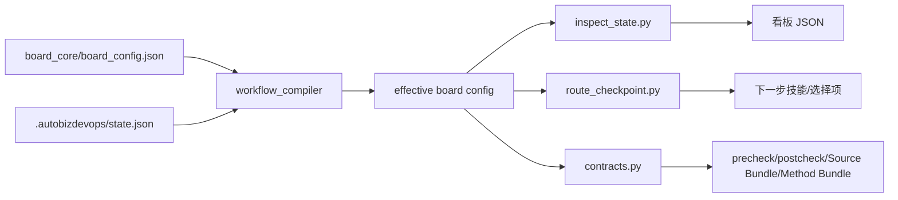

# Inspect、状态 JSON 与动态工作流实现说明

本文面向维护者，解释本仓库当前 `dev_workflow` 分支下的看板 inspect 适配器、`board_core` JSON 配置、状态存储，以及动态工作流的实现机制。

## 当前分支结论

本分支的工作流语义可以先记住四点：

- `workflow.profiles` 当前只有 `standard`。旧的 `frontend_before_specs` / `dev.frontend` profile 路线已经移除，PRD 完成后不再弹出“先 HTML 转前端”的 profile 选择。
- HTML 设计稿被并入 `dev.code` 的可选输入 `frontend_html`，路径为 `frontend-html/**/*`。缺失时按该 input 的 `extract.degrade` 跳过，不阻塞编码。
- skill 文档不再维护静态产物清单。每个 skill 运行前应通过 `hooks/inspect_skill_contract.py <skill> --feature <FEATURE_ID> --json` 查询当前 Feature 的 Source Bundle 和 Method Bundle。
- `external` flag 已被移除，缺少上游 producer 的输入通过 drop semantics 从有效契约中移除；bundle 未列出的 input 不读、不等、不索要。

## 1. 总体结构

当前插件把一个 Feature 的研发流程拆成三层：

| 层级 | 代表文件 | 职责 |
| --- | --- | --- |
| 配置层 | `board_core/board_config.json` | 声明看板命令、工作流模板、节点、checkpoint、产物契约、动态阶段、skip 策略。 |
| 编译与契约层 | `board_core/workflow_compiler.py`、`board_core/contracts.py`、`board_core/workflow.py`、`board_core/workflow_closure.py` | 把基础 JSON 和运行态选择编译成某个 Feature 的有效工作流，并派生状态、转移、技能契约、输入依赖闭包。 |
| 运行态层 | `.autobizdevops/state.json`、`inspect_state.py`、`hooks/route_checkpoint.py`、`hooks/update_checkpoint.py`、`hooks/skip_node.py` | 读取和更新每个 Feature 的 checkpoint、动态决策、模板选择和跳过节点，然后输出给 UI 或技能路由使用。 |

核心思路是：`board_config.json` 定义可用流程，`state.json` 记录每个 Feature 实际选择了哪条流程，inspect 和 hooks 每次都基于这两者临时编译有效工作流。



## 2. Inspect 适配器

入口文件是 `inspect_state.py`。它不是简单读取状态，而是把工作流 shell、Feature 当前节点、节点状态、产物扫描结果和引用路径组装为看板协议 JSON。

### 2.1 命令入口来自 board_config

`board_config.json` 的 `inspectCommands` 为不同平台声明 UI 可调用命令：

| 命令 | 作用 |
| --- | --- |
| `project_status` | 调用 `inspect_state.py --mode project`，返回多个项目的 run 摘要。 |
| `feature_status` | 调用 `inspect_state.py --mode run`，返回某个 Feature 的完整节点和产物状态。 |
| `create_project` | 调用 `hooks/init_workspace.py --mode createProject` 初始化项目产物目录。 |
| `create_feature` | 调用 `hooks/init_workspace.py --mode createFeature` 创建 Feature，并写入初始状态记录。 |
| `dynamic_workflow` | 调用 `hooks/inspect_workflow_templates.py`，给 UI 返回模板和自定义节点目录。 |
| `skip_node` | 调用 `hooks/skip_node.py`，由 UI 显式参数跳过节点。 |

`system_prompt_inject` 会给技能上下文注入 `PLUGIN_ROOT`、`PLUGIN_WORKSPACE`、`PROJECT_DIR`、`PROJECT_PLUGIN_DIR`、`FEATURE_DIR` 等路径，避免技能自己猜 Feature 名或产物路径。

### 2.2 run 模式

`run_mode(workspace, feature, config)` 处理单个 Feature：

1. 通过 `load_state_records()` 读取 `.autobizdevops/state.json`，兼容修复 `STATE.md`。
2. 找到当前 Feature 记录，提取：
   - `workflowProfile`
   - `workflowTemplate`
   - `workflowDecisions`
   - `workflowNodes`
   - `workflowSkippedNodes`
3. 如果记录不是标准流程，调用 `load_record_effective_board_config()` 编译该 Feature 的有效 workflow。
4. 调用 `load_state_md()` 读取 feature 到 checkpoint 的映射。函数名保留旧兼容性，实际以 `state.json` 为准。
5. 用 `find_current_node()` 把 checkpoint 映射到节点。
6. 对每个节点调用：
   - `derive_node_status()` 派生 `not_started`、`in_progress`、`done`、`skipped`、`archived` 等状态。
   - `scan_artifacts()` 扫描该节点输出产物是否存在。
7. 输出：
   - `workflow`: 由 `build_workflow_shell()` 清理后的工作流展示结构。
   - `run`: Feature 当前状态、节点状态、产物状态、watch refs、hook log refs。

`workflow_marker()` 会根据 profile、template、decisions、workflowNodes 和 skipped nodes 生成稳定的 `workflowId`。project 模式会用它区分不同有效链，避免 UI 缓存把不同流程混在一起。

### 2.3 project 模式

`project_mode(workspace, projects, config)` 会遍历项目目录，调用 `_collect_project_runs()` 汇总每个 Feature：

| 字段 | 含义 |
| --- | --- |
| `featureName` / `featureId` | Feature slug。 |
| `currentNodeId` | 当前 checkpoint 所属节点。 |
| `currentNodeStatus` | 当前节点状态。 |
| `currentNodeStatusLabel` | UI 展示文案。 |
| `nodeIds` | 该 Feature 有效工作流的节点链。 |
| `workflowTemplate` | 非标准模板时返回。 |
| `workflowSkippedNodes` | 有跳过节点时返回。 |

project 模式不扫描每个节点产物，只给列表页使用的轻量摘要。

### 2.4 inspect 的降级行为

当状态不存在或异常时，inspect 不直接崩溃：

| 场景 | 行为 |
| --- | --- |
| `state.json` 不存在 | summary 中说明项目尚未初始化。 |
| `state.json` 中无记录 | summary 中说明没有 Feature 记录。 |
| Feature 不存在 | summary 中说明该 Feature 未找到。 |
| checkpoint 未知 | summary 中说明无法映射到流程节点。 |
| Feature 目录不存在 | 仍按约定路径扫描，产物显示缺失。 |

这让 UI 可以展示“未初始化/状态异常”的看板，而不是只得到进程失败。

## 3. 状态 JSON

运行态状态文件位于项目产物目录：

```text
.autobizdevops/state.json
```

`STATE.md` 仍存在，但它现在是生成视图。`board_core/state_store.py` 负责在读取时检查或修复两者同步。

### 3.1 state.json 结构

当前 schema 是 `autobizdevops.state.v3`：

```json
{
  "schemaVersion": "autobizdevops.state.v3",
  "features": {
    "alpha": {
      "feature": "alpha",
      "owner": "owner",
      "checkpoint": "plan_done",
      "stage": "Plan 完成",
      "iteration": "1",
      "updated_at": "2026-05-25 12:00:00",
      "workflowProfile": "standard",
      "workflowDecisions": {
        "detail_design_before_code": "enabled"
      },
      "workflowTemplate": "standard"
    }
  }
}
```

字段说明：

| 字段 | 必要性 | 说明 |
| --- | --- | --- |
| `feature` | 必需 | 与 features map 的 key 必须一致。 |
| `checkpoint` | 必需 | 当前状态，必须存在于该 Feature 的有效 workflow contracts 中。 |
| `stage` | 可补齐 | 展示文案，默认由 checkpoint 的 stage label 派生。 |
| `owner`、`iteration`、`updated_at` | 可补齐 | project 看板展示字段。 |
| `workflowProfile` | 可选 | 默认为 `standard`。用于选择 profile overlay。 |
| `workflowDecisions` | 可选 | 动态阶段选择，值只能是 `enabled` 或 `skipped`。 |
| `workflowTemplate` | 可选 | 默认为 `standard`。可为 `standard`、`lean`、`custom`。 |
| `workflowNodes` | custom 模板使用 | 自定义模板选择的节点列表，创建时会经 closure 求解。 |
| `workflowSkippedNodes` | 可选 | 中途跳过的节点 id 列表。 |

### 3.2 读取和修复策略

`board_core/state_store.py` 中有两组读取函数：

| 函数 | 行为 |
| --- | --- |
| `load_state_json_records_result()` | 只读 `state.json`，不 fallback，不修复。`read_state_json.py` 使用它。 |
| `check_or_fix_state_sync(fix=True)` | 以 `state.json` 为主；若缺失则从旧 `STATE.md` 迁移；必要时重写规范化的 `state.json` 和 `STATE.md`。 |
| `load_state_md()` | 兼容旧函数名，实际调用 `check_or_fix_state_sync()`。 |
| `write_state_records()` | 原子写入 `state.json`，并重新生成 `STATE.md`。 |

状态规范化会校验：

- Feature key 与记录内 `feature` 是否一致。
- `workflowDecisions` 是否为对象，值是否为 `enabled` 或 `skipped`。
- `workflowSkippedNodes` 是否为非空字符串列表。
- 当前 checkpoint 是否存在于该 Feature 编译后的有效 workflow。
- custom 模板的 `workflowNodes` 是否可解析。

## 4. 运行时契约查询

当前分支把 skill 的输入输出契约收敛到运行时查询，而不是在各个 `SKILL.md` 里维护静态清单。入口是：

```bash
python "{PLUGIN_ROOT}/hooks/inspect_skill_contract.py" <skill> --feature "{FEATURE_ID}" --json
```

如果没有 `FEATURE_ID`，可以省略 `--feature` 查看基线契约。带 `--feature` 时，脚本会读取该 Feature 的 `state.json` 记录，并根据 `workflowProfile`、`workflowTemplate`、`workflowDecisions`、`workflowNodes`、`workflowSkippedNodes` 编译出该 Feature 的真实契约。

JSON 输出里的关键字段：

| 字段 | 含义 |
| --- | --- |
| `inputs` | 完整输入 artifact 列表，包含 `extract`。 |
| `outputs` | 输出 artifact 列表。 |
| `required_inputs` | 必需输入路径列表，缺失时应阻塞。 |
| `required_outputs` | 必需输出路径列表。 |
| `sourceBundle` | 运行时要读什么：每个输入的路径、label、required。 |
| `methodBundle` | 运行时怎么读：每个输入对应的 `extract.focus`、`extract.method`、`extract.degrade`。 |
| `workflow` | 带 `--feature` 时返回 Feature 的 workflow 上下文。 |
| `validators` / `guards` | 当前节点的校验器和 guard。 |

配套的 `hooks/sync_skill_contract_hints.py` 只在 skill 文档中维护一段查询提示：契约唯一事实来源是 `board_config.json` 的编译结果，skill 文档正文里写死的文件名不应作为准入依据。

## 5. board_config.json 当前内容

`board_core/board_config.json` 是工作流的基础配置。它主要包含 `inspectCommands`、`workflow` 和 `checkpointSuffixState`。

### 5.1 workflow.templates

当前有三个模板：

| 模板 | kind | 当前含义 |
| --- | --- | --- |
| `standard` | `profile` | 完整主干流程，默认 Biz -> Dev -> Ops。 |
| `lean` | `nodeSubset` | 精简路线：`dev.specs` -> `dev.code` -> `ops.archive`。 |
| `custom` | `custom` | 用户自由选择节点，但强制包含 `dev.code` 和 `ops.archive`。 |

`nodeSubset` 和 `custom` 都会走 `compile_node_subset()`。它们不支持非标准 `workflowProfile`，也不支持 `workflowDecisions`。

### 5.2 workflow.profiles

当前内置 profile 只有 `standard`：

| profile | 当前含义 |
| --- | --- |
| `standard` | PRD 完成后进入 `autodev-specs`；HTML 转前端已并入 `autodev-code` 的前端 HTML 实现分支。 |

旧的 `frontend_before_specs` profile 和 `dev.frontend` 节点在本分支已移除。编译器仍支持从以下位置加载 profile overlay：

```text
board_core/workflow.d/*.json
<project>/.autobizdevops/workflow.d/*.json
```

overlay 可声明新增节点和 `enabledDynamicPhases`。默认允许动态节点 phase 为 `Biz` 和 `Dev`，`Ops` 需要 overlay 显式启用。

因为当前只有一个 profile，`prd_done` 处的 `requiresProfileChoice` 为 `false`。只有重新加入第二个 profile 或外部 profile overlay 后，profile 选择才会再次出现。

### 5.3 workflow.dynamicStages

当前配置了一个动态阶段：

| 字段 | 当前值 |
| --- | --- |
| `id` | `detail_design_before_code` |
| `phase` | `Dev` |
| `choiceCheckpoint` | `plan_done` |
| `defaultDecision` | `pending` |
| `insertAfter` | `dev.plan` |
| `enableTargetCheckpoint` | `detail_design_in_progress` |
| `skipTargetCheckpoint` | `code_in_progress` |
| 启用节点 | `dev.detail_design` |
| 启用技能 | `autodev-detail-design` |
| 输出产物 | `DETAIL_DESIGN.md` |

含义是：当 Feature 到达 `plan_done` 时，UI 或技能路由需要让用户选择是否进入详细设计。

- 选择 `enabled`：插入 `dev.detail_design`，转移变成 `plan_done -> detail_design_in_progress -> detail_design_done -> code_in_progress`。
- 选择 `skipped`：不插入该节点，继续使用 `plan_done -> code_in_progress`。
- 未选择且 `defaultDecision=pending`：路由会返回 `requiresWorkflowChoice=true`，提示 UI 展示选择项。

### 5.4 checkpointSuffixState

checkpoint 后缀到节点状态的映射如下：

| 后缀或特殊 checkpoint | nodeStatus | label |
| --- | --- | --- |
| `_in_progress` | `in_progress` | `进行中` |
| `_done` | `done` | `已完成` |
| `needs_fix` | `blocked` | `已阻断` |
| `archived` | `archived` | `已归档` |

`board_core/workflow.py` 的 `extract_checkpoint_suffix()` 和 `derive_node_status()` 使用该映射计算看板节点状态。

### 5.5 当前主干节点

| 顺序 | 节点 | skill | checkpoint | 主要输入 | 主要输出 |
| --- | --- | --- | --- | --- | --- |
| 1 | `biz.discuss` 需求澄清 | `autobiz-requirement-discuss` | `discuss_in_progress`、`discuss_done` | 无 | `PRD_DISCUSS.md` |
| 2 | `biz.prd` PRD 生成 | `autobiz-prd-generate` | `prd_in_progress`、`prd_done` | `PRD_DISCUSS.md` | `PRD.md` |
| 3 | `dev.specs` 行为规格 | `autodev-specs` | `specs_in_progress`、`specs_done` | `PRD.md` | `proposal.md`、`specs/**/*.md` |
| 4 | `dev.plan` 技术设计与计划 | `autodev-plan` | `plan_in_progress`、`plan_done` | `proposal.md`、`specs/**/*.md` | `design.md`、`PLAN.md` |
| 5 | `dev.code` 代码实现 | `autodev-code` | `code_in_progress`、`code_done` | `proposal.md`、`specs/**/*.md`、`PRD.md`、`design.md`、`PLAN.md`、`frontend-html/**/*` | 代码变更 |
| 6 | `dev.review` 需求实现评审 | `autodev-reviewer` | `requirements_eval_in_progress`、`requirements_eval_done` | specs、PRD、design、PLAN | `REQUIREMENTS_EVAL.md` |
| 7 | `dev.utest` 单元测试 | `autodev-utest` | `unit_test_in_progress`、`unit_test_done` | specs、PRD、design、PLAN、评审报告 | `UNIT_TEST_REPORT.md`、`test-output.log` |
| 8 | `dev.e2e` E2E 测试 | `autodev-e2e` | `e2e_in_progress`、`e2e_done` | specs、PRD、design、PLAN、评审和单测报告 | `E2E_TEST_CASES.yaml`、`E2E_REPORT.md`、`e2e-run.log` |
| 9 | `dev.verify` 验收汇总 | `autodev-verify` | `verify_in_progress`、`verify_done` | specs、design、PLAN、测试报告 | `VERIFY_REPORT.md` |
| 10 | `ops.cicd` CI/CD | `autoops-cicd` | `cicd_in_progress`、`cicd_done` | `VERIFY_REPORT.md`、`PRD.md`、`design.md` | `CICD_CHECKLIST.md`、`PR_BODY.md` |
| 11 | `ops.archive` 归档 | `autoops-archive` | `archived` | `CICD_CHECKLIST.md` | 无 |

`dev.code` 当前带有 `code_compile` guard。进入 `code_done` 前还会通过相关 hook 执行编译保护。

`frontend-html/**/*` 是 `required: false` 的可选输入。它只提供页面结构、布局、组件槽位和交互线索，不覆盖 specs、design、PLAN；缺失时按 `extract.degrade` 直接跳过前端 HTML 分支。

### 5.6 Method Bundle 完整性约束

`tests/test_board_config_invariants.py` 保护两个分支级不变量：

- 所有 input artifact 都必须声明 `extract`，且 `extract.degrade` 非空。这样 Source Bundle 中的每个“读什么”都能配对 Method Bundle 中的“怎么读/缺失怎么降级”。
- 任何 artifact 都不得再声明 `external` 字段。旧 external 语义已经由 drop semantics 取代。

## 6. 动态工作流编译机制

动态工作流的主入口是：

```python
load_effective_board_config(...)
load_record_effective_board_config(...)
compile_board_config(...)
compile_node_subset(...)
```

### 6.1 标准流程编译

标准流程没有 template subset 时走 `compile_board_config()`：

1. 规范化 profile、decisions 和 skipped nodes。
2. 读取 `workflow.dynamicStages` 并校验 schema。
3. 收集 overlay：
   - `workflow.profiles[profile]`
   - `board_core/workflow.d/*.json`
   - `<workspace>/.autobizdevops/workflow.d/*.json`
   - 已启用动态阶段生成的 overlay。
4. 如果没有 overlay 且没有 skipped nodes，返回基础配置，但仍校验 dynamic stage 定义。
5. 如果有 overlay，则逐个 `_build_dynamic_node()` 并 `_insert_dynamic_node()`。
6. 如果有 skipped nodes，则 `_mark_skipped_nodes()`，并从 active chain 中 `_drop_broken_inputs()`。
7. `_assemble_effective()` 统一派生：
   - 节点顺序 `order`
   - 节点 states 和 nextAction
   - checkpoint initial
   - checkpoint transitions
   - stage labels
   - UI transitions
8. 返回有效 config，并带上 `workflowProfile`、`workflowDecisions`，必要时带 `workflowSkippedNodes` 和 `workflowDroppedInputs`。

### 6.2 动态阶段如何插入节点

`workflow.dynamicStages` 本身只是声明“可选阶段”。只有当 `workflowDecisions[stageId] == "enabled"` 时，编译器才会把该 stage 转为 overlay。

以当前 `detail_design_before_code` 为例：

```json
{
  "detail_design_before_code": "enabled"
}
```

启用后会把 `dev.detail_design` 插入 `dev.plan` 后面。编译器随后重新计算节点链，所以不是简单追加节点，而是完整重建：

```text
dev.plan(plan_done)
  -> dev.detail_design(detail_design_in_progress)
  -> dev.detail_design(detail_design_done)
  -> dev.code(code_in_progress)
```

如果决策为 `skipped`，动态节点不会进入节点链。`workflowDecisions` 仍保存在状态记录中，用来表明该 Feature 在选择点做过“不需要详细设计”的决定。

### 6.3 动态阶段校验

编译器会在加载时拒绝不一致配置：

| 校验 | 说明 |
| --- | --- |
| stage id 唯一 | 不允许重复 dynamic stage。 |
| `phase` | 当前 dynamic stage 只支持 `Dev`。overlay 编译器支持 `Biz`、`Dev`、`Ops`，但 `Ops` 默认未启用。 |
| `insertAfter` / `insertBefore` | 必须且只能声明一个插入锚点。 |
| `choiceCheckpoint` | 必须是基础节点已声明 checkpoint。 |
| `skipTargetCheckpoint` | 必须是基础节点已声明 checkpoint。 |
| `enableTargetCheckpoint` | 必须等于动态 stage 第一个节点的 start checkpoint。 |
| skill 安装 | `_validate_skill()` 会检查对应 `skills/**/SKILL.md` 是否存在。 |
| required input | `_validate_artifact_dependencies()` 要求 required input 必须由上游节点产出。 |
| checkpoint 唯一 | 不允许两个节点声明同一个 checkpoint。 |

### 6.4 nextAction 派生

`workflow_compiler.py` 的 `_derive_node_states()` 会为每个节点派生 states：

| 状态 | nextAction 指向 |
| --- | --- |
| `not_started` | 当前节点 skill。 |
| `in_progress` | 当前节点 skill。 |
| `done` | 下一个未跳过节点的 skill。 |
| `archived` | archive 节点自身 skill，并使用查看归档状态文案。 |

如果节点已有 state 且其中的 `nextAction.slashSkill` 与目标 skill 相同，编译器会保留该 state 的额外 UI 字段。动态节点还可以通过节点内 `nextAction` 覆盖不同状态的默认文案。

这就是为什么启用详细设计后，`dev.plan` 的 done 状态会从原来的 `/autodev-code` 改为 `/autodev-detail-design`。

### 6.5 workflow shell

`build_workflow_shell()` 会把内部字段从有效 config 中剥离，只保留 UI 需要的展示结构。

会被移除的字段包括：

- 顶层 `id`、`version`、`kind`
- `workflow.templates`
- `workflow.checkpoints`
- `workflow.transitions`
- `workflow.profiles`
- `workflow.dynamicStages`
- `workflow.skipPolicy`
- node 内部的 `checkpoints`、`order`、`skill`、`artifacts`、`validators`、`guards`、`_dynamic` 等

UI 看到的是节点、状态、状态动作和 artifact definitions，而不是完整契约。

## 7. 动态路由机制

下一步路由入口是 `hooks/resolve_next_skill.py`，它调用 `hooks/route_checkpoint.py` 的 `resolve_route()`。

### 7.1 resolve_route 输出

核心输出字段：

| 字段 | 含义 |
| --- | --- |
| `workflowProfile` | 当前 Feature profile。 |
| `workflowTemplate` | 当前 Feature template。 |
| `workflowDecisions` | 已做出的动态阶段选择。 |
| `workflowSkippedNodes` | 已跳过节点。 |
| `checkpoint` | 当前 checkpoint。 |
| `currentNodeId` | 当前节点。 |
| `currentNodeStatus` | 当前状态。 |
| `allowedNextCheckpoints` | 当前 checkpoint 允许去往的下一个 checkpoint。 |
| `recommendedNextSkill` | 根据 allowed next 和 contracts 推导的推荐 skill。 |
| `requiresProfileChoice` | 当前 checkpoint 是否需要选择 profile。 |
| `profileChoices` | profile 选择项。 |
| `requiresWorkflowChoice` | 当前 checkpoint 是否需要动态阶段选择。 |
| `workflowChoices` | 动态阶段 enabled/skipped 选择项。 |
| `skippableNodes` | 当前允许跳过的节点列表。 |
| `nextAction` | 当前节点当前状态的 UI 行为。 |

`resolve_next_skill.py --json` 原样输出机器可读 JSON；不带 `--json` 时打印简短文本。

### 7.2 Workflow choice 的产生

`_pending_dynamic_stage()` 会查找：

1. stage 的 `choiceCheckpoint` 等于当前 checkpoint。
2. 该 stage id 不在 `workflowDecisions` 中。
3. `defaultDecision` 不是 `skip`。

满足条件时，`_workflow_choice_payload()` 生成两个选择：

| 选择 | 写入值 | target |
| --- | --- | --- |
| 启用 | `stageId=enabled` | `enableTargetCheckpoint` |
| 跳过 | `stageId=skipped` | `skipTargetCheckpoint` |

每个选择都会预编译一次 workflow，用于返回 `allowedNextCheckpoints` 和 `recommendedNextSkill`。

### 7.3 写入决策

`hooks/update_checkpoint.py` 的 `prepare_checkpoint_update()` 支持 `workflow_decision_updates`。它会：

1. 校验 `stage=enabled|skipped` 格式。
2. 校验只能在该 dynamic stage 的 `choiceCheckpoint` 写入决策。
3. 合并旧 `workflowDecisions` 和本次更新。
4. 用合并后的 workflow record 编译 contracts。
5. 校验目标 checkpoint 是否属于有效 workflow。
6. 校验 checkpoint transition。
7. 运行 lifecycle precheck/postcheck。
8. 成功后写回 `state.json` 和 `STATE.md`。

因此动态选择不是 UI 的临时态，而是写入 `state.json` 的 Feature 级持久决策。

## 8. 模板、自定义节点与 closure

`hooks/inspect_workflow_templates.py` 给 UI 提供两个模式。

### 8.1 templates 模式

默认模式会返回：

- `templates`: `standard`、`lean`、`custom` 的展示选项。
- `nodes`: 可选节点目录，包括 id、label、group、skill、description、inputs、outputs。

### 8.2 closure 模式

`--mode closure --nodes ...` 会调用 `solve_node_closure()`：

| 输出 | 说明 |
| --- | --- |
| `nodes` | 最终节点列表，按基础 workflow 顺序排序。 |
| `added` | 自动补全模式下被拉入的 producer 节点。 |
| `entryNodes` | 入口节点，或因 required input 被移除而成为入口的节点。 |
| `dropped` | 因上游 producer 不在链中而从契约移除的输入。 |
| `suggestions` | 可以补充哪些上游节点来提供被移除输入。 |
| `initialCheckpoints` | 编译后初始 checkpoint。 |
| `transitions` | 编译后的 checkpoint 转移图。 |

默认不会强行补全上游。缺少 producer 的输入会从节点契约中移除，技能不会读取，也不会向用户索要。`--auto-include` 才会递归拉入 required input 的 producer。

### 8.3 lean 模板示例

`lean` 固定节点为：

```text
dev.specs -> dev.code -> ops.archive
```

编译时会移除不在链中的输入。例如 `dev.code` 在完整流程中依赖 `design.md` 和 `PLAN.md`，但 lean 没有 `dev.plan`，所以这些输入会从 code 契约中删除。最终 code 主要基于 `proposal.md` 和 `specs/**/*.md` 工作。

## 9. 跳过节点机制

UI 通过 `hooks/skip_node.py` 调用 `prepare_skip_update()`。

跳过节点与动态 stage 的 `skipped` 不同：

| 类型 | 存储字段 | 含义 |
| --- | --- | --- |
| 动态阶段跳过 | `workflowDecisions[stageId] = "skipped"` | 在选择点决定不插入某个动态阶段。 |
| 中途跳过节点 | `workflowSkippedNodes = ["dev.utest"]` | 对已经在有效链中的节点执行 skip。 |

### 9.1 skip 校验规则

`validate_skip_request()` 会检查：

- 请求不能为空。
- node id 必须存在于当前有效链。
- 不能跳过已跳过节点。
- 不能跳过 `skipPolicy.lockedNodes` 中锁定的节点。
- 不能跳过已完成节点。
- 当前节点只有在 `*_in_progress` 时才能跳过。
- 不能跳过全部剩余节点。
- 如果跳过当前节点，后面必须有可落地的 active 节点。

### 9.2 skip 编译行为

跳过后，节点仍保留在 `workflow.nodes` 中用于 UI 展示，但标记为：

```json
{ "skipped": true }
```

contracts、transitions、precheck、postcheck 只看 active chain。也就是说：

- 被跳过节点的 checkpoint 变为未知，不能再作为合法转移目标。
- transitions 会桥接到下一个 active 节点。
- 因跳过导致上游缺失的输入会被 `_drop_broken_inputs()` 移出契约。
- 如果跳过的是当前节点，`landing_checkpoint_after_skip()` 会把 checkpoint 落到后续 active 节点的 start checkpoint。

## 10. 契约与生命周期校验

`board_core/contracts.py` 从有效 workflow 生成 `WorkflowContracts`：

| 字段 | 用途 |
| --- | --- |
| `skill_contracts` | skill 到节点输入输出、validator、guard 的映射。 |
| `known_checkpoints` | 当前有效 workflow 允许出现的 checkpoint。 |
| `initial_checkpoints` | 新 Feature 可进入的初始 checkpoint。 |
| `allowed_next` | checkpoint transition 白名单。 |
| `stage_labels` | checkpoint 到展示阶段文案。 |
| `start_checkpoint_to_skill` | 进入某 checkpoint 时应运行哪个 skill 的 precheck。 |
| `end_checkpoint_to_skill` | 离开某 checkpoint 时应运行哪个 skill 的 postcheck。 |
| `skipped_skills` | 如果 skill 所属节点被跳过，访问契约时给出明确错误。 |

`hooks/state_checkpoint.py` 使用 contracts 做两类校验：

- `validate_transitions()`：检查 checkpoint 变更是否在 `allowed_next` 中。
- `validate_lifecycle()`：进入新节点时跑 precheck，离开旧节点时跑 postcheck。

因此 workflow 的合法性不是散落在各 skill 中，而是由编译后的 contracts 统一约束。

## 11. 产物扫描

`board_core/artifacts.py` 负责 inspect 时的输出产物状态。

支持两类路径：

| 类型 | 行为 |
| --- | --- |
| 普通文件 | 检查 `<feature_dir>/<path>` 是否存在。 |
| glob | 目前只允许 `specs/**/*.md`，且 artifact id 必须是 `specs`。 |

返回字段包括：

- `id`
- `artifactLabel`
- `path` 或 `paths`
- `artifactStatus`: `generated` 或 `missing`
- `artifactStatusLabel`: `已生成` 或 `未生成`

## 12. 常见维护场景

### 12.1 新增普通节点

1. 在 `board_config.json` 的 `workflow.nodes` 中新增节点。
2. 声明唯一 `id`、`label`、`group`、`skill`、`checkpoints`。
3. 声明 `artifacts.inputs` 和 `artifacts.outputs`。
4. 更新基础 `workflow.checkpoints.transitions` 和 `stageLabels`，或确认编译器会派生。
5. 确认对应 `skills/**/<skill>/SKILL.md` 存在。
6. 运行相关测试。

### 12.2 新增动态阶段

1. 在 `workflow.dynamicStages` 中添加 stage。
2. 确认 `choiceCheckpoint` 是已有 checkpoint。
3. 确认 `insertAfter` 或 `insertBefore` 锚点存在。
4. 确认 `enableTargetCheckpoint` 等于动态阶段第一个节点的 start checkpoint。
5. 确认 `skipTargetCheckpoint` 存在于基础 workflow。
6. 为 stage nodes 声明 `checkpointPrefix`，不要包含 `_in_progress` 或 `_done` 后缀。
7. 确认 required input 都由启用后的上游节点产出。
8. 通过 `resolve_next_skill.py --json` 检查选择点是否返回 `workflowChoices`。

### 12.3 调试某个 Feature 的路由

常用命令：

```bash
python3 hooks/resolve_next_skill.py --workspace <project-plugin-dir> --feature <feature> --json
```

如果要查看看板 run 输出：

```bash
python3 inspect_state.py --workspace <plugin-workspace> --mode run --project <project> --feature <feature>
```

如果只想检查状态 JSON：

```bash
PLUGIN_WORKSPACE=<plugin-workspace> PROJECT_CODE=<project> FEATURE_ID=<feature> python3 read_state_json.py --feature <feature>
```

`read_state_json.py` 故意只读 `state.json`，不会从 `STATE.md` fallback，适合排查真实状态源。

### 12.4 调试某个 skill 的运行时契约

查看某个 Feature 下某个 skill 的真实 Source Bundle / Method Bundle：

```bash
python3 hooks/inspect_skill_contract.py autodev-code --workspace <project-plugin-dir> --feature <feature> --json
```

如果 output 中没有某个 input，就表示它不属于当前有效工作流；不要读取、等待或向用户索要。

## 13. 当前实现的关键边界

- `state.json` 是主状态源，`STATE.md` 是生成视图。
- inspect run 输出的是某个 Feature 的有效 workflow，不一定等于基础 `board_config.json`。
- template subset 和 custom 不支持动态阶段决策，也不支持非标准 profile。
- 动态 stage 的 `skipped` 是选择不插入节点；`workflowSkippedNodes` 是中途跳过已在链中的节点。
- 被跳过节点留在 UI 节点数组中，但不参与 contracts。
- `nextAction` 会随有效链重算，不能只看基础 JSON 中写死的 done action。
- Source Bundle 和 Method Bundle 来自有效 contracts，跳过或 subset 后不存在的输入不会被技能读取。
- `required: false` 的输入缺失时按 `extract.degrade` 继续；不再通过 `external` 或“让用户补文件”表达。
