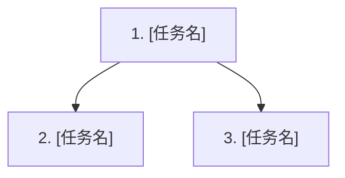

# 计划模板

> 由 Plan 阶段生成，写入 `{FEATURE_DIR}/PLAN.md`。本文件只承载执行层任务、验证计划和覆盖矩阵；行为契约以 `{FEATURE_DIR}/specs/**/*.md` 为准，接口/数据/技术决策以 `{FEATURE_DIR}/design.md` 为准。

---

````markdown
# 执行计划: [来自 proposal/specs/design.md 的标题]

来源: proposal.md + specs/**/*.md + design.md
状态: 待执行
创建时间: [ISO 日期时间]

## 概述

**Feature**: {slug}
**目标**: [一句话说明本轮实现目标]
**行为依据**: specs/**/*.md
**设计依据**: design.md

---

## 任务 DAG



---

## 任务总览

共 N 个任务，预计涉及 M 个文件。

| #    | 任务           | 依赖 | 覆盖规格/设计项          | 状态 |
| ---- | -------------- | ---- | ------------------------ | ---- |
| 1    | [需求闭环名称] | 无   | REQ- / API- / DATA- / D- | 待做 |
| 2    | [需求闭环名称] | 1    | REQ- / API- / DATA- / D- | 待做 |

---

## 任务详情

> **具体度要求（粗泛即不合格）:** explore 阶段读到的真实路径/类名/可复用点必须在这里落下，不要回到 PLAN 再抽象成“相关服务”“更新相关逻辑”。每个任务的执行要点**至少一条钉住真实锚点**——`文件#符号`、真实入口、或 `design.md#API/DATA/D-xxx`；`验证命令`带具体目标（测试类/用例）或具体人工步骤，不要写裸 `mvn test`/`npm test`。

> **✅ 示例（仅示范“需求闭环粒度 + 可开工具体度”，生成时删除本示例块）:**
>
> ### Task [T0XX]: 支持订单大数据量异步导出
>
> - **做什么:** 用户导出订单时小数据量同步下载、大数据量转异步任务并可轮询下载，覆盖成功/失败两条可观察路径
> - **规格依据:** specs/order-export/spec.md#REQ-003 / #SCN-006
> - **api_id:** API-002
> - **data_id:** DATA-002
> - **decision_id:** D-003
> - **设计依据:** design.md#API-002 / #DATA-002 / #D-003
> - **证据依据:** ev_0012
> - **涉及范围:** 复用 `src/.../export/CsvExportService.java`（现有同步导出）；分流入口 `OrderExportController#export`；新增任务表 `export_job`（design.md#DATA-002）
> - **执行要点:**
>   1. `OrderExportController#export` 按 design.md#API-002 的 `size` 阈值（5万行）分流：≤阈值走现有 `CsvExportService.export()`；>阈值落 `export_job` 返回 `202 + jobId`
>   2. 异步消费复用现有 `@Async` 线程池（见 `AsyncConfig`），产物落对象存储，回写 `export_job.status/file_url`
>   3. 失败路径：消费异常时 `export_job.status=FAILED` 并记审计（复用 `AuditLogger`）；下载接口对 `FAILED` 返回 409
>   4. jobId 鉴权按 design.md#D-003（仅本人/同租户可查）实现，未定部分标风险
> - **验证命令:** `mvn test -Dtest=OrderExportAsyncTest`；手工：POST 6万行导出 → 返回 202+jobId → 轮询 GET 状态 RUNNING→SUCCESS → 下载链接可下
> - **预期结果:** 大数据量返回 202 与 jobId、小数据量仍同步下载；失败 job 状态=FAILED 且下载返回 409
> - **状态:** 待做

### Task [T001]: [需求闭环任务名]

- **做什么:** [本任务交付的需求能力、用户可观察行为或验收闭环；不要写成单个文件/类/方法修改]
- **规格依据:** [specs/[capability]/spec.md#REQ-001 / #SCN-001]
- **api_id:** [API-001 / API-002 / 无]
- **data_id:** [DATA-001 / DATA-002 / 无]
- **decision_id:** [D-001 / D-002]
- **设计依据:** [design.md#API-001 / #DATA-001 / #D-001；若 design.md 标记无 API/无 SQL，则省略对应 API/DATA 引用；也可作为摘要保留 design.md]
- **证据依据:** [ev_0001, ev_0002]
- **涉及范围:** [钉到真实路径/入口/表名；确实无法定位时写“要在 X 中定位的现有范围”，不要写“相关服务/相关模块”这类空话]
- **执行要点:**
  1. [实现切入点/复用锚点：钉住 文件#符号 或现有可复用能力，写出具体动作]
  2. [关键改动或约束：改哪里、按哪个 API-/DATA-/D- 决策，避免只写“更新相关逻辑”]
  3. [边界/失败路径/兼容性的具体处理]
  4. [测试或验证补充：具体到测什么]
- **验证命令:** `[带具体目标的命令(如 mvn test -Dtest=XxxTest)；纯人工时写具体操作步骤；不要写裸 mvn test / npm test]`
- **预期结果:** [明确可观察结果；不要只写“通过”]
- **状态:** 待做

### 2. [需求闭环任务名]

- **做什么:** [本任务交付的需求能力、用户可观察行为或验收闭环]
- **规格依据:** [specs/[capability]/spec.md 中的 Requirement / Scenario]
- **设计依据:** [design.md 中的 API/Data/Decision ID]
- **涉及范围:** [模块、入口、服务、模型、配置、测试等方向]
- **执行要点:**
  1. [实现切入点或复用现有能力的具体动作]
  2. [关键改动或约束]
  3. [边界/失败路径/兼容性处理]
- **验证命令:** `[检查命令或人工验证入口]`
- **预期结果:** [明确可观察结果]
- **状态:** 待做

---

## Specs 行为覆盖

| Spec Requirement / Scenario | 覆盖任务  | 验证方法                 |
| --------------------------- | --------- | ------------------------ |
| REQ-01 / Scenario           | 任务 1, 2 | [命令/测试/人工验证方式] |

---

## 规格与设计决策覆盖

| specs/design 项             | 类型               | 实现任务    | 验证任务/方法 |
| --------------------------- | ------------------ | ----------- | ------------- |
| REQ-01                      | Behavior           | 任务 1      | [验证方法]    |
| API-01 / x-auto-no-http-api | API                | 任务 2 / 无 | [验证方法]    |
| DATA-01 / x-auto-no-sql     | Data               | 任务 3 / 无 | [验证方法]    |
| D-01                        | Technical Decision | 任务 1      | [验证方法]    |

---

## 用户补充说明 / 技术细节

| 内容 | 状态 | 影响 |
|------|------|------|
| [用户补充] | 已确认/待确认 | [影响的任务/风险] |

---

## 风险与待确认项

| ID | 来源 | 描述 | 处理方式 |
|----|------|------|----------|
| R-01 | design.md | [风险/待确认项] | [追问/任务覆盖/暂缓] |
````
