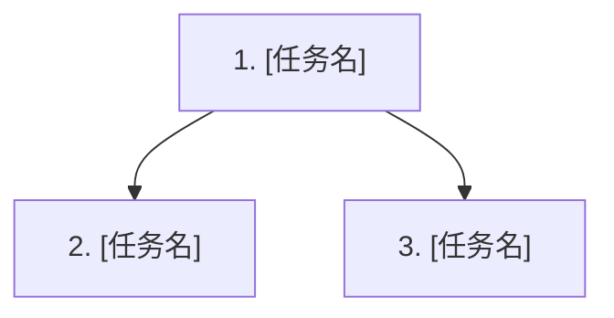

# 计划模板

> 由 Plan 阶段生成，写入 `{工作目录}/PLAN.md`。本文件只承载执行层任务、验证计划和覆盖矩阵；需求契约、行为规格、接口/数据决策以 `{工作目录}/design.md` 为准。

---

````markdown
# 执行计划: [来自 PRD/design.md 的标题]

来源: PRD.md + design.md
状态: 待执行
创建时间: [ISO 日期时间]

## 概述

**Feature**: {slug}
**目标**: [一句话说明本轮实现目标]
**设计依据**: design.md

---

## 任务 DAG



---

## 任务总览

共 N 个任务，预计涉及 M 个文件。

| # | 任务 | 依赖 | 涉及文件 | 覆盖设计项 | 状态 |
|---|------|------|----------|------------|------|
| 1 | [名称] | 无 | [文件列表] | REQ- / API- / DATA- / D- | 待做 |
| 2 | [名称] | 1 | [文件列表] | REQ- / API- / DATA- / D- | 待做 |

---

## 任务详情

### 1. [任务名]
- **做什么:** [具体操作步骤，包含实际路径、函数/类/配置名]
- **设计依据:** [design.md 中的 Requirement/API/Data/Decision ID]
- **CodePlan实施步骤:** [编码业务逻辑、流程]
- **涉及文件:** [file1.ts, file2.ts]
- **验证方法:** [可执行检查命令或测试命令] 预期结果：[明确可观察结果]
- **状态:** 待做

### 2. [任务名]
- **做什么:** [具体操作步骤]
- **设计依据:** [design.md 中的 Requirement/API/Data/Decision ID]
- **CodePlan实施步骤:** [编码业务逻辑、流程]
- **涉及文件:** [file1.ts]
- **验证方法:** [检查方法] 预期结果：[明确可观察结果]
- **状态:** 待做

---

## PRD 验收标准覆盖

| PRD 验收标准 | design.md 行为规格 | 覆盖任务 | 验证方法 |
|-------------|-------------------|----------|----------|
| AC-01 | REQ-01 / Scenario | 任务 1, 2 | [命令/测试/人工验证方式] |

---

## 设计决策覆盖

| design.md 项 | 类型 | 实现任务 | 验证任务/方法 |
|--------------|------|----------|---------------|
| REQ-01 | Behavior | 任务 1 | [验证方法] |
| API-01 / x-auto-no-http-api | API | 任务 2 / 无 | [验证方法] |
| DATA-01 / x-auto-no-sql | Data | 任务 3 / 无 | [验证方法] |
| D-01 | Technical Decision | 任务 1 | [验证方法] |

---

## 用户补充说明 / 技术细节

| 内容 | 状态 | 影响 |
|------|------|------|
| [用户补充] | 已确认/待确认 | [影响的任务/风险] |

---

## 风险与待确认项

| ID | 来源 | 描述 | 处理方式 |
|----|------|------|----------|
| R-01 | design.md | [风险/待确认项] | [追问/任务覆盖/暂缓] |
````
