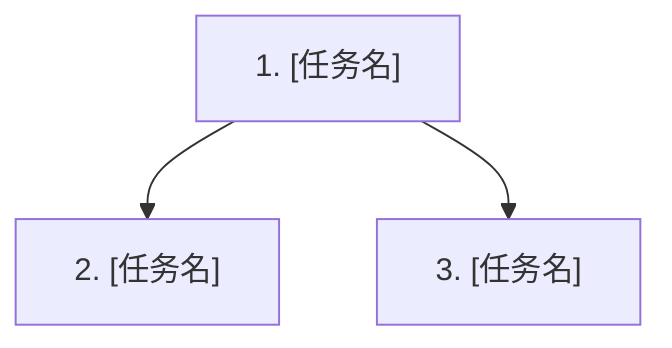

# 计划模板

> 由 Plan 阶段生成，写入 `{FEATURE_DIR}/PLAN.md`。本文件只承载执行层任务、验证计划和覆盖矩阵；行为契约以 `{FEATURE_DIR}/specs/**/*.md` 为准，接口/数据/技术决策以 `{FEATURE_DIR}/design.md` 为准。

## 稳定 ID 规范

- Task ID 统一使用 `T001`、`T002` ...，并写在任务标题和任务表格中。
- Task 必须引用 `specRefs`、`designRefs`、`evidenceIds`，引用格式使用 `specs/<capability>/spec.md#REQ-001` / `design.md#API-001` / `ev_0001`。
- `designRefs` 只引用 `design.md` 中实际存在的设计 ID；若 `x-auto-no-http-api: true` / `x-auto-no-sql: true`，不要为对应类型伪造 `API-*` / `DATA-*`。
- 覆盖矩阵中的 Requirement / Scenario 也必须带同样的本地 ID。
- 新建任务继续递增，不允许重用已删除或已完成任务的 ID。

---

````markdown
# 执行计划: [来自 proposal/specs/design.md 的标题]

来源: proposal.md + specs/**/*.md + design.md
状态: 待执行
创建时间: [ISO 日期时间]

## 概述

**Feature**: {slug}
**目标**: [一句话说明本轮实现目标]
**行为依据**: specs/**/*.md
**设计依据**: design.md

---

## 任务 DAG



---

## 任务总览

共 N 个任务，预计涉及 M 个文件。

| Task ID | 任务           | 依赖 | 覆盖规格/设计项          | 状态 |
| ------- | -------------- | ---- | ------------------------ | ---- |
| T001    | [需求闭环名称] | 无   | REQ-001 / SCN-001 / API-001 / DATA-001 / D-001 | 待做 |
| T002    | [需求闭环名称] | T001 | REQ-002 / SCN-002 / API-002 / DATA-002 / D-002 | 待做 |

---

## 任务详情

### Task [T001]: [需求闭环任务名]

- **做什么:** [本任务交付的需求能力、用户可观察行为或验收闭环；不要写成单个文件/类/方法修改]
- **规格依据:** [specs/[capability]/spec.md#REQ-001 / #SCN-001]
- **设计依据:** [design.md#API-001 / #DATA-001 / #D-001；若 design.md 标记无 API/无 SQL，则省略对应 API/DATA 引用]
- **证据依据:** [ev_0001, ev_0002]
- **验证方法:** [可执行检查命令或测试命令] 预期结果：[明确可观察结果]
- **状态:** 待做

### Task [T002]: [需求闭环任务名]

- **做什么:** [本任务交付的需求能力、用户可观察行为或验收闭环]
- **规格依据:** [specs/[capability]/spec.md#REQ-002 / #SCN-002]
- **设计依据:** [design.md#API-002 / #DATA-002 / #D-002；若 design.md 标记无 API/无 SQL，则省略对应 API/DATA 引用]
- **证据依据:** [ev_0003]
- **验证方法:** [检查方法] 预期结果：[明确可观察结果]
- **状态:** 待做

---

## Specs 行为覆盖

| Spec Requirement / Scenario | 覆盖任务  | 验证方法                 |
| --------------------------- | --------- | ------------------------ |
| REQ-001 / SCN-001           | T001      | [命令/测试/人工验证方式] |
| REQ-002 / SCN-002           | T002      | [命令/测试/人工验证方式] |

---

## 规格与设计决策覆盖

| specs/design 项             | 类型               | 实现任务    | 验证任务/方法 |
| --------------------------- | ------------------ | ----------- | ------------- |
| REQ-001 / SCN-001           | Behavior           | T001        | [验证方法]    |
| API-001 / x-auto-no-http-api | API                | T001 / 无   | [验证方法]    |
| DATA-001 / x-auto-no-sql     | Data               | T002 / 无   | [验证方法]    |
| D-001                        | Technical Decision | T001        | [验证方法]    |

---

## 用户补充说明 / 技术细节

| 内容 | 状态 | 影响 |
|------|------|------|
| [用户补充] | 已确认/待确认 | [影响的任务/风险] |

---

## 风险与待确认项

| ID | 来源 | 描述 | 处理方式 |
|----|------|------|----------|
| R-01 | design.md | [风险/待确认项] | [追问/任务覆盖/暂缓] |
````
