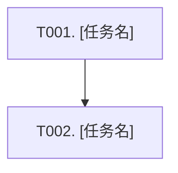

# 计划模板

> 由 Plan 阶段生成，写入 `{FEATURE_DIR}/PLAN.md`。本文件只承载执行层任务、验证计划和覆盖矩阵；行为契约以 `{FEATURE_DIR}/specs/**/*.md` 为准，接口/数据/技术决策以 `{FEATURE_DIR}/design.md` 为准。

## 稳定 ID 规范

- Task ID 统一使用 `T001`、`T002` ...，并写在任务标题和任务表格中。
- Task 必须引用 `specRefs`、`api_id`、`data_id`、`decision_id`、`evidenceIds`。
- `specRefs` 使用 `specs/<capability>/spec.md#REQ-001` / `#SCN-001`。
- `api_id`、`data_id`、`decision_id` 分别写成独立字段；每个字段都可以写多个 ID，多个值用 `/` 或 `,` 分隔。
- 若 `x-auto-no-http-api: true` / `x-auto-no-sql: true`，对应字段写 `无`，不要为对应类型伪造 `API-*` / `DATA-*`。
- `设计依据` 可作为人类可读摘要保留，但机器校验只看单独字段；它不需要和字段一一对账。模板里仍保留 `design.md#API-001 / #DATA-001 / #D-001` 这种可追溯写法。
- 覆盖矩阵中的 Requirement / Scenario 也必须带同样的本地 ID。
- 新建任务继续递增，不允许重用已删除或已完成任务的 ID。

---

````markdown
# 执行计划: [来自 proposal/specs/design.md 的标题]

来源: proposal.md + specs/**/*.md + design.md
状态: 待执行
创建时间: [ISO 日期时间]

## 概述

**Feature**: {slug}
**目标**: [一句话说明本轮实现目标]
**行为依据**: specs/**/*.md
**设计依据**: design.md

---

## 任务 DAG



---

## 任务总览

共 N 个任务，预计涉及 M 个文件。

| Task ID | 任务 | 依赖 | 覆盖规格/设计项 | 状态 |
| ------- | ---- | ---- | -------------- | ---- |
| T001 | [需求闭环名称] | 无 | REQ-001 / SCN-001 / API-001 / DATA-001 / D-001 | 待做 |
| T002 | [需求闭环名称] | T001 | REQ-002 / SCN-002 / API-002 / DATA-002 / D-002 | 待做 |

---

## 任务详情

### Task [T001]: [需求闭环任务名]

- **做什么:** [本任务交付的需求能力、用户可观察行为或验收闭环；不要写成单个文件/类/方法修改]
- **规格依据:** [specs/[capability]/spec.md#REQ-001 / #SCN-001]
- **api_id:** [API-001 / API-002 / 无]
- **data_id:** [DATA-001 / DATA-002 / 无]
- **decision_id:** [D-001 / D-002]
- **设计依据:** [design.md#API-001 / #DATA-001 / #D-001；若 design.md 标记无 API/无 SQL，则省略对应 API/DATA 引用；也可作为摘要保留 design.md]
- **证据依据:** [ev_0001, ev_0002]
- **涉及范围:** [模块、入口、服务、模型、配置、测试等方向；能确定真实路径时写路径，不能确定时写要定位的现有范围]
- **执行要点:**
  1. [实现切入点或复用现有能力的具体动作]
  2. [关键改动或约束，避免只写“更新相关逻辑”]
  3. [边界/失败路径/兼容性处理]
  4. [测试或验证补充]
- **验证命令:** `[可执行检查命令、测试命令或具体人工验证入口]`
- **预期结果:** [明确可观察结果；不要只写“通过”]
- **状态:** 待做

### Task [T002]: [需求闭环任务名]

- **做什么:** [本任务交付的需求能力、用户可观察行为或验收闭环]
- **规格依据:** [specs/[capability]/spec.md#REQ-002 / #SCN-002]
- **api_id:** [API-002 / API-003 / 无]
- **data_id:** [DATA-002 / DATA-003 / 无]
- **decision_id:** [D-002 / D-003]
- **设计依据:** [design.md#API-002 / #DATA-002 / #D-002；若 design.md 标记无 API/无 SQL，则省略对应 API/DATA 引用；也可作为摘要保留 design.md]
- **证据依据:** [ev_0003]
- **涉及范围:** [模块、入口、服务、模型、配置、测试等方向]
- **执行要点:**
  1. [实现切入点或复用现有能力的具体动作]
  2. [关键改动或约束]
  3. [边界/失败路径/兼容性处理]
- **验证命令:** `[检查命令或人工验证入口]`
- **预期结果:** [明确可观察结果]
- **状态:** 待做

---

## Specs 行为覆盖

| Spec Requirement / Scenario | 覆盖任务 | 验证方法 |
| --------------------------- | -------- | -------- |
| REQ-001 / SCN-001 | T001 | [命令/测试/人工验证方式] |
| REQ-002 / SCN-002 | T002 | [命令/测试/人工验证方式] |

---

## 规格与设计决策覆盖

| specs/design 项 | 类型 | 实现任务 | 验证任务/方法 |
| --------------- | ---- | -------- | ------------- |
| REQ-001 / SCN-001 | Behavior | T001 | [验证方法] |
| API-001 / x-auto-no-http-api | API | T001 / 无 | [验证方法] |
| DATA-001 / x-auto-no-sql | Data | T002 / 无 | [验证方法] |
| D-001 | Technical Decision | T001 | [验证方法] |

---

## 用户补充说明 / 技术细节

| 内容 | 状态 | 影响 |
|------|------|------|
| [用户补充] | 已确认/待确认 | [影响的任务/风险] |

---

## 风险与待确认项

| ID | 来源 | 描述 | 处理方式 |
|----|------|------|----------|
| R-01 | design.md | [风险/待确认项] | [追问/任务覆盖/暂缓] |
````
