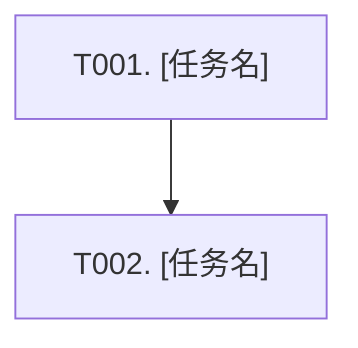

# 计划模板

> 由 Plan 阶段生成，写入 `{FEATURE_DIR}/PLAN.md`。`plan.json` 是同一计划的机器事实源，本模板只描述 PLAN.md 的人类视图；行为契约以 `{FEATURE_DIR}/specs/**/*.md` 为准，接口/数据/技术决策以 `{FEATURE_DIR}/design.md` 为准。

## 稳定 ID 规范

- Task ID 统一使用 `T001`、`T002` ...，并写在任务标题和任务表格中。
- Task 必须列出 `specRefs`、`api_id`、`data_id`、`decision_id`、`evidenceIds`；对应的 `plan.json` 需同步保存 `deps`、`status`、`goal`、`scope`、`implementationPoints`、`acceptanceCriteria`、`nonGoals`、`validationCommands`。
- `specRefs` 使用 `specs/<capability>/spec.md#REQ-001` / `#SCN-001`。
- `api_id`、`data_id`、`decision_id` 分别写成独立字段；每个字段都可以写多个 ID，多个值用 `/` 或 `,` 分隔。
- 单个任务不涉及接口或数据变更时，对应字段写 `无` 或 `-`，不要为对应类型伪造 `API-*` / `DATA-*`；对应 `plan.json.apiIds` / `dataIds` 写空数组 `[]`，不要写字符串 `"-"`。
- 若整轮 `x-auto-no-http-api: true` / `x-auto-no-sql: true`，对应覆盖矩阵字段也写 `无` 或 `-`。
- `设计依据` 可作为人类可读摘要保留，但机器校验只看单独字段；它不需要和字段一一对账。模板里仍保留 `design.md#API-001 / #DATA-001 / #D-001` 这种可追溯写法。
- 覆盖矩阵中的 Requirement / Scenario 也必须带同样的本地 ID。
- 新建任务继续递增，不允许重用已删除或已完成任务的 ID。
- `plan.json` 与 PLAN.md 必须描述同一批任务，不能出现任务缺失或状态漂移；PLAN.md 的「做什么 / 涉及范围 / 执行要点 / 验收标准 / 不做什么」必须从 `plan.json` 投影，不能独写。

---

````markdown
# 执行计划: [来自 proposal/specs/design.md 的标题]

来源: proposal.md + specs/**/*.md + design.md
状态: 待执行
创建时间: [ISO 日期时间]

## 概述

**Feature**: {slug}
**目标**: [一句话说明本轮实现目标]
**行为依据**: specs/**/*.md
**设计依据**: design.md

---

## 任务 DAG



---

## 任务总览

共 N 个任务，预计涉及 M 个文件。

| Task ID | 任务 | 依赖 | 覆盖规格/设计项 | 状态 |
| ------- | ---- | ---- | -------------- | ---- |
| T001 | [需求闭环名称] | 无 | REQ-001 / SCN-001 / API-001 / DATA-001 / D-001 | 待做 |
| T002 | [需求闭环名称] | T001 | REQ-002 / SCN-002 / API-002 / DATA-002 / D-002 | 待做 |

---

## 任务详情

> **具体度要求（粗泛即不合格）:** explore 阶段读到的真实路径/类名/可复用点必须在这里落下，不要回到 PLAN 再抽象成“相关服务”“更新相关逻辑”。每个任务的执行要点**至少一条钉住真实锚点**——`文件#符号`、真实入口、或 `design.md#API/DATA/D-xxx`；`验证命令`必须是大模型能直接运行并自行判读的命令（测试类/用例、构建、lint、`curl`/HTTP 脚本断言），带具体目标，不要写裸 `mvn test`/`npm test`，**禁止"手工""人工验证""Postman""浏览器点击"等需要人参与的步骤**。

> **✅ 示例（仅示范“需求闭环粒度 + 可开工具体度”，生成时删除本示例块）:**
>
> ### Task [T0XX]: 提交订单后返回已创建状态
>
> - **做什么:** 用户提交一个有效订单后，接口返回订单号与 `CREATED` 状态
> - **规格依据:** specs/order-create/spec.md#REQ-001 / #SCN-001
> - **api_id:** API-001
> - **data_id:** DATA-001
> - **decision_id:** D-001
> - **设计依据:** design.md#API-001 / #DATA-001 / #D-001
> - **证据依据:** ev_0012
> - **涉及范围:** `OrderController#create`；`OrderService#createOrder`；订单表 `order`（design.md#DATA-001）；接口测试 `OrderCreateTest`
> - **执行要点:**
>   1. `OrderController#create` 按 design.md#API-001 接收有效订单请求并调用 `OrderService#createOrder`
>   2. `OrderService#createOrder` 写入 `order` 表并返回订单号，状态固定为 `CREATED`
>   3. 参数缺失时沿用现有错误体格式返回校验失败，不创建订单
> - **验收标准:** 有效订单返回 200、订单号非空、状态为 `CREATED`
> - **不做什么:** 不实现订单支付、取消、列表查询或异步导出
> - **验证命令:** `mvn test -Dtest=OrderCreateTest`
> - **预期结果:** `OrderCreateTest` 中有效提交和参数缺失两条断言通过
> - **状态:** 待做

### Task [T001]: [需求闭环任务名]

- **做什么:** [来自 plan.json.goal；本任务交付的需求能力、用户可观察行为或验收闭环；不要写成单个文件/类/方法修改]
- **规格依据:** [specs/[capability]/spec.md#REQ-001 / #SCN-001]
- **api_id:** [API-001 / API-002 / 无]
- **data_id:** [DATA-001 / DATA-002 / 无]
- **decision_id:** [D-001 / D-002]
- **设计依据:** [design.md#API-001 / #DATA-001 / #D-001；若 design.md 标记无 API/无 SQL，则省略对应 API/DATA 引用；也可作为摘要保留 design.md]
- **证据依据:** [ev_0001, ev_0002]
- **涉及范围:** [来自 plan.json.scope；列出 modules / entrypoints / pages / dataObjects，钉到真实路径/入口/表名；确实无法定位时写“要在 X 中定位的现有范围”，不要写“相关服务/相关模块”这类空话]
- **执行要点:** [来自 plan.json.implementationPoints]
  1. [实现切入点/复用锚点：钉住 文件#符号 或现有可复用能力，写出具体动作]
  2. [关键改动或约束：改哪里、按哪个 API-/DATA-/D- 决策，避免只写“更新相关逻辑”]
  3. [边界/失败路径/兼容性的具体处理]
  4. [测试或验证补充：具体到测什么]
- **验收标准:** [来自 plan.json.acceptanceCriteria；写可观察验收口径，不替代验证命令]
- **不做什么:** [来自 plan.json.nonGoals；无则写 `无`]
- **合并理由:** [仅当 plan.json.splitRationale 非空时展示；说明超过粒度阈值仍合并的原因]
- **验证命令:** `[大模型可直接运行并自行判读的命令：mvn test -Dtest=XxxTest / 构建 / lint / curl 断言；不要写裸 mvn test / npm test，禁止手工·人工·Postman·浏览器点击]`
- **预期结果:** [明确可观察结果；不要只写“通过”]
- **状态:** 待做

### Task [T002]: [需求闭环任务名]

- **做什么:** [来自 plan.json.goal；本任务交付的需求能力、用户可观察行为或验收闭环]
- **规格依据:** [specs/[capability]/spec.md#REQ-002 / #SCN-002]
- **api_id:** [API-002 / API-003 / 无]
- **data_id:** [DATA-002 / DATA-003 / 无]
- **decision_id:** [D-002 / D-003]
- **设计依据:** [design.md#API-002 / #DATA-002 / #D-002；若 design.md 标记无 API/无 SQL，则省略对应 API/DATA 引用；也可作为摘要保留 design.md]
- **证据依据:** [ev_0003]
- **涉及范围:** [来自 plan.json.scope；模块、入口、服务、模型、配置、测试等方向]
- **执行要点:** [来自 plan.json.implementationPoints]
  1. [实现切入点或复用现有能力的具体动作]
  2. [关键改动或约束]
  3. [边界/失败路径/兼容性处理]
- **验收标准:** [来自 plan.json.acceptanceCriteria；写可观察验收口径]
- **不做什么:** [来自 plan.json.nonGoals；无则写 `无`]
- **合并理由:** [仅当 plan.json.splitRationale 非空时展示]
- **验证命令:** `[大模型可直接运行的检查/测试/curl 命令，无需人工]`
- **预期结果:** [明确可观察结果]
- **状态:** 待做

---

## Specs 行为覆盖

| Spec Requirement / Scenario | 覆盖任务 | 验证方法 |
| --------------------------- | -------- | -------- |
| REQ-001 / SCN-001 | T001 | [可直接运行的命令/测试，无需人工] |
| REQ-002 / SCN-002 | T002 | [可直接运行的命令/测试，无需人工] |

---

## 规格与设计决策覆盖

| specs/design 项 | 类型 | 实现任务 | 验证任务/方法 |
| --------------- | ---- | -------- | ------------- |
| REQ-001 / SCN-001 | Behavior | T001 | [验证方法] |
| API-001 / x-auto-no-http-api | API | T001 / 无 | [验证方法] |
| DATA-001 / x-auto-no-sql | Data | T002 / 无 | [验证方法] |
| D-001 | Technical Decision | T001 | [验证方法] |

---

## 用户补充说明 / 技术细节

| 内容 | 状态 | 影响 |
|------|------|------|
| [用户补充] | 已确认/待确认 | [影响的任务/风险] |

---

## 风险与待确认项

| ID | 来源 | 描述 | 处理方式 |
|----|------|------|----------|
| R-01 | design.md | [风险/待确认项] | [追问/任务覆盖/暂缓] |
````
